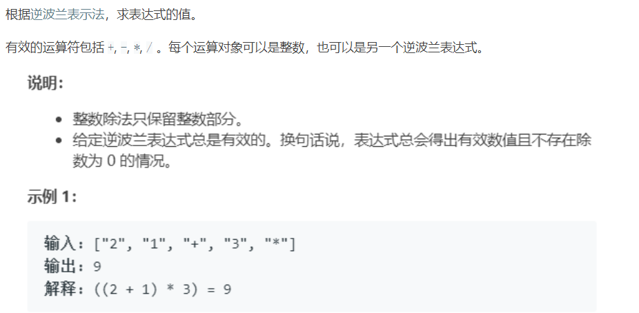
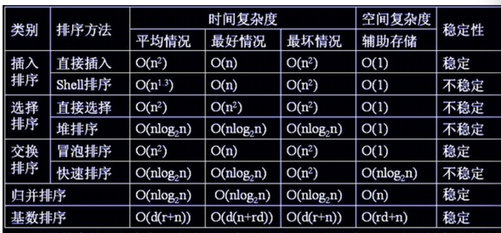

# 基础数据结构

## 背包

背包是一种不支持从中删除元素的集合数据类型。

## 队列

先进先出（FIFO），例如二叉树的广度优先遍历可以用队列实现。

## 栈

后进先出（LIFO），例如二叉树的深度优先遍历可以用栈实现。

### 经典应用：

leetcode.150 逆波兰表达式求值（后缀表示法）



解答：

```java
        public int evalRPN(String[] tokens) {
            int num1, num2;
            Stack<Integer> stack = new Stack<>();
            for (int i = 0; i < tokens.length; i++) {
                switch (tokens[i]) {
                    case "+":
                        num2 = stack.pop();
                        num1 = stack.pop();
                        stack.push(num1 + num2);
                        break;
                    case "-":
                        num2 = stack.pop();
                        num1 = stack.pop();
                        stack.push(num1 - num2);
                        break;
                    case "*":
                        num2 = stack.pop();
                        num1 = stack.pop();
                        stack.push(num1 * num2);
                        break;
                    case "/":
                        num2 = stack.pop();
                        num1 = stack.pop();
                        stack.push(num1 / num2);
                        break;
                    default:
                        stack.push(Integer.parseInt(tokens[i]));
                }
            }
            return stack.pop();
        }
```

## 链表

一个节点由该节点存储的数据和指向下一个节点的引用组成。

```java
public class Node{
    Item item;
    Node next;
}
```

典型操作：

1、插入、删除节点

在头部插入节点，只需要新建一个节点，将节点的next指向当前链表的头结点，然后将头结点的引用改为新节点即可。

```java
newNode = new Node();//新建一个节点
newNode.next = head;//next指向当前链表的头结点
head = newNode;//更新头结点为新建的节点

```

在链表中间插入节点，需要先将待插入节点的next指向待插入位置后面的节点，然后将前面节点的next指向自己即可。

```java
newNode = new Node();
newNode.next = pre.next;
pre.next = newNode;
```

在链表中间删除节点，直接让节点的next指向next的next即可。

```
node.next = node.next.next;
```

2、链表的遍历

链表遍历用节点是否为null来判断，每次循环更新next即可。

```java
while(node!=null){
    //do something
    node=node.next;
}

for(Node x = first;x!=null;x=x.next){
    //do something
}
```

3、链表模拟栈

4、链表模拟队列

5、环形链表

6、反转链表

# 算法分析

## 时间复杂度


## 空间复杂度


# 并查集 union-find

把连通的点看作是**下级-->上级**的关系，只要n个点是连通的，那么他们就有n-1条边，从任意一个点出发沿着边走都可以到达另外任意一个连通的点。可以认为其中某个点是最上级的根节点，然后一级一级直到最下级的节点。这样就把连通分量转成了树。

find方法：

```java
int find(int p){
    //循环寻找p的最上级节点
    //最上级节点的上级是他自己
    while(p != pre[p]){
        p = pre[p];
    }
    return p;
}
```

union方法：

```java
void union(int p,int q){
    //寻找p、q的最上级节点，然后将其中一个节点作为另一个节点的上级
	int pRoot = find(p);
	int qRoot = find(q);
	if(pRoot = qRoot){
		return;
	}
    pre[pRoot] = qRoot;
}
```

union-find 方法也有缺陷，可能会造成形成一颗深度过大的树，甚至退化成单链表。

改进方式：加权。加一个数组num[p]，用于记录各个根节点对应分量的大小。

也即记录下每堆连通分量包含的节点个数，然后总是将包含节点小的树链接到节点多的树上。

瘦树变成胖树，尽可能减小树的深度。


# 排序

参考：https://www.cnblogs.com/Winnie-T/p/7866777.html

总体情况：



## 冒泡排序

冒泡排序就是相邻的两位，两两比较，大的放后面，每趟排序确定一个最值。

第一趟，从0开始，到length-1为止，每相邻的两个两两交换，一趟下来，总能找到一个最大值排到倒数第一位。
注意：最大值已经挑选出来放在最后一位了。
第二趟，从0开始到length-2为止，一趟下来，总能找到一个最大值，放在倒数第二位。

。。。。

```java
for(int i = nums.length - 1,i > 0;i--){
    for(int j = 0;j < i;  j++){
        if(nums[j] > nums[j+1]){
            swap(nums,j,j+1);
        }
    }
    
}
```

可以优化的地方：如果某一趟排序没有任何交换，说明已经排序完毕。

加一个flag标志用于判断本趟排序是否发生交换。

```java
boolean flag = false;
for(int i = nums.length - 1,i > 0;i--){
	//每趟排序前，将标志重置
    flag = false;
    for(int j = 0;j < i;  j++){
        if(nums[j] > nums[j+1]){
            swap(nums,j,j+1);
            //如果发生了交换，flag置为true
            flag = true;
        }
    }
    //一趟排序下来，如果没有发生交换，则以排序完毕，跳出外层循环。
    if(!flag){
        break;
    }
}
```

冒泡排序在遇到相邻元素相等的情况下，不交换元素。另外冒泡排序智能相邻的两元素发生交换，也不会跳跃着交换元素，所以相同元素排序前后的顺序是不变的，冒泡排序是稳定排序。


## 选择排序

每次给当前位置选出一个最小值，与当前位置的值交换。

第一趟，遍历0~length-1，选出一个最小值，与0位交换。

注意，此时0位已是数组的最小值。

第二趟，遍历1~length-1，选出一个最小值，与1 位交换。

。。。。

```java
for(int i = 0; i<nums.length - 1; i++){
	//记录最小值的索引
    int min = i;
    //遍历数组，找最小值
    for(int j =i+1; j < nums.length-1; j++){
        if(nums[j] < nums[min]){
            min = j;
        }
    }
    //交换位置
    swap(nums,i,min);
}
```

在一趟选择排序中，如果当前元素比一个元素小，而这个小的元素又出现在另外一个和当前元素相等的元素后面，交换后稳定性就被破坏了。例如5，8，5，2，9，两个5的相对顺序在排序后被颠倒。所以选择排序不是稳定排序。

选择排序特点：运行时间和输入无关，拥有最少的数据移动次数。每次交换都会改变两个值，N个元素用了N次交换。交换次数和数组大小是线性关系。

## 插入排序

在已经有序的序列上一次插入一个元素。

插入排序依赖元素的初始顺序，最坏情况：数组是逆序的。

排序过程：

第一趟，认为数组只有一个元素，所以他就是有序的。
第二趟，插入一个元素，和目前有序的数组（一个元素）相比，放在他合适的地方。
第三趟，插入一个元素，和目前有序的数组相比（二个元素）相比，放在他合适的地方。
。。。。就酱紫

```JAVA
	for (int i = 0; i < nums.length - 1; i++) {
            int j = i + 1;
            while (j > 0) {
                if (nums[j] < nums[j - 1]) {
                    swap(nums, j, j - 1);
                }
                j--;
            }
        }
```

插入排序的比较是从有序序列的末尾开始的，也就是想要插入的元素和已经有序的最大者开始比起，如果比它大则直接插入在其后面，否则一直往前找直到找到它该插入的位置。如果碰见一个和插入元素相等的，那么插入元素把想插入的元素放在相等元素的后面。所以，相等元素的前后顺序没有改变，从原无序序列出去的顺序就是排好序后的顺序，所以插入排序是稳定的。

