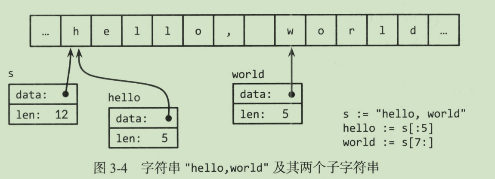

# 前言

公司的一个基础平台忽然就转go了。。楼上的半知名游戏公司服务端开发只要go了。。

经不住身边各位老哥的安利，学一下吧。有C/Java基础，上手应该很快。

教材是 《Go程序设计语言》

# 入门

1、添加输入参数

```
go run Test.go arg=param
```

2、go goroutine 示例

```go
package main

import (
	"fmt"
	"time"
)

func main() {
	go compute(10)
	go compute(10)
	var input string
	fmt.Scanln(&input)

}

func compute(x int) {
	for i := 0; i < x; i++ {
		time.Sleep(time.Second)
		fmt.Println(i)
	}
}

```

3、一个简单的web服务器示例

```go
package main

import (
	"fmt"
	"log"
	"net/http"
)

func handler(w http.ResponseWriter, r *http.Request) {
	fmt.Fprintf(w,"%s %s %s\n",r.Method,r.URL,r.Proto)
	for k,v:=range r.Header{
		fmt.Fprintf(w,"Header[%q]=%q\n",k,v)
	}
	fmt.Fprintf(w,"Host=%q\n",r.Host)
	fmt.Fprintf(w,"RemoteAddr=%q\n",r.RemoteAddr)
	if err := r.ParseForm();err!=nil {
		log.Print(err)
	}
	for k,v:=range r.Form{
		fmt.Fprintf(w,"Form[%q]=%q\n",k,v)
	}

}

func main() {
	http.HandleFunc("/", handler)       // 设置访问的路由
	err := http.ListenAndServe(":8080", nil) // 设置监听的端口
	if err != nil {
		log.Fatal("ListenAndServer Failed:", err)
	}
}

```

# Go运算

%取模，负号只取决于被除数。

&^ 位清空，示例：

c = a &^ b
含义：b 转为二进制，值为1 的位置对应c的位置值为0；c中剩余位置值与a对应位置值相同（即：所谓的位清空操作，把b中1对应位置在c位置上清空

<< >> go的左移，低位补0，右移高位补0还是1要看这个数是否有符号，无符号整数补0，有符号整数补符号位。

+Inf -Inf Nan 正无穷、负无穷、无意义的计算结果如 1/0

Nan参与比较的结果都是false，除了不等于之外。

复数，complex(实部，虚部),real提取实部，imag提取虚部。

也可以接a+bi 来赋值。

逻辑运算&& ||，&&优先级高于||

Go语言和Java一样，不会将非0值认为是true

Go的字符串值也是不可改变的，类似于Java，可以安全地共用数据。



Unicode编码

将一个整数值转成字符串，会按照文字类型解释，输出代表这个文字的utf-8码

rune,用来区分字符值和整数值，和int32基本一样。

```go
	ss := "你好"
	fmt.Print(len(ss))//6
	fmt.Print(len([]rune(ss)))//2
```


# 数据类型

## 数组：

```go
//声明并初始化一个数组
var a [3]int=[3]int{1,2,3}
//遍历数组的索引和值
for i,v :=range a{
		fmt.Printf("%d %d\n",i,v)
	}
//仅遍历值不遍历索引
for _,v :=range a{
		fmt.Printf("%d\n",v)
	}

```

数组的长度是数组类型的一部分，[3]int 和[4]int 是两种不同的数据类型。

go里面数组传递给方法，默认是值传递，而不像Java那样是引用传递。

需要修改数组元素，应该传递一个指向数组的指针。

数组一旦创建，不可改变大小。

## slice切片

表示拥有相同类型元素、长度可变的序列。

slice三个属性：指针、长度、容量

创建一个数组的slice类似于给数组创建了一个别名。

不允许直接比较slice，

创建方式和数组创建方式类似，但是不指定长度。

内建函数make可以创建一个指定长度、容量、元素类型的slice

append函数，追加元素到slice末尾

## map 哈希表

使用map之前，必须先初始化

```go
//创建哈希表
ages:=make(map[string]int)
	ages["ss"]=1
	ages["yy"]=2
	print(ages["ss"])

//------或者
	ages:= map[string]int{
		"ss":1,
		"yy":2,
	}
	print(ages["ss"])
//快捷赋值
	ages["ss"]++

//示例：判断两个map是否包含相同的元素
func equal(x, y map[string]int) bool {
	if len(x) != len(y) {
		return false
	}
	for key,value :=range x{
		 yValue, ok := y[key]
		if !ok || yValue != value {
			return false
		}
	}
	return true
}
```

map元素不是一个变量，不能获取他的地址，rehash可能会导致元素被散列到新的存储位置。

和java一样，不保证map的迭代顺序。

go没有提供集合类型。

## 结构体

和C语言的结构体很像。

```go
package main

import (
	"fmt"
	"time"
)

type Employee struct {
	ID        int
	Name      string
	Address   string
	DoB       time.Time
	Position  string
	Salary    int
	ManagerID int
}

func main() {
	var dilbert Employee
	dilbert.Salary = 5000
	ptr := &dilbert
	fmt.Printf("%d\n", ptr.Salary)
}

```

示例：用二叉树来排序。

思路：遍历各个元素，构造一棵二叉查找树，然后对二叉搜索树进行中序遍历，得到一个按照升序排序的数组。

```java
package main

import "fmt"

type tree struct {
	value       int
	left, right *tree
}

func main() {
	ss := []int{3, 2, 1, 5, 7, 0, 6}
	Sort(ss)
	fmt.Printf("%v", ss)
}

func Sort(values []int) {
	var root *tree
	for _, v := range values {
		root = add(root, v)
	}
	appendValues(values[:0], root)
}

func appendValues(values []int, t *tree) []int {
	if t != nil {
		values = appendValues(values, t.left)
		values = append(values, t.value)
		values = appendValues(values, t.right)
	}
	return values
}

func add(t *tree, value int) *tree {
	if t == nil {
		t = new(tree)
		t.value = value
		return t
	}
	if value < t.value {
		t.left = add(t.left, value)
	} else {
		t.right = add(t.right, value)
	}
	return t
}

```

go语言根据首字母大小写来判断访问权限，方法、常量、变量、结构体皆是如此。大写，可以被其他的包访问，小写则只能在本包中使用。

如果接构成所有成员都是可以比较的，那么结构体就可以比较，== 和!=，会按照结构体成员的顺序比较。

## JSON

序列化和反序列化