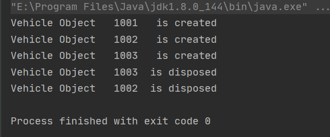
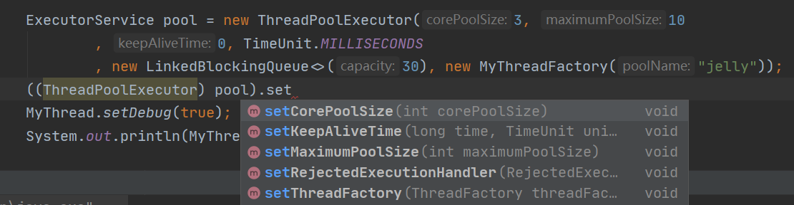

# 对象的共享

## synchronized 内置锁

 synchronized是可重入的。

一个示例，说明锁是可重入的。

参考：https://my.oschina.net/u/3149614/blog/3032984

```java
public class Widget {
    public synchronized void doSomething() {
        System.out.println("Widget中的this: " + this);
    }
}

public class LoggingWidget extends Widget {
    @Override
    public synchronized void doSomething() {
        super.doSomething();
        System.out.println("LoggingWidget中的super: " + super.toString());
        System.out.println("LoggingWidget中的this: " + this);
    }

    public static void main(String[] args) {
        LoggingWidget loggingWidget = new LoggingWidget();
        loggingWidget.doSomething();
    }
}
```

super、this都是在子类对象中调用的，他们具体的指向都是子类的实例对象，持有的锁都同一个对象锁。如果内置锁是不可重入的，这段代码会导致死锁。


## 发布与逸出


## 线程封闭


### 栈封闭

其实就是指方法内部定义的局部变量，它是线程安全的。

方法的每次调用都会产生一个对应的栈帧，对一个方法的调用过程，就是一个栈帧入栈到出栈的过程。（参考JVM内存模型）

局部变量存放在虚拟机栈中，而虚拟机栈是私有的，不是线程共享的，所以局部变量是线程安全的。


### ThreadLocal

使用示例：

```java
private static final ThreadLocal<SimpleDateFormat> dateFormatter = 
ThreadLocal.withInitial(() -> new SimpleDateFormat("yyyy/MM/dd"));
```

一般都使用static修饰，避免重复创建与线程相关的变量。

可以简单理解为 Map<Thread,Object> ，各个线程都有自己独立的副本，所以不会在并发情况下出现线程安全的问题。

### 不可变对象

使用不可变对象，如String，就不必担心线程安全问题。

注意，final修饰的变量并非是不可变的。例如一个final引用指向某个对象，虽然引用指向不变，但是对象本身的属性还是可以被修改的。

Java并发编程实践里面给出的对象不可变定义：

> 1、对象创建后状态不能再修改，需要修改时候，通过保存一个新状态的实例来替换原有的不可变对象
>
> 2、对象的所有域都是final类型
>
> 3、对象是正确创建的，在创建过程中this引用没有逸出

## 安全的发布对象

必要条件：对象的引用一级对象的状态必须同时对其他线程可见。常用的方式：

1、静态初始化函数中初始化一个对象的引用

2、对象引用保存在volatile类型的域中或者 Atomicreferance对象中

3、保存在正确构造的final域中

4、保存在一个由锁保护的域中

最后一条，包括将对象放入线程安全的集合中，例如：ConcurrentMap、SynchronizedHashMap、CopyOnWriteArrayList、ConcurrentLinkedQueue等。以JUC包中的线程安全集合类为主。


# 对象的组合

## 设计线程安全的类

### 收集同步需求

确保类的线程安全性，就是确保它的不变性条件不会再并发访问的情况下被破坏。需要对他的状态进行判断。

对象与变量都有一个状态空间，就是他们所有可能的取值。状态空间越小越容易判断线程的状态。

#### 不可变条件和后验条件

类的方法中往往会有一些不可变的条件，用于判断状态时是有效还是无效的。

操作中可能还会有一些后验条件来判断状态迁移是否是有效的，下一个状态可能会依赖于当前的状态。

#### 先验条件

例如：读-->判断-->更新。

单线程中这种操作是没问题的，但是在多线程下，先验条件可能由其他线程执行操作而改变。

### 实例封闭

将对象封装在实例对象里面，通过线程安全的方法进行访问。


### 监视器模式

对累的方法使用synchronized加锁，建议使用一个私有的锁对象而不是对象的内置锁。


# 基础构建模块

## 同步容器类

Vector ，Stack，HashTable以及Collections提供的同步集合类:

```java
List list = Collections.synchronizedList(new ArrayList());
Set set = Collections.synchronizedSet(new HashSet());
Map map = Collections.synchronizedMap(new HashMap());
```

会严重降低并发性，吞吐量会急剧降低。

## 并发容器类


CopyOnWriteArrayList

这系列容器基本原理都是读写分离，读操作无锁，写操作会另起一个副本。所以叫“写时复制(CopyOnWrite)”。应对读多写少的场景。

在每次修改时候，都会创建并重新发布一个新的容器副本，从而实现读写分离。当然，这种情况下，读取的可能不是最新值。


CopyOnWriteArraySet

待补充


ConcurrentHashMap

JDK8之前，采用分段锁实现，

它不会抛出ConCurrentModificationException，在迭代过程中不需加锁，它具有弱一致性，不具备快速失败机制，可以容忍并发修改。所以例如size() 和 isEmpty() 方法可能返回已经过期的值。

对于一些复合操作，已经实现为原子操作：

仅当没有相应的key才会插入

```java
V putIfAbsent(K key, V value);
```

remove：仅当key被映射到V时候才移除。

```java
boolean remove(Object key, Object value);
```

replace：对于某个key而言，仅当它对应的 value值和预期值相等时才会更新value。

```java
 boolean replace(K key, V oldValue, V newValue);
```

等等。

ConcurrentSkipListMap

待补充

ConcurrentSkipListSet

待补充

ConcurrentLinkedQueue

待补充

ConsurrentLinkedDeque

待补充

ArrayBlockingQueue

阻塞队列BlockingQueue接口，基本方法有4个，put、take以及支持定时的offer、poll。

take从队列中拿走数据，如果队列为空则阻塞自身，一直到队列中有数据可取才会自动唤醒该线程。

put 将数据放入队列，如果队列已满则阻塞自身，一直到队列有空间可以放数据为止。

```java
//BlockingQueue接口的基本方法
void put(E e) throws InterruptedException;
boolean offer(E e, long timeout, TimeUnit unit) throws InterruptedException;
E take() throws InterruptedException;
E poll(long timeout, TimeUnit unit) throws InterruptedException;
```


LinkedBlockingQueue

待补充

LinkedBlockingDeque

待补充

SynchronousQueue

待补充

PriorityBlockingQueue

待补充

LinkedTransferQueue

待补充

DelayQueue

待补充


### 串行线程封闭

生产者-消费者通过阻塞队列，实现了串行线程封闭，对象的所有权从生产者安全地交付给消费者。线程封闭对象只能由单个线程拥有，但是通过这种模式安全地转移了所有权。

这里的关键在于，确保只有一个线程能接受被转移的对象。

使用阻塞队列简化 生产者-消费者设计：

```
//生产者：
...

while(true){
//生产产品
Production production=new Production();
//放入阻塞队列
blockingQueue.put(production);
}
...

//消费者
...
while(true){
	Production production = blockingQueue.take();
	doSomething(production);
}
...
```

生产者消费者模型可以用多种方式实现，例如wait-notify、Semaphore、Lock等：详情参考 [生产者消费者的五种实现方式-Java](https://juejin.im/entry/596343686fb9a06bbd6f888c "With a Title"). 

### 双端队列与工作密取

在生产者-消费者设计中，所有的消费者共享一个工作队列，在工作密取设计中，每个消费者拥有自己的双端队列。

如果一个消费者完成了自己双端队列中的全部工作，可以从其他消费者的双端队列**末尾**秘密的获取工作。

工作密取模式更适合即使生产者又是消费者对的情况->当执行某个工作任务的时候，会出现更多的工作。

参考代码：

```java
//来源：https://houbb.github.io/2019/01/18/jcip-14-deque-workstealing
/**
 * 基本思路是维护一个阻塞队列数组，开始时候消费者按照自己规定的编号消费自己的双端队列，
 * 如果消费完成，那么可以选择数组中另外一个双端队列进行消费。
 */
 public interface WorkStealingEnableChannel<P> extends Chanel<P> {
    P take(BlockingDeque<P> preferredQueue) throws InterruptedException;
}

public class WorkStealingChannel<P> implements WorkStealingEnableChannel<P> {
    private final BlockingDeque<P>[] managedQueues;

    public WorkStealingChannel(BlockingDeque<P>[] managedQueues) {
        super();
        this.managedQueues = managedQueues;
    }

    @Override
    public P take() throws InterruptedException {
        return take(null);
    }

    @Override
    public void put(P product) throws InterruptedException {
        int targetIndex = (product.hashCode() % managedQueues.length);
        BlockingQueue<P> targetQueue = managedQueues[targetIndex];
        targetQueue.put(product);
    }

    @Override
    public P take(BlockingDeque<P> preferredQueue) throws InterruptedException {
        BlockingDeque<P> targetQueue = preferredQueue;
        P product = null;
        if (null != targetQueue) {
            product = targetQueue.poll();
        }
        int queueIndex = -1;
        while (null != product) {
            queueIndex = (queueIndex + 1) % managedQueues.length;
            targetQueue = managedQueues[queueIndex];
            product = targetQueue.pollLast();
            if (preferredQueue == targetQueue) {
                break;
            }
        }
        if (null == product) {
            queueIndex = (int) (System.currentTimeMillis() % managedQueues.length);
            targetQueue = managedQueues[queueIndex];
            product = targetQueue.pollLast();
            System.out.println("stealed from " + queueIndex + ": " + product);
        }
        return product;
    }
}

public class WorkStealingExample {
    private final WorkStealingEnableChannel<String> channel;
    private final TerminationToken token = new TerminationToken();

    public static void main(String[] args) throws InterruptedException {
        WorkStealingExample wse = new WorkStealingExample();
        Thread.sleep(3500);
    }

    public WorkStealingExample() {
        int nCPU = Runtime.getRuntime().availableProcessors();
        int consumerCount = nCPU / 2 + 1;
        BlockingDeque<String>[] managedQueues = new LinkedBlockingDeque[consumerCount];
        channel = new WorkStealingChannel<String>(managedQueues);
        Consumer[] consumers = new Consumer[consumerCount];
        for (int i = 0; i < consumerCount; i++) {
            managedQueues[i] = new LinkedBlockingDeque<String>();
            consumers[i] = new Consumer(token, managedQueues[i]);
        }
        for (int i = 0; i < nCPU; i++) {
            new Producer().start();
        }
        for (int i = 0; i < consumerCount; i++) {
            consumers[i].start();
        }
    }

    private class Producer extends AbstractTerminatableThread {
        private int i = 0;

        @Override
        protected void doRun() throws Exception {
            channel.put(String.valueOf(i++));
            Thread.sleep(10);
            token.reservations.incrementAndGet();
        }
    }

    private class Consumer extends AbstractTerminatableThread {
        private final BlockingDeque<String> workQueue;

        public Consumer(TerminationToken token, BlockingDeque<String> workQueue) {
            super(token);
            this.workQueue = workQueue;
        }

        @Override
        protected void doRun() throws Exception {
            String product = channel.take();
            if (product != null) {
            }
            System.out.println("Processing product:" + product);
            try {
                Thread.sleep(new Random().nextInt(50));
            } catch (Exception e) {
            } finally {
                token.reservations.decrementAndGet();
            }
        }
    }
}
 
```

## 同步工具类

### 闭锁

CountDownLatch，类似于发令枪，枪响后线程全部解除阻塞的状态，而且是一次性的。

使用方式1：等待所有子线程就绪后，一起启动。

使用方式2：等待所有子线程工作任务完成后，主线程继续往后执行。


示例：

启动门和startGate结束门endGate，启动门的初始计数为1，所有线程会先执行一个startGate.await()方法，然后进入等待状态，知道所有县城准备完毕后，主线程调用startGate.countDown()方法放行所有阻塞的线程，然后调用endGate.await()方法等待所有线程执行完毕。所有线程会同时启动执行各自任务，线程执行完工作任务后调用endGate.coutDown()，直到所有线程工作任务都执行完毕后主线程才会继续往后进行。

```java
public long timeTasks(int nThreads, final Runnable task) throws InterruptedException {
    final CountDownLatch startGate = new CountDownLatch(1);
    final CountDownLatch endGate = new CountDownLatch(nThreads);
    ThreadFactory threadFactory = new ThreadFactoryBuilder().setNameFormat("test-thread-%d").build();
    ThreadPoolExecutor pool = new ThreadPoolExecutor(nThreads, nThreads, 300, TimeUnit.SECONDS,
            new LinkedBlockingQueue<>(1000), threadFactory,new ThreadPoolExecutor.AbortPolicy());
    for (int i = 0; i < nThreads; i++) {
        pool.execute(() -> {
            try {
                startGate.await();
                try {
                    task.run();
                } finally {
                    endGate.countDown();
                }

            } catch (InterruptedException e) {
                e.printStackTrace();
            }
        });
    }
    long start = System.currentTimeMillis();
    startGate.countDown();
    endGate.await();
    long end = System.currentTimeMillis();
    return end - start;
}
```

### 信号量

Semaphore，信号量用于控制同时访问某个特定资源的操作数量，

需要时先请求许可，acquire()，如果获得可以继续下一步，没得到则等待。

使用完成后交还许可，release()，一般放在finally里面。

信号量不保证被争抢资源自身的同步性，他只控制可以有几个线程去用这个资源，但是资源自给的同步性、互斥性需要自己来保证。
信号量不保证同步与互斥！！

仅当初始化许可值为1 时候，信号量才能是个互斥锁。


### 栅栏

循环栅栏 CyclicBarrier

使一定数量的参与方反复在栅栏位置汇集。
到达栅栏位置调用await()，会阻塞所有线程必须都到达栅栏位置。到达后栅栏会自动打开。
await()超时或者调用这个方法的线程被中断，认为栅栏被打破，所有阻塞调用都会终止并抛出异常 BrokenBarrierException。
成功通过栅栏后，await会给每个线程分配一个唯一的到达索引号
初始化会给一个数值n，线程调用await方法后会阻塞等待，当n个线程都调用await方法后，栅栏一起放行。

CyclicBarrier的构造函数可以传入一个Runnable，最后到达栅栏的线程会执行这个方法。

```java
package com.jelly.appinit;

import java.util.concurrent.CyclicBarrier;

public class CyclicBarrierDemo {

    static class TaskThread extends Thread {

        CyclicBarrier barrier;

        public TaskThread(CyclicBarrier barrier) {
            this.barrier = barrier;
        }

        @Override
        public void run() {
            try {
                Thread.sleep(1000);
                System.out.println(getName() + " 到达栅栏 A");
                barrier.await();
                System.out.println(getName() + " 冲破栅栏 A");

                Thread.sleep(2000);
                System.out.println(getName() + " 到达栅栏 B");
                barrier.await();
                System.out.println(getName() + " 冲破栅栏 B");
            } catch (Exception e) {
                e.printStackTrace();
            }
        }
    }

    public static void main(String[] args) {
        int threadNum = 5;
        CyclicBarrier barrier = new CyclicBarrier(threadNum, new Runnable() {
            
            @Override
            public void run() {
                System.out.println(Thread.currentThread().getName() + " 完成最后任务");
            }
        });

        for(int i = 0; i < threadNum; i++) {
            new TaskThread(barrier).start();
        }
    }

}
```


两方栅栏，Exchanger，作用类似于SynchronousQueue。

举例来说：就是一个线程在完成一定的任务后想与另一个线程交换数据，则第一个先拿出数据的线程会一直等待第二个线程，直到第二个线程拿着数据到来时才能彼此交换对应数据。


# 任务执行

### 线程池

为什么使用线程池？

最核心的原因：减少频繁创建、销毁线程带来的资源消耗。

### 线程饥饿死锁

阿里巴巴开发手册里面，提到不能使用Executors创建线程池。建议手动创建，示例：

```java
package com.example.demo;
//引入google的guava包
import com.google.common.util.concurrent.ThreadFactoryBuilder;

import java.util.concurrent.*;

public class MyTest {
    public static void main(String[] args) {
        ThreadFactory threadFactory = new ThreadFactoryBuilder().setNameFormat("demo-pool-%d").build();
        ExecutorService pool = new ThreadPoolExecutor(5, 200, 0L, TimeUnit.MILLISECONDS,
                new LinkedBlockingQueue<Runnable>(1024), threadFactory, new ThreadPoolExecutor.AbortPolicy());
        pool.execute(()-> System.out.println(Thread.currentThread().getName()));
        pool.shutdown();//gracefully shutdown
    }
}
```

方法解释：

```java
public ThreadPoolExecutor(int corePoolSize, //线程池核心线程数量
                          int maximumPoolSize,//线程池最大数量
                          long keepAliveTime,//空闲线程存活时间
                          TimeUnit unit,//时间单位
                          BlockingQueue<Runnable> workQueue,//线程池所使用的缓冲队列
                          ThreadFactory threadFactory,//线程池创建线程使用的工厂
                          RejectedExecutionHandler handler)//线程池对拒绝任务的处理策略
```

Executors.newCachedThreadPool

```java
   public static ExecutorService newCachedThreadPool() {
        return new ThreadPoolExecutor(0, Integer.MAX_VALUE,
                                      60L, TimeUnit.SECONDS,
                                      new SynchronousQueue<Runnable>());
    }
```

核心线程池数量为0，但是线程池最大数量没有限制(Integer.MAX_VALUE),提交一个新任务时，不创建核心线程。由于SynchronousQueue 是一种非常特殊的阻塞队列，他没有实际的容量，甚至连一个队列的容量都没有。（没有数据缓冲），每个put操作必须等待take操作，反过来也一样（和Exchanger提供的作用非常相似）。所以可以理解为这个队列时钟都是满的，所以最终都是创建非核心线程来执行任务，由于线程池最大容量没做限制，所以可以认为线程是可以无限创建的，可能会引发OOM异常。

Executors.newSingleThreadExecutor

```java
    public static ExecutorService newSingleThreadExecutor() {
        return new FinalizableDelegatedExecutorService
            (new ThreadPoolExecutor(1, 1,
                                    0L, TimeUnit.MILLISECONDS,
                                    new LinkedBlockingQueue<Runnable>()));
    }
```

**注意这里使用了一个无界(Integer.MAX_VALUE)的阻塞队列**，如果不断地的提交任务，超过了核心线程的数量，就会暂时放入阻塞队列中，因为无界，所以可以不限制的放入任务，可能会引发OOM。由于队列是无界限的，所以根本就不会创建非核心线程。

Executors.newFixedThreadPool

```java
  public static ExecutorService newFixedThreadPool(int nThreads) {
        return new ThreadPoolExecutor(nThreads, nThreads,
                                      0L, TimeUnit.MILLISECONDS,
                                      new LinkedBlockingQueue<Runnable>());
    }
```

和上一个差不多，使用了无界队列存放任务，所以可能会堆积大量任务从而引发OOM异常。

### 线程池的生命周期

JVM仅在所有（非守护）线程全部终止后才会退出。

使用扩展了Executor的ExecutorService接口来管理线程池。

shutdown 平滑关闭线程池：不再接受新任务，等待已提交任务（包括队列中等待的任务）执行完毕后自行退出。

```java
    /**
     * Initiates an orderly shutdown in which previously submitted
     * tasks are executed, but no new tasks will be accepted.
     * Invocation has no additional effect if already shut down.
     *
     * <p>This method does not wait for previously submitted tasks to
     * complete execution.  Use {@link #awaitTermination awaitTermination}
     * to do that.
     *
     * @throws SecurityException if a security manager exists and
     *         shutting down this ExecutorService may manipulate
     *         threads that the caller is not permitted to modify
     *         because it does not hold {@link
     *         java.lang.RuntimePermission}{@code ("modifyThread")},
     *         or the security manager's {@code checkAccess} method
     *         denies access.
     */
    void shutdown();
```

shutdownNow强制关闭，取消已有的任务，包括在队列中排队的未开始任务。

使用awaitTermination 方法阻塞直到线程池关闭，或者使用isTerminated 轮询判断线程池是否关闭。

```java
boolean awaitTermination(long timeout, TimeUnit unit)
        throws InterruptedException;
```

### Runnable、Callable和FutureTask

Runnable，没有返回值，线程池使用execute提交。或者也可以使用submit提交获得future对象，通过get方法阻塞主线程直到执行完毕，但是get方法得到的是个null。不能取消执行。

此外，Runnable 不能抛出异常，只能捕获异常。

```java
@FunctionalInterface
public interface Runnable {
    public abstract void run();
}
```

因为Runnable接口的run方法本身就没有抛出任何异常，实现Runnable接口重写run方法时候，由于子类抛出异常要小于父类抛出异常，所以实现Runnable重写run方法自然不能够抛出任何异常。

Callable，有返回值，可以抛出异常，线程池必须用submit提交，返回值类型是Future定义的泛型。

```java
@FunctionalInterface
public interface Callable<V> {
  
    V call() throws Exception;
}
```

Callable可以通过调用**future.cancel**方法取消任务执行。

```java
   boolean cancel(boolean mayInterruptIfRunning);
```

非阻塞方法，cancel(false)会取消正在阻塞队列中排队还没有执行的任务，cancel(true)会取消所有任务，包括正在执行的任务。

FutureTask是Future接口的一个唯一实现类，

```java
public class FutureTask<V> implements RunnableFuture<V> {...}

public interface RunnableFuture<V> extends Runnable, Future<V> {
    /**
     * Sets this Future to the result of its computation
     * unless it has been cancelled.
     */
    void run();
}
```

FutureTask实现了Runnable、Future接口，所以它作为Runnable提交给线程池执行。

FutureTask的构造器可以传入一个实现了Runnable或者Callable接口的对象，提交给线程池执行，之后可以使用isDone判断是否完成、使用get阻塞直到获取结果或者超时。

和普通线程执行一样，不要直接调用FutureTask的run方法来执行任务。调用run方法不会启新线程，而是会直接串行方式执行。


### CompletionService接口

完成服务：在使用线程池提交Callable任务时候，可以拿到一个Future对象，如果提交了多个任务，并且需要获取他们的结果做处理，可以使用List<Future<V>> 来存储Future对象，然后在循环中依次处理。如下：

```java
  ExecutorService pool = new ThreadPoolExecutor(3, 10, 0, TimeUnit.MILLISECONDS,
                new LinkedBlockingQueue<>(30), factory, new ThreadPoolExecutor.AbortPolicy());
        CompletionService<String> service = new ExecutorCompletionService<>(pool);
        Future<String> future1 = pool.submit(() -> {
            Thread.sleep(8000);
            return "4";
        });
        Future<String> future2=   pool.submit(() -> {
            Thread.sleep(1000);
            return "1";
        });

        Future<String> future3=   pool.submit(() -> {
            Thread.sleep(5000);
            return "3";
        });

        Future<String> future4=   pool.submit(() -> {
            Thread.sleep(3000);
            return "2";
        });
        List<Future<String>> list = Lists.newArrayList(future1,future2,future3,future4);
        for (int i = 0; i < 4; i++) {
            System.out.println(list.get(i).get());
        }
        pool.shutdownNow();
    }

//输出 4 1 3 2
```

CompletionService接口的作用是结合了BlockingQueue和Executor。实现类：ExecutorCompletionService,构造器传入一个线程池对象。

提交多个Callable任务后，他会将完成的任务放入内部的阻塞队列中，获取结果只需要调用take或者poll方法即可。如果队列为空，调用take方法会阻塞，直到获取结果为止。

```java
       ThreadFactory factory = new ThreadFactoryBuilder().setNameFormat("study-%d").build();
        ExecutorService pool = new ThreadPoolExecutor(3, 10, 0, TimeUnit.MILLISECONDS,
                new LinkedBlockingQueue<>(30), factory, new ThreadPoolExecutor.AbortPolicy());
        CompletionService<String> service = new ExecutorCompletionService<>(pool);
        service.submit(() -> {
            Thread.sleep(8000);
            return "4";
        });
        service.submit(() -> {
            Thread.sleep(1000);
            return "1";
        });

        service.submit(() -> {
            Thread.sleep(5000);
            return "3";
        });

        service.submit(() -> {
            Thread.sleep(3000);
            return "2";
        });
        for (int i = 0; i < 4; i++) {
            System.out.println(service.take().get());
        }
        pool.shutdownNow();
    }
//按照任务完成的先后顺序，将Future会放入阻塞队列中
//输出 1  2  3  4 
```

CompletionService 可以解决已完成任务得不到及时处理的问题。因为只有已完成的任务才会被加到内部的阻塞队列中。也就是说，在阻塞队列里面存放的都是已经完成的任务，调用take方法拿到future后，调用get方法是可以直接返回结果不需等待的。

但是如果队列里面没有future，take方法还是会阻塞的。

多个ExecutorCompletionService可以共用同一个Executor，CompletionService可以看作是一组任务对象的句柄。

### 任务的时间限制

Future的get方法支持传入一个时间限制。

在规定时间内没有获得到结果，就会抛出一个TimeOutException 异常。

```java
    /**
     * Waits if necessary for at most the given time for the computation
     * to complete, and then retrieves its result, if available.
     */
    V get(long timeout, TimeUnit unit)
        throws InterruptedException, ExecutionException, TimeoutException;
```


### 提交一组任务

将一组任务提交给ExecutorService线程池，然后获得一组future。支持时间限制。

```java
 <T> List<Future<T>> invokeAll(Collection<? extends Callable<T>> tasks)
        throws InterruptedException;

 <T> List<Future<T>> invokeAll(Collection<? extends Callable<T>> tasks,
                                  long timeout, TimeUnit unit)
        throws InterruptedException;
```

返回的Future集合顺序和task任务集合的顺序是一致、相对应的。

这两个invokeAll方法都会阻塞当前线程，直到所有任务完成。

带有超时时间限制的invokeAinv方法，这个时间限制是对于所有task任务而言的，如果超时，会取消所有没有执行完的任务，并抛出异常。


# 取消与关闭

Java没有提供任何机制可以用来安全的终止线程。Thread的stop->可能破坏数据一致性，和suspend方法->可能造成死锁，都已经被废弃。

## 中断

每个线程都有一个boolean类型的中断状态：

```java
public static boolean interrupted() ..//静态方法，清除当前线程的中断状态，并返回他之前的值(清除中断状态的唯一方法)
public boolean isInterrupted() ...//返回目标线程的中断状态
public void interrupt() ...//中断目标线程
```

阻塞库方法，Thread.sleep、join和Object.wait，阻塞队列的put、take 方法等都会检测线程的中断状态，在发现中断后会响应中断：清除中断状态、提前返回并抛出InterruptedException异常。

但是线程如果在非阻塞状态下中断，只会设置中断标志，具体如何处理，由目标线程在获得中断请求后自行处理。

就是说：中断并不会真正的中断一个正在运行的线程，只是发出了中断请求然后由线程在下一个合适的时刻中断自己。

静态方法interrupted()会清除中断状态，所以在调用此方法返回true时，必须考虑是否要抛出异常或者再次调用interrupt()恢复中断状态，而不能直接无脑的屏蔽中断。

## 通过Future中断

future的cancel方法，传递mayInterruptIfRunning为true时，可以中断正在执行任务的线程，为false时候表示县城如果还没启动，那么就不要运行它。

## 未捕获异常的处理

UncaughtExceptionHandler接口用于处理未捕获异常。

要为线程池中的所有线程设置一个UncaughtExceptionHandler，需要为ThreadPoolExecutor的构造函数提供一个ThreadFactory。

仍然建议使用Guava的线程工厂，非常好用。


然后在新建线程池的时候使用带有ThreadFactory的构造器就ok了。
注意：只有通过execute提交的任务才能将他抛出的异常交给未捕获异常处理器，而通过submit提交的任务，无论是未检查异常还是受检异常，都将会被认为是任务返回状态的一部分。通过submit提交的任务抛出了异常而结束，那么异常将被Future.get封装在ExecutionExecption中重新抛出。

## JVM关闭

### 关闭钩子

在正常关闭中，JVM会调用所有已注册的关闭钩子。

关闭钩子：通过Runtime.addShutdownHook注册的但是尚未开始的线程。JVM不保证关闭钩子的调用顺序。多个关闭钩子会并发执行。

示例：

```java

public class Demo {
    private static ThreadFactory factory = new ThreadFactoryBuilder()
            .setNameFormat("study-%d")
            .build();
    private static ExecutorService pool = new ThreadPoolExecutor(3, 10, 0, TimeUnit.MILLISECONDS,
            new LinkedBlockingQueue<>(30), factory, new ThreadPoolExecutor.AbortPolicy());

    public static void main(String[] args) throws ExecutionException, InterruptedException {
        //注册关闭钩子
        Runtime.getRuntime().addShutdownHook(new Thread(){
            @Override
            public void run() {
                System.out.println("Jvm要关闭了");
            }
        });

        FutureTask<String> futureTask = new FutureTask<>(new Callable<String>() {
            @Override
            public String call() throws Exception {
                Thread.sleep(3000);
                return "success";
            }
        });

        try {
            pool.submit(futureTask);
            System.out.println(futureTask.isDone());
            String s = futureTask.get(10, TimeUnit.MILLISECONDS);
            System.out.println(s);
        } catch (TimeoutException e) {
            futureTask.cancel(true);
            System.out.println("执行太慢了，已超时");
        }
        pool.shutdown();
        Thread.sleep(2000);
    }
```

关闭钩子应该是线程安全的，并且不应该对应用程序的状态或者JVM的关闭原因做出任何假设。最后关闭钩子必须尽快退出。
建议将多个清理、关闭操作放在同一个关闭钩子中，串行化执行。
关闭钩子仅在JVM 正常关闭才会执行，在强制关闭JVM时不会执行。

### 守护线程

典型：垃圾回收器、执行辅助工作的线程。

创建线程时，新线程会继承创建它的线程的守护状态，所以默认情况下主线程创建的都是普通线程。

如果只剩下守护线程，JVM会直接退出。所有守护线程都会被直接抛弃，而且也不会执行finally代码块。

### 终结器

参考：https://blog.csdn.net/abvedu/article/details/54586848

示例：

```java


public class Vehicle {
    private int id;

    public Vehicle(int id) {
        this.id = id;
        System.out.println("Vehicle Object   " + id + "   is created");
    }

    @Override
    protected void finalize() throws java.lang.Throwable {
        super.finalize();
        System.out.println("Vehicle Object   " + id + "  is disposed");
    }


}


class Test {


        public static void main(String[] args){
            Vehicle car1 = new Vehicle(1001);
            Vehicle car2 = new Vehicle(1002);
            Vehicle car3 = new Vehicle(1003);

            car2  = null;
            car3 = null;
            System.gc();//Invoke the Java garbage collector

        }

}

```



垃圾回收器在回收对象时候，会对定义了finalize方法的对象进行特殊处理：在回收器释放他们后，调用他们的finalize方法。

**避免使用终结器**


# 线程池的使用


#### 依赖性任务

线程池中如果有任务依赖于其他任务，就有可能会发生死锁。

例如线程池中正在执行任务的线程在等待处在线程池工作等待队列中的任务，就会发生死锁。


除了线程池显式设置的最大线程数之外，也会受到资源上的限制。例如只有n个连接的JDBC连接池，超过n个任务时候，多的任务必须等待之前的任务释放连接。

#### 耗时任务

如果任务执行时间过长，即使不出现死锁，也会降低线程池的响应性。

如果不加以限制，很有可能最终线程池中执行的全都是耗时长的任务，造成线程池阻塞。

建议视情况对某些耗时长的任务施加最长等待时间，超出了等待事件就标记为失败，不再无限期等待。

### 线程池的大小

N为CPU总核数，那么：

如果是CPU密集型应用，则线程池大小设置为N+1

如果是IO密集型应用，则线程池大小设置为2N+1

如果一台服务器上只部署这一个应用并且只有这一个线程池，那么这种估算或许合理，具体还需自行测试验证。但是，IO优化中，这样的估算公式可能更适合：

最佳线程数目 = （（线程等待时间+线程CPU时间）/线程CPU时间 ）* CPU数目

**线程等待时间所占比例越高，需要越多线程。线程CPU时间所占比例越高，需要越少线程。**

http://ifeve.com/how-to-calculate-threadpool-size/

### 线程的创建与销毁

线程池创建方法：

```java
public ThreadPoolExecutor(int corePoolSize, //线程池核心线程数量
                          int maximumPoolSize,//线程池最大数量
                          long keepAliveTime,//空闲线程存活时间
                          TimeUnit unit,//时间单位
                          BlockingQueue<Runnable> workQueue,//线程池所使用的缓冲队列
                          ThreadFactory threadFactory,//线程池创建线程使用的工厂
                          RejectedExecutionHandler handler)//线程池对拒绝任务的处理策略
```

线程池的核心线程数量corePoolSize、最大线程数量maximumPoolSize和空闲线程存活时间keepAliveTime共同负责线程池的创建与销毁。

corePoolSize：在创建线程池时候指定corePoolSize，并不是一创建线程池就会立即创建corePoolSize数量的线程，新创建的线程池中是没有任何线程的，线程会在提交任务到线程池的时候进行创建。corePoolSize的作用在于，如果提交任务到线程池时候，如果当前线程数量小于corePoolSize，那么无论当前的线程是否空闲，都会创建一个新的线程来执行任务。直到线程池的线程数量等于corePoolSize。

如果当前正在执行任务的线程数=corePoolSize，那么新提交的任务会进入阻塞队列等待。

只有当阻塞队列满了的时候，才会创建超出corePoolSize数量的线程，但是会始终小于等于maximumPoolSize。

如果某个线程的空闲时间超过了keepAliveTime，并且此时线程池的线程数量大于corePoolSize，那么该线程就会被终止。

### 饱和策略/拒绝策略

当要创建的线程数量大于线程池的最大线程数的时候，新的任务就会根据饱和策略来进行处理，也即调用这个接口里的方法。

如何处理新提交的任务由饱和策略来决定。

此外，如果线程池已经被关闭，却仍然使用这个线程池提交新任务，那么也会调用这个方法。

ThreadPlloExecutor 提供了4种默认的饱和策略实现。


AbortPolicy 中止：默认饱和策略，直接抛出RejectedExecutionException 异常，并放弃这个任务，不再执行。

看代码就是直接抛出异常。

```java
    public static class AbortPolicy implements RejectedExecutionHandler {
        /**
         * Creates an {@code AbortPolicy}.
         */
        public AbortPolicy() { }

        /**
         * Always throws RejectedExecutionException.
         *
         * @param r the runnable task requested to be executed
         * @param e the executor attempting to execute this task
         * @throws RejectedExecutionException always
         */
        public void rejectedExecution(Runnable r, ThreadPoolExecutor e) {
            throw new RejectedExecutionException("Task " + r.toString() +
                                                 " rejected from " +
                                                 e.toString());
        }
    }
```

DiscardPolicy 抛弃，什么都没做，直接丢弃。

看代码发现方法体是空的，直接丢弃，不做任何事情，不抛出异常也不会执行任务。

```java
 public static class DiscardPolicy implements RejectedExecutionHandler {
        /**
         * Creates a {@code DiscardPolicy}.
         */
        public DiscardPolicy() { }

        /**
         * Does nothing, which has the effect of discarding task r.
         *
         * @param r the runnable task requested to be executed
         * @param e the executor attempting to execute this task
         */
        public void rejectedExecution(Runnable r, ThreadPoolExecutor e) {
        }
    }
```

DiscardOldestPolicy 抛弃最旧的任务：它会抛弃阻塞队列中最先加入的任务，然后再把这个新任务添加到阻塞队列里面。

看代码， 队列是FIFO的，先让队列头的任务(最老的任务)出队，然后再提交这个新任务到队列里面。

```java
    public static class DiscardOldestPolicy implements RejectedExecutionHandler {
        /**
         * Creates a {@code DiscardOldestPolicy} for the given executor.
         */
        public DiscardOldestPolicy() { }

        /**
         * Obtains and ignores the next task that the executor
         * would otherwise execute, if one is immediately available,
         * and then retries execution of task r, unless the executor
         * is shut down, in which case task r is instead discarded.
         *
         * @param r the runnable task requested to be executed
         * @param e the executor attempting to execute this task
         */
        public void rejectedExecution(Runnable r, ThreadPoolExecutor e) {
            if (!e.isShutdown()) {
                e.getQueue().poll();
                e.execute(r);
            }
        }
    }
```


CallerRunsPolicy 调用者运行，也就是线程池所在的线程直接来运行这个新提交的任务。

看方法，直接调用了run()方法。

```java
   public static class CallerRunsPolicy implements RejectedExecutionHandler {
        /**
         * Creates a {@code CallerRunsPolicy}.
         */
        public CallerRunsPolicy() { }

        /**
         * Executes task r in the caller's thread, unless the executor
         * has been shut down, in which case the task is discarded.
         *
         * @param r the runnable task requested to be executed
         * @param e the executor attempting to execute this task
         */
        public void rejectedExecution(Runnable r, ThreadPoolExecutor e) {
            if (!e.isShutdown()) {
                r.run();
            }
        }
    }
```

执行任务需要一定的时间，因此在这期间，主线程会阻塞在这里，直到任务完成。那么至少会有一段时间，主线程不会再提交新的任务，是的线程池中的任务得以慢慢完成。

在这期间，主线程不会调用accept来接受新的请求，到达的新请求会保存在TCP层的队列中。如果持续过载，那么TCP层的请求队列也会被填满，继而会开始抛弃新的请求。也即过载的状况会逐渐向外延伸，从线程池工作队列到应用程序再到TCP层，最终到达客户端，从而让服务器在高负载情况下平缓的降低性能。

默认的四种策略都很简单，可以自定义饱和策略，实现RejectedExecutionHandler接口即可。

## 线程工厂

每当线程池需要创建一个线程的时候，都是通过线程工厂方法来完成的。	

默认的线程工厂```DefaultThreadFactory```：通过Executors.defaultThreadFactory()创建。

```java
    /**
     * The default thread factory
     */
    static class DefaultThreadFactory implements ThreadFactory {
        private static final AtomicInteger poolNumber = new AtomicInteger(1);
        private final ThreadGroup group;
        private final AtomicInteger threadNumber = new AtomicInteger(1);
        private final String namePrefix;

        DefaultThreadFactory() {
            SecurityManager s = System.getSecurityManager();
            group = (s != null) ? s.getThreadGroup() :
                                  Thread.currentThread().getThreadGroup();
            namePrefix = "pool-" +
                          poolNumber.getAndIncrement() +
                         "-thread-";
        }

        public Thread newThread(Runnable r) {
            //设置线程名，默认为 pool-线程池编号-thread-线程编号
            Thread t = new Thread(group, r,
                                  namePrefix + threadNumber.getAndIncrement(),
                                  0);
            //默认都设置为非守护线程
            if (t.isDaemon())
                t.setDaemon(false);
            //默认都设置为正常优先级
            if (t.getPriority() != Thread.NORM_PRIORITY)
                t.setPriority(Thread.NORM_PRIORITY);
            return t;
        }
    }
```

自定义线程工厂只需要实现newThread 方法即可。

可以继承Thread类，来实现自己的一些逻辑，例如记录日志、记录活跃线程数量等。

Java Concurrency in Practice上的例子：

自定义线程工厂：

```java
public class MyThreadFactory implements ThreadFactory {
    //线程池命名
    private final String poolName;

    public MyThreadFactory(String poolName) {
        this.poolName = poolName;
    }

    @Override
    public Thread newThread(Runnable r) {
        return new MyThread(r, poolName);

    }
}

```

自定义Thread类：

```java
public class MyThread extends Thread {

    public static final String DEFAULT_NAME = "MyThread";
    private static volatile boolean debugLifecycle = false;
    private static final AtomicInteger created = new AtomicInteger();
    private static final AtomicInteger alive = new AtomicInteger();

    public MyThread(Runnable r) {
        this(r, DEFAULT_NAME);
        super.setUncaughtExceptionHandler(new Thread.UncaughtExceptionHandler() {
            @Override
            public void uncaughtException(Thread t, Throwable e) {
                System.out.println("UncaughtException in thread " + t.getName() + e.toString());
            }
        });
    }

    @Override
    public void run() {
        boolean debug = debugLifecycle;
        if (debug) {
            System.out.println("Created " + super.getName());
        }
        try {
            alive.incrementAndGet();
            super.run();
        } finally {
            alive.decrementAndGet();
            if (debug) {
                System.out.println("Existing " + super.getName());
            }
        }
    }

    public static int getThreadsCreated() {
        return created.get();
    }

    public static int getThreadsAlive() {
        return alive.get();
    }

    public static boolean getDebug() {
        return debugLifecycle;
    }

    public static void setDebug(boolean b) {
        debugLifecycle = b;
    }

    public MyThread(Runnable r, String name) {
        super(r, name + "-" + created.incrementAndGet());
        super.setUncaughtExceptionHandler(new Thread.UncaughtExceptionHandler() {
            @Override
            public void uncaughtException(Thread t, Throwable e) {
                System.out.println("UncaughtException in thread " + t.getName() + e.toString());
            }
        });
    }
}

```

测试：

```java
public class MainDemo {

    public static void main(String[] args) {

        ExecutorService pool = new ThreadPoolExecutor(3, 10, 0, TimeUnit.MILLISECONDS,
                new LinkedBlockingQueue<>(30), new MyThreadFactory("jelly"));
        MyThread.setDebug(true);
        pool.execute(() -> {
            System.out.println(Thread.currentThread().getName());
        });
        pool.execute(() -> {
            System.out.println(Thread.currentThread().getName());
        });
        pool.execute(() -> {
            System.out.println(1 / 0);
        });

        pool.shutdownNow();

    }
}

```

输出：


## 修改Executor

通过调用构造函数构建了线程池之后，仍然可以通过setter函数对线程池的属性进行修改，包括核心线程数、最大线程数、拒绝执行处理器等。

将结果类型转为ThreadPoolExecutor才能访问setter方法。

示例：



#### 扩展ThreadPoolExecutor

ThreadPoolExecutor 提供了```beforeExecute```、`afterExecute`、`terminated`三个可以在子类中重写的方法，用他们可以控制、扩展ThreadPoolExecutor的行为。

beforeExecute：线程执行任务前调用。如果执行beforeExecute中抛出了异常，那么任务将不会在执行，并且也不会再调用afterExecute。jdk文档建议在重写方法的末尾调用super.beforeExecute.

afterExecute: 线程执行任务完成后调用，无论任务是正常的执行完run方法后返回，还是在执行run方法中抛出了异常而提前返回，afterExecute都会被调用。(任务执行出现Error错误时候，afterExecute不会被调用)。jdk文档建议在重写方法的开头调用super.afterExecute

terminated:在线程池关闭，所有任务都已完成、所有工作者线程关闭之后，会调用terminated方法。jdk文档建议在重写方法中调用super.terminated

## 线程池是怎么重复利用线程的？

参考：[线程池是怎么重复利用线程的](https://blog.csdn.net/pursuer211/article/details/83892918#deadlock)


线程持有一个Runnable对象task，在循环中判断task是否为null，如果不为null，那么就直接调用该对象的run方法执行，执行完毕后会将task重新设置为null。继续循环判断。也就是说，线程在执行完传入的任务后是不退出的，而是将task设为null后继续循环。

这个task值是初始化时候的值或者从工作队列里面取值，从工作队列里面取值时候会进行判断，如果是非核心线程，带有超时控制，会使用BlockingQueue的poll方法，超时还没获取到对象时候会返回null，打破了work线程的循环条件，就会退出循环，并且销毁该线程。如果是核心线程，不带有超时控制，会使用BlockingQueue的take方法，取不到就一直阻塞。线程池就用这种方法维持coreSize线程的数量。

> 实际上线程本身是不知道自己是不是核心线程的，对于线程而言，都是一样的。只是当线程池中的线程多于指定的核心线程数量时，会将多出来的线程销毁掉，池中只保留指定个数的线程。那些被销毁的线程是随机的，可能是第一个创建的线程，也可能是最后一个创建的线程，或其它时候创建的线程。一开始我以为会有一些线程被标记为“核心线程”，而其它的则是“非核心线程”，在销毁多余线程的时候只销毁那些“非核心线程”，而“核心线程”不被销毁。这种理解是错误的。

# 活跃性危险

## 死锁

### 锁顺序死锁

两个线程以不同的顺序来获取相同的锁。

### 协作对象之间发生死锁

在持有锁的情况下调用某个外部方法，必须注意死锁的可能性。

### 资源死锁

多个线程相互持有彼此正等待的锁而又不失方自己已持有的锁时会发生死锁，当他们在相同的资源集合上等待的时候，也可能会发生死锁。

## 饥饿

线程由于无法访问他所需要的资源而不能继续执行时候，就会发生 “饥饿” 现象。引发饥饿最常见的就是CPU时钟周期。

例如，如果给线程设置了优先级，那么可能会导致高优先级线程不断的进入执行，而低优先级线程分配不到CPU时钟周期，没有执行的机会。虽没有发生死锁，但是线程仍旧无法向前推进。这也是不建议设置线程优先级、统一使用默认优先级`Thread.NORM_PRIORITY`的原因。

## 活锁

和死锁最大的区别就是，死锁是拿不到想要的资源就无脑等待，而且不放弃已持有资源。活锁是就拿不到就放弃，并且释放持有的资源，然后重新再试。

活锁的具体表现就是：两个线程不断地重复执行相同的操作，而且总会失败。

[什么是活锁](https://www.zhihu.com/question/20566246)

这个配图太形象了。。


过于礼貌的两人不断的相互避让就是活锁。

解决活锁的一个方法是在重试机制中加入随机因素。例如加入一个随机的重试等待时间。

# 显式锁

## Lock和ReentrantLock