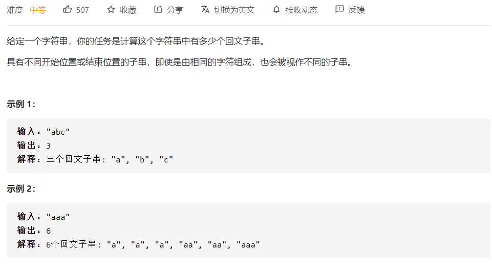
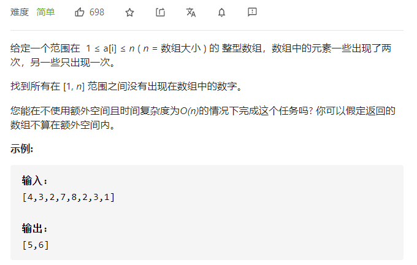

# leetcode

刷题是不可能刷题的，这辈子都不可能刷题的，看也看不懂，学也学不会，只能靠着题解区大佬的解答才能维持得了生活的样子，里面个个都是人才，代码写的秀，讲解说的透，我超喜欢这里的！

## leetcode 最热100题

### 739.每日温度


题意：找数组里面每个数字后面第一个比他大的数字距离他的距离，没有则置为0.

解法：单调栈。找数组中距离某个值左侧/右侧第一个比他大/小的值之间的距离这种，可考虑单调栈。类似lc84题。

维护一个单调递减的栈，栈中存放元素的下标：

1、栈为空，直接入栈；

2、栈不为空，比较当前值与栈顶下标对应值的大小：

若小于栈顶值则入栈当前元素的下标。

大于栈顶值，则栈顶元素出栈，下标之差即为第一个比栈顶元素大的值距离栈顶元素的距离。

java：

```java
class Solution {
    public int[] dailyTemperatures(int[] T) {
        //单调栈
        Deque<Integer> stack = new LinkedList<>();
        int[] res = new int[T.length];
        //遍历数组
        for(int i=0;i<T.length;i++){
            //拿到当前元素
            int currentTemperature = T[i];
            //栈不为空且栈顶下标指向值小于当前值
            while(stack.size()!=0 && T[stack.peek()]<currentTemperature){
                //出栈并计算栈顶元素的距离差
                int temp = stack.pop();
                res[temp] = i - temp;
            }
            //其他情况则直接入栈
            stack.push(i);
        }
        return res;
    }
}
```

### 647.回文子串



题意：计算一个子串中有多少回文子串。

解法：中心扩展法，和lc第5题 求解最长回文子串类似。

解1：串长分为奇数和偶数两种情况，中心点是不一样的，可能为1个，也可能是2个，所以直接计算两次。

```java
class Solution {
    int result = 0;

    public int countSubstrings(String s) {
        //遍历字符串，分别计算奇数、偶数两种情况，
        for (int i = 0; i < s.length(); i++) {
            //奇数中心点只有一个，也即left、right初始位置重合
            help(i, i, s);
            //偶数中心点有两个，left和right相邻
            help(i, i + 1, s);
        }
        return result;
    }

    public void help(int left, int right, String s) {
        while (left >= 0 && right < s.length() && s.charAt(left) == s.charAt(right)) {
            result++;
            left--;
            right++;
        }
    }
}
```

解2：之所以要分为奇数和偶数，就是因为串长不同，会导致左右指针的初始位置不同，如果考虑把字母之间的间隙考虑进去，如果中心点是字母之间的空格，看一下左右指针的初始位置。中心点位置为center，左指针为left，右指针为right，则

| center | left | right |
| ------ | ---- | ----- |
| 0      | 0    | 0     |
| 1      | 0    | 1     |
| 2      | 1    | 1     |
| 3      | 1    | 2     |
| 4      | 2    | 2     |
| 5      | 2    | 3     |
| 6      | 3    | 3     |

带上字母之间的间隙，center一共有2n-1个遍历位置。

很直观的结论  ： left = center/2，right = center-center/2;

Java:

```java
class Solution {
    public int countSubstrings(String s) {
        int n = s.length();
        int left = 0, right = 0, result = 0;
        //center从0~2n-1遍历
        for (int center = 0; center <= 2 * n - 1; center++) {
            //初始化left 和 right指针
            left = center / 2;
            right = center - left;
            //判断是否已到边界&&是否是回文串,更新结果
            while (left >= 0 && right < n && s.charAt(left) == s.charAt(right)) {
                result++;
                left--;
                right++;
            }
        }
        return result;
    }
}
```

### 621.任务调度器


题意：给了不同的任务，任务如何排列花费时间最少，相同的任务在执行时候有冷却时间的限制，比如执行了任务A，那么下一次执行A之前，必须等待足够N的时间，才能够再次A类型的任务。

解答：给了三个实例，看完后感觉就是，应该选择多个不同的任务(也即新选择的任务尽可能不在冷却时间中)来回切换，并且切换的任务数不大于冷却时间最好(为了给之后的任务尽可能多的提供来回切换的机会)。为了达成这个条件，每次选择的就应该是不在冷却中、并且剩余最多的任务。

所以应该选出数量最多的任务进行分组，每个组的大小应该为冷却时间+1，这样第一组执行完，轮到第二组的时候，数量最多的任务刚刚好冷却完毕。然后将剩余任务依次放入分组中即可。这样，只需要计算最后一个分组有多少个元素，就可以得到最短时间了。

解析中的桶思想和这个差不多。


$$
(maxTimes-1)*(n+1)+maxCount
$$
如果冷却时间足够短，任务种类足够多，上面的公式计算式错误的，例如冷却时间1秒，任务为5A 4B 3C，按照公式计算的结果是 (5-1)*2+1=9,实际值应该就是任务的个数，也即是12. 所以最终应该计算两者，并取较大的值作为正确结果。

```java
class Solution {
    public int leastInterval(char[] tasks, int n) {
        int[] taskNumArr = new int[26];
        //统计26中任务出现的次数
        for (char cr : tasks) {
            taskNumArr[cr - 'A']++;
        }
        //排序
        Arrays.sort(taskNumArr);
        //最大次数在末尾，也即maxTimes，并计算和它值相等的任务种类
        //也即maxCount，最后一个分组的任务个数
        int maxTimes = taskNumArr[taskNumArr.length - 1];
        int maxCount = 1;
        for (int i = taskNumArr.length - 2; i > 0; i--) {
            if (taskNumArr[i] == maxTimes) {
                maxCount++;
            } else {
                break;
            }
        }
        return Math.max(tasks.length, (maxTimes - 1) * (n + 1) + maxCount);
    }
}
```

### 617.合并二叉树


题意：合并二叉树。。对应位置值合并，构建一个新的二叉树。

递归

```java
class Solution {
    public TreeNode mergeTrees(TreeNode root1, TreeNode root2) {
        //如果有一个为null，直接连接剩下的树
        if (root1 == null) {
            return root2;
        }
        if (root2 == null) {
            return root1;
        }
        //递归构建二叉树
        TreeNode treeNode = new TreeNode(root1.val + root2.val);
        treeNode.left = mergeTrees(root1.left, root2.left);
        treeNode.right = mergeTrees(root1.right, root2.right);
        return treeNode;
    }
}
```


迭代，层序遍历，

广度优先遍历(层序)用队列，深度优先遍历(前中后序)用栈。

```java
class Solution {
    public TreeNode mergeTrees(TreeNode root1, TreeNode root2) {
        if (root1 == null) {
            return root2;
        }
        if (root2 == null) {
            return root1;
        }
        //层序遍历的方式，用队列
        Queue<TreeNode> queueRes = new LinkedList<>();
        Queue<TreeNode> rootQueue1 = new LinkedList<>();
        Queue<TreeNode> rootQueue2 = new LinkedList<>();
        //初始化，从根节点开始
        TreeNode res = new TreeNode(root1.val + root2.val);
        queueRes.offer(res);
        rootQueue1.offer(root1);
        rootQueue2.offer(root2);
        //两棵树的队列均不为空
        //若有一个队列为空，则说明其中某个树已经完全遍历完成，另一棵树余下的子节点已经直接连接到合并树上了，不需要再计算
        while (rootQueue1.size() != 0 && rootQueue2.size() != 0) {
            //3队列头元素出队
            TreeNode treeNode1 = rootQueue1.poll();
            TreeNode treeNode2 = rootQueue2.poll();
            TreeNode resNode = queueRes.poll();
            //拿到左右子节点
            TreeNode left1 = treeNode1.left;
            TreeNode left2 = treeNode2.left;
            TreeNode right1 = treeNode1.right;
            TreeNode right2 = treeNode2.right;
            //如果左孩子均不为空，则新建节点并入队，同时，两个左节点也各自入队
            if (left1 != null && left2 != null) {
                TreeNode left = new TreeNode(left1.val + left2.val);
                resNode.left = left;
                queueRes.offer(left);
                rootQueue1.offer(left1);
                rootQueue2.offer(left2);
             //若有一个为null，则直接将余下的节点连接起来即可
            } else if (left1 == null) {
                resNode.left = left2;
            } else {
                resNode.left = left1;
            }
            //右孩子同理
            if (right1 != null && right2 != null) {
                TreeNode right = new TreeNode(right1.val + right2.val);
                resNode.right = right;
                queueRes.offer(right);
                rootQueue1.offer(right1);
                rootQueue2.offer(right2);
            } else if (right1 == null) {
                resNode.right = right2;
            } else {
                resNode.right = right1;
            }
        }
        return res;
    }
}
```

### 581.最短无需连续子数组


解答1：将数组排序，然后比照着原数组，左边第一个不同的元素和右边第一个不同的元素，它们的差就是所求。

```java
class Solution {
    public int findUnsortedSubarray(int[] nums) {
        int[] tempArr = nums.clone();
        //排序
        Arrays.sort(tempArr);
        //初始化值left应该在最右侧，right应该在最左侧
        //考虑下数组整体逆序的情况
        int left =nums.length - 1;
        int right = 0;
        //比较位置的不同
        for (int i = 0; i < nums.length; i++) {
            if (nums[i] != tempArr[i]) {
                left = i;
                break;
            }
        }
        for (int i = nums.length - 1; i >= 0; i--) {
            if (nums[i] != tempArr[i]) {
                right = i;
                break;
            }
        }
        //差值+1即为所求
        return right - left > 0 ? right - left + 1 : 0;
    }
}
```

解答2：其实就是寻找数组里面所有逆序子数组中最大和最小的元素，然后寻找他们在原数组应该放置的正确的位置。

```java
class Solution {
    public int findUnsortedSubarray(int[] nums) {
        int min = Integer.MAX_VALUE;
        int max = Integer.MIN_VALUE;
        //寻找所有 *逆序* 子数组中的最大值和最小值 
        for (int i = 0; i < nums.length - 1; i++) {
            if (nums[i] > nums[i + 1]) {
                min = Math.min(min, nums[i + 1]);
                max = Math.max(max, nums[i]);
            }
        }
        int left = 0;
        int right = 0;
        //从左向左找第一个大于逆序子数组最小值的元素位置。
        //(其实就是将数组排序，然后把逆序子数组的最小值放到它应该放的位置)
        for (int i = 0; i < nums.length; i++) {
            if (nums[i] > min) {
                left = i;
                break;
            }
        }
        //从右向左寻找第一个小于逆序子数组最大值的元素(原理同上)
        for (int i = nums.length - 1; i >= 0; i--) {
            if (nums[i] < max) {
                right = i;
                break;
            }
        }
        return right - left > 0 ? right - left + 1 : 0;
    }
}
```

### 560.和为K的子数组


解答1：暴力法。

外循环从0遍历到数组末尾，内循环以外层循环当前值为数组的头，累计计算所有可能的子数组的和。

```java
class Solution {
    public int subarraySum(int[] nums, int k) {
        int count = 0;
        for (int i = 0; i < nums.length; i++) {
            int sum = 0;
            for (int start = i; start <= nums.length - 1; start++) {
                sum += nums[start];
                if (sum == k) {
                    count++;
                }
            }
        }
        return count;
    }
}
```

解答2：前缀和+哈希

暴力法中数组的和的计算方式可以优化，不必每次都从一个数开始，逐个数相加。

子数组 [ i, j] 的和可以通过前缀和直接计算：
$$
Sum(i,j) = preSum[j]-preSum[i-1]
$$

```java
class Solution {
    public int subarraySum(int[] nums, int k) {
    //    Strin
        int pre = 0;
        Map<Integer, Integer> map = new HashMap<>();
        map.put(0, 1);
        int count = 0;
        for (int i = 0; i < nums.length; i++) {
            pre += nums[i];
            if (map.containsKey(pre - k)) {
                count += map.get(pre - k);
            }
            map.put(pre, 1 + map.getOrDefault(pre, 0));
        }
        return count;
    }
}
```


### 543.二叉树的直径


解答1：递归计算每隔节点的深度

```java
class Solution {
    int maxDia = 0;
    public int diameterOfBinaryTree(TreeNode root) {
            help(root);
            return maxDia;
        }

        private int help(TreeNode node) {
            if (node == null) {
                return 0;
            }
            //递归求解以左孩子、右孩子为根节点的深度
            int left = help(node.left);
            int right = help(node.right);
            //两者取其大
            maxDia = Math.max((left + right), maxDia);
            //需要计算上从左孩子/右孩子连接本节点的这一段路径。也即+1.
            return Math.max(left, right) + 1;
        } 
}
```


### 538.把二叉搜索树转换为累加树


解答：二叉搜索树的中序遍历(左根右)为单调递增，那么反向遍历，按照右根左的顺序遍历，并累加节点值，即可得到结果。

```java
class Solution {
    int sum = 0;

    public TreeNode convertBST(TreeNode root) {
        if (root != null) {
            TreeNode tempNode = convertBST(root.right);
            sum += tempNode.val;
            root.val = sum;
            convertBST(root.left);
        }
        return root;
    }
}
```

同理可以使用莫斯利遍历反着来写，以后补充。。

### 494.目标和(DP)


解法1：递归。

定义一个函数，用来递归的计算数组的和。需要4个参数，数组本身(用来取值)、下标索引(查看递归的进度以及取值)、当前和(判断是否符合结果)、目标和（用于递归判断）

```java
class Solution {
    int count=0;
    public int findTargetSumWays(int[] nums, int S) {
      calculate(nums,0,0,S);
      return count;
    }

    private void calculate(int[] nums,int i,int sum,int S){
        if (i==nums.length){
            if (sum==S){
                count++;
            }
        }else {
            calculate(nums,i+1,sum+nums[i],S);
            calculate(nums,i+1,sum-nums[i],S);
        }
    }
}
```

仍不太熟悉dp，mmp。

```
class Solution {
    public  int findTargetSumWays(int[] nums, int s) {
        int sum = 0;
        for (int i = 0; i < nums.length; i++) {
            sum += nums[i];
        }
        // 绝对值范围超过了sum的绝对值范围则无法得到
        if (Math.abs(s) > Math.abs(sum)) return 0;

        int len = nums.length;
        // - 0 +
        int t = sum * 2 + 1;
        int[][] dp = new int[len][t];
        // 初始化
        if (nums[0] == 0) {
            dp[0][sum] = 2;
        } else {
            dp[0][sum + nums[0]] = 1;
            dp[0][sum - nums[0]] = 1;
        }

        for (int i = 1; i < len; i++) {
            for (int j = 0; j < t; j++) {
                // 边界
                int l = (j - nums[i]) >= 0 ? j - nums[i] : 0;
                int r = (j + nums[i]) < t ? j + nums[i] : 0;
                dp[i][j] = dp[i - 1][l] + dp[i - 1][r];
            }
        }
        return dp[len - 1][sum + s];
    }
}
```

### 461.汉明距离


思路：x 和 y 异或操作，然后计算异或后数值里面1的个数。经典位运算 n&(n-1)即可完成。

```java
class Solution {
    public int hammingDistance(int x, int y) {
        int z = x^y;
        int count = 0;
        while(z!=0){
            z=z&(z-1);
            count++;
        }
        return count;
    }
}
```

常见位运算用法：

n & -n   作用 : 保留最后一位 1 ，其他位全变为0；

n & (n-1)   作用：最后一位1变为0；另外可用于判断是否是2的幂。

n & 1    作用：判断奇偶数。 n & 1==0 说明最后一位不是1，所以是偶数

n & (1<<N - 1) 作用：高于N位 的清零

### 448.找到所有数组中消失的数字



思路：数组中值的范围是1~n，所以将值当做下标进行遍历，遍历到的值将它变为绝对值的相反数，这样，只要数组中缺失的数字是一定修改不到的，所以必定为正数。最后扫描一遍数组，>0的即为所求。

遍历数组，拿数组中值当做下标进行一些操作，必定有缺失的数值会始终无法进行修改操作。。。

```java
class Solution {
    public List<Integer> findDisappearedNumbers(int[] nums) {
        List<Integer> list =  new ArrayList<>();

		for(int i=0;i<nums.length;i++){
          	nums[Math.abs(nums[i])-1]= -Math.abs(nums[Math.abs(nums[i])-1]);
     	 }
       for(int i =0;i<nums.length;i++){
           if(nums[i]>0){
               list.add(i+1);
           }
       }
       return list;
    }
}
```

### 438.找到字符串中所有字母异位词


思路: 双指针滑动窗口，哈希表判断相等字符数。

解：

```java
public static List<Integer> findAnagrams(String s, String p) {
        List<Integer> result = new ArrayList<>();
        //左右双指针，滑动窗口
        int left = 0;
        int right = 0;
        //用于判断当前窗口包含字符数是否和目标串相匹配
        Map<Character, Integer> window = new HashMap<>();
        Map<Character, Integer> needs = new HashMap<>();
        //目标串对应的哈希表
        for (int i = 0; i < p.length(); i++) {
            needs.put(p.charAt(i), needs.getOrDefault(p.charAt(i), 0) + 1);
        }
        //匹配的字符数("aa" 算匹配到了一个字符)
        int matchNum = 0;
        while (right < s.length()) {
            //取出窗口最右侧的字符
            Character c = s.charAt(right);
            //判断该字符是否是目标串中字符
            if (needs.containsKey(c)) {
                //如果是，则加入当前串的字符哈希表
                window.put(c, window.getOrDefault(c, 0) + 1);
                //如果当前窗口对应的哈希表与目标串对应的哈希表中的某个字符数量一致，则将匹配到的字符数+1
                if (window.get(c).equals(needs.get(c))) {
                    matchNum++;
                }
            }
            //扩大窗口
            right++;
            //如果所有字符都已匹配,则进入循环，开始移动左侧窗口
            while (matchNum == needs.size()) {
                //取出左侧窗口的字符
                Character x = s.charAt(left);
                //如果该字符是目标船中的字符
                if (needs.containsKey(x)) {
                    //判断当前窗口长度是否和目标串长度一致，一致则记录左侧窗口索引
                    if (right - left == p.length()) {
                        result.add(left);
                    }
                    //修改当前窗口对应的哈希表中该字符的数量
                    window.put(x, window.get(x) - 1);
                    //如果修改后的数量小于目标串中该字符的数量，则说明该字符不再匹配，将匹配到的字符数减去 1
                    if (window.get(x)<needs.get(x)){
                        matchNum--;
                    }
                }
                //移动左侧窗口
                left++;
            }

        }
        return result;
    }
```

### 437.路径总和 3


思路1：双递归

```java
    /**
     * Definition for a binary tree node.
     * public class TreeNode {
     *     int val;
     *     TreeNode left;
     *     TreeNode right;
     *     TreeNode() {}
     *     TreeNode(int val) { this.val = val; }
     *     TreeNode(int val, TreeNode left, TreeNode right) {
     *         this.val = val;
     *         this.left = left;
     *         this.right = right;
     *     }
     * }
     */
    class Solution {
        int count=0;
        //该函数作用，输入目标和，以及一个节点，返回路径和等于给定数值的路径总数
        public int pathSum(TreeNode root, int sum) {
            if(root ==null){
                return 0;
            }
            //前序遍历的顺序，
            //计算当前节点-->递归左孩子-->递归右孩子即可
            helper(root, sum) ;
            pathSum(root.left, sum) ;
            pathSum(root.right, sum);
            return count;
        }

        //递归函数作用：
        //计算以该节点为根节点，子路精上所有满足条件的和。
        private void helper(TreeNode root, int sum) {
            if (root == null) {
                return;
            }
            if (sum - root.val == 0) {
                ++count;
            }
            helper(root.left, sum - root.val);
            helper(root.right, sum - root.val);


        }
    }
```

思路2：前缀和+回溯,

注意点：

--前缀和为0的路径默认就有一条，也即什么节点都不选的路径。

--dfs回到本层时候必须要恢复本层的状态，回溯法常见的操作。

```java
/**
 * Definition for a binary tree node.
 * public class TreeNode {
 *     int val;
 *     TreeNode left;
 *     TreeNode right;
 *     TreeNode() {}
 *     TreeNode(int val) { this.val = val; }
 *     TreeNode(int val, TreeNode left, TreeNode right) {
 *         this.val = val;
 *         this.left = left;
 *         this.right = right;
 *     }
 * }
 */
class Solution {
   public int pathSum(TreeNode root, int sum) {
            //Key->前缀和,Value-> 前缀和Key出现的次数
            Map<Integer,Integer> prefixSumCount = new HashMap<>();
            //前缀和为0的一条路径，前缀和为0，则默认可以没有任何元素，也即什么节点都不选的路径
            prefixSumCount.put(0,1);
            return recurSionPathSum(root,prefixSumCount,sum,0);
        }
        //该递归函数的作用是：给定一个节点、目标和、当前节点和以及前缀和Map，返回路径和等于给定目标和的路径总数
        private int recurSionPathSum(TreeNode node,Map<Integer,Integer> prefixSumCount,int target,int currSum){
            //递归终止条件
            if (node==null){
                return 0;
            }
            //该节点需要进行的操作：
            //res->路径上当前节点符合要求的前缀和的个数
            int res = 0;
            //当前路径和
            currSum = currSum+node.val;
            //查看该条路径上是否存在路由和为currSum-target的路径，得到路径的条数，并更新res。
            //显然，currSum - (currSum - target) = target
            res += prefixSumCount.getOrDefault(currSum-target,0);
            //更新路径上当前节点前缀和的个数
            prefixSumCount.put(currSum,prefixSumCount.getOrDefault(currSum,0)+1);
            //递归求解左孩子和右孩子，进入下一层
            res += recurSionPathSum(node.left,prefixSumCount,target,currSum);
            res += recurSionPathSum(node.right,prefixSumCount,target,currSum);
            //回到本层，恢复状态，取出当前节点的前缀和数量
            //恢复本层原有的状态，回溯法常见操作
            prefixSumCount.put(currSum,prefixSumCount.get(currSum)-1);
            return res;
        }
}
```

### 416.分割等和子集


思路：0-1背包问题 ( )

```java
class Solution {
  public boolean canPartition(int[] nums) {
            int sum = 0;
            for (int num : nums) {
                sum += num;
            }
            if (sum % 2 != 0) {
                return false;
            }
            //背包问题,背包可放置物品的数量
            int N = nums.length;
            //背包问题，背包的容量
            int V = sum / 2;
            // dp 数组
            //之所以使用N+1/V+1，是因为放置物品是从1开始的，但是数组是从下标0开始的,这里还需要能取值到N，所以建立 N+1大小的数组。
            //需要用0来代表不放置、背包容量为0的情况
            boolean[][] dp = new boolean[N + 1][V + 1];
            // 初始化:
            //dp[0][*]:没有物品，所以背包不可能放满，所以均为false
            //dp[*][0]:背包容量为0，没有空间了相当于默认就是满的了，所以均为true;
            for (int i = 0; i < N + 1; i++) {
                dp[i][0] = true;
            }
            for (int i = 1; i < N + 1; i++) {
                for (int j = 1; j < V + 1; j++) {
                    //0-1背包的状态转移方程中，有对索引 j - Ci 的操作(减去该物品占用的容量)
                    //所以这里要判断一下。。
                    if (j < nums[i - 1]) {
                        //因为 j(容量) 已经不足以支持放入第i件物品了，所以dp[i][j] 和dp[i-1][j]的值是一致的
                        dp[i][j] = dp[i - 1][j];
                    } else {
                        //考虑第i件物品放还是不放，可以转为：
                        //不放i:转化为前 i-1 件物品放置在V容量包里是否能装满的的问题
                        //放 i:转化为 前i-1 件物品放置在V容量减去i物品占用容量的是否能装满的问题
                       
                        dp[i][j] = dp[i - 1][j] || dp[i - 1][j - nums[i - 1]];
                    }
                }
            }
            //需要的值是:N件物品，恰好能放满sum/2的容量
            return dp[N][V];
        }
}
```


### 406. 根据身高重建队列


思路：先按照身高逆序排列，再按照个数正序排列，之后在按照身高采用插入排序即可。

```java
class Solution {
      public int[][] reconstructQueue(int[][] people) {
        Arrays.sort(people, (o1, o2) -> o1[0] == o2[0] ? o1[1] - o2[1] : o2[0] - o1[0]);

        LinkedList<int[]> list = new LinkedList<>();
        for (int[] i : people) {
            list.add(i[1], i);
        }
        return list.toArray(new int[list.size()][2]);
    }
}
```

### 399.除法求值


思路：毫无思路，看了解析才想起来并查集。。

PS：第一次读算法第四版的时候，最先学的就是这个并查集，结果在LC上每每遇到并查集的题目，都是束手无策。。

```java
package com.calmjelly.leetcode.practice;

import java.util.HashMap;
import java.util.List;
import java.util.Map;

public class Solution {
    public double[] calcEquation(List<List<String>> equations, double[] values, List<List<String>> queries) {
        int equationsSize = equations.size();

        UnionFind unionFind = new UnionFind(2 * equationsSize);
        // 第 1 步：预处理，将变量的值与 id 进行映射，使得并查集的底层使用数组实现，方便编码
        Map<String, Integer> hashMap = new HashMap<>(2 * equationsSize);
        int id = 0;
        for (int i = 0; i < equationsSize; i++) {
            List<String> equation = equations.get(i);
            String var1 = equation.get(0);
            String var2 = equation.get(1);

            if (!hashMap.containsKey(var1)) {
                hashMap.put(var1, id);
                id++;
            }
            if (!hashMap.containsKey(var2)) {
                hashMap.put(var2, id);
                id++;
            }
            unionFind.union(hashMap.get(var1), hashMap.get(var2), values[i]);
        }

        // 第 2 步：做查询
        int queriesSize = queries.size();
        double[] res = new double[queriesSize];
        for (int i = 0; i < queriesSize; i++) {
            String var1 = queries.get(i).get(0);
            String var2 = queries.get(i).get(1);

            Integer id1 = hashMap.get(var1);
            Integer id2 = hashMap.get(var2);

            if (id1 == null || id2 == null) {
                res[i] = -1.0d;
            } else {
                res[i] = unionFind.isConnected(id1, id2);
            }
        }
        return res;
    }


    /**
     * 并查集
     */
    private class UnionFind {

        private int[] parent;

        /**
         * 指向的父结点的权值
         */
        private double[] weight;


        public UnionFind(int n) {
            this.parent = new int[n];
            this.weight = new double[n];
            for (int i = 0; i < n; i++) {
                parent[i] = i;
                weight[i] = 1.0d;
            }
        }

        public void union(int x, int y, double value) {
            int rootX = find(x);
            int rootY = find(y);
            if (rootX == rootY) {
                return;
            }

            parent[rootX] = rootY;
            // 关系式的推导请见「参考代码」下方的示意图
            weight[rootX] = weight[y] * value / weight[x];
        }

        /**
         * 路径压缩
         *
         * @param x
         * @return 根结点的 id
         */
        public int find(int x) {
            if (x != parent[x]) {
                int origin = parent[x];
                parent[x] = find(parent[x]);
                weight[x] *= weight[origin];
            }
            return parent[x];
        }

        public double isConnected(int x, int y) {
            int rootX = find(x);
            int rootY = find(y);
            if (rootX == rootY) {
                return weight[x] / weight[y];
            } else {
                return -1.0d;
            }
        }
    }
}

```


### 394.字符串解码


解法1：使用栈，由内向外求解，类似于逆波兰表达式的求解过程。

```java


public class Solution {
    public String decodeString(String s) {
        StringBuilder res = new StringBuilder();
        int multi = 0;
        Deque<Integer> stackMulti = new LinkedList<>();
        Deque<String> stackRes = new LinkedList<>();
        for (char c : s.toCharArray()) {
            if (c == '[') {
                //遇到 [ 就将括号前的倍数入栈
                stackMulti.push(multi);
                //同时将当前已构建的字符串保存起来
                stackRes.push(res.toString());
                //清零倍数和，以便下次遇到[时使用
                multi = 0;
                res = new StringBuilder();
            } else if (c == ']') {
                //遇到 ] 则出栈倍数
                StringBuilder tempBuilder = new StringBuilder();
                Integer tempMulti = stackMulti.pop();
                //将当前res按照倍数叠加起来
                for (int i = 0; i < tempMulti; i++) {
                    tempBuilder.append(res);
                }
                //更新当前的res
                res = new StringBuilder(stackRes.pop() + tempBuilder);
            } else if (c >= '0' && c <= '9') {
                //更新multi
                multi = multi * 10 + c-'0';
            }else {
                res.append(c);
            }
        }
        return res.toString();
    }

}

```

解法2：使用递归

```java


public class Solution {
    public String decodeString(String s) {
        return dfs(s, 0)[0];
    }

    /**
     * 定义递归函数为：传入字符串和下标位置，返回当前拼接的字符串或者字符串+索引
     * @param s
     * @param i
     * @return
     */
    private String[] dfs(String s, int i) {
        StringBuilder res = new StringBuilder();
        int multi = 0;
        while (i < s.length()) {
            if (s.charAt(i) >= '0' && s.charAt(i) <= '9') {
                multi = multi * 10 + s.charAt(i) - '0';
                //遇到 '[' 开始递归
            }else if(s.charAt(i)=='['){
                String[] tmp = dfs(s,i+1);
                i = Integer.parseInt(tmp[0]);
                while (multi>0){
                    res.append(tmp[1]);
                    multi--;
                }
            }else if(s.charAt(i)==']'){
                return new String[]{String.valueOf(i),res.toString()};
            }else {
                res.append(s.charAt(i));
            }
            i++;
        }
        return new String[]{res.toString()};
    }

}

```


### 347.前K个高频元素


思路：哈希表+大顶堆

先统计各种字符出现的次数，然后使用这些值构建小顶堆。

```java
public class Solution {
    public int[] topKFrequent(int[] nums, int k) {
        //统计每个数字出现的次数
        Map<Integer, Integer> numMap = IntStream.of(nums)
                .boxed()
                .collect(Collectors.toMap(e -> e, e -> 1, Integer::sum));
        //定义小顶堆,按照数字出现的频率排序
        Queue<Integer> priorityQueue = new PriorityQueue<>(Comparator.comparingInt(numMap::get));
        //遍历数组，维护一个大小为K的小顶堆

        numMap.forEach((num, count) -> {
            //不足K个,则直接加入
            if (priorityQueue.size() < k) {
                priorityQueue.offer(num);
                //否则就判断是否比最小堆的堆顶元素大，大的话就移除原堆顶元素并加入新元素
            } else if (count > numMap.get(priorityQueue.peek())) {
                priorityQueue.poll();
                priorityQueue.offer(num);
            }
        });
        int[] res = new int[k];
        int i = 0;
        for (Integer num : priorityQueue) {
            res[i++] = num;
        }
        return res;
    }

}

```


### 338.比特位计数


解法：动态规划

```java
package com.calmjelly.leetcode.practice;

public class Solution {
    public int[] countBits(int num) {
        //从0开始，到num为止，包含num，所以dp数组为num+1
        //dp[i] 表示第i个数包含二进制1的个数
        int[] dp = new int[num + 1];
        //初始条件
        dp[0] = 0;
        for (int i = 0; i <= num; i++) {
            //奇数情况下，紧挨着的上一个偶数+1
            if (i % 2 != 0) {
                dp[i] = dp[i - 1] + 1;
            } else {
                //偶数情况下，最后一个数一定是0，那么右移一位不影响1的个数，也即和除以2的数包含1的戈书香桐
                dp[i] = dp[i / 2];
            }
        }
        return dp;
    }

}

```


### 337.打家劫舍3


解答：动态规划。

```java
package com.calmjelly.leetcode.practice;

import com.calmjelly.leetcode.model.TreeNode;

public class Solution {
    public int rob(TreeNode root){
        int[] res = dfs(root);
        return Math.max(res[0],res[1]);
    }

    private int[] dfs(TreeNode node) {
        if (node==null){
            return new int[]{0,0};
        }
        //当前节点的值取决于左右孩子偷或者不偷
        // 在此之前，需要先计算出先左右节点的值
        int[] left = dfs(node.left);
        int[] right = dfs(node.right);
        //dp[0]:以当前node为根节点的子树能够投去的最大值，并且node节点不偷
        //dp[1]：以当前node为根节点的子树能够投去的最大值，并且偷取node节点
        int[] dp = new int[2];
        //当前节点不偷，那么左右孩子都可以偷，也都可不偷，取最大值
        dp[0]=Math.max(left[0],left[1])+Math.max(right[0],right[1]);
        //偷取当前节点，那么左右孩子都不能偷
        dp[1]=node.val+left[0]+right[0];
        return dp;
    }
}
```

### 322.零钱兑换


思路：完全背包问题

```java
package com.calmjelly.leetcode.practice;

import java.util.Arrays;

public class Solution {
    public int coinChange(int[] coins, int amount) {
        int max = amount + 1;
        //dp[i] 表示凑成金额i所需要的最少硬币数
        int[] dp = new int[amount + 1];
        Arrays.fill(dp, max);
        //初始化，dp[0]=0,，凑成金额0所需的最少金币数为0
        dp[0] = 0;
        //i从1开始
        for (int i = 1; i <= amount; i++) {
            //这里必须正序，因为每个硬币是可以无限次选择的，这也是完全背包和0-1背包的区别
            for (int j = 0; j < coins.length; j++) {
                //只有当硬币金额小于目标金额时才有必要进行更新
                if (coins[j] <= i) {
                    dp[i] = Math.min(dp[i], dp[i - coins[j]] + 1);
                }
            }
        }
        return dp[amount] > amount ? -1 : dp[amount];
    }
}
```

