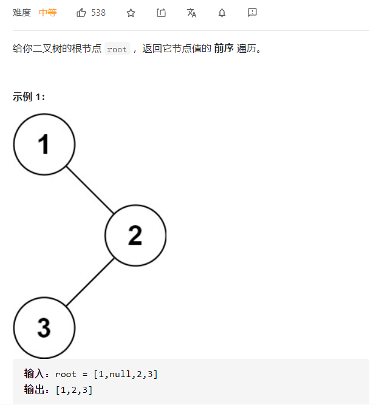
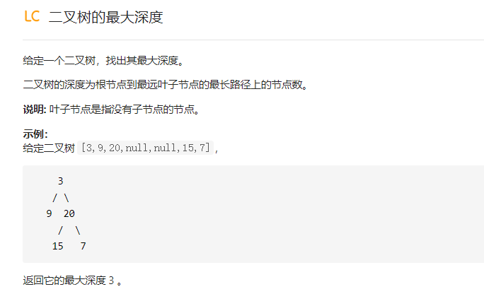

# 树

## 二叉树的遍历

### 前序遍历



解答：1、递归：

```java
/**
 * Definition for a binary tree node.
 * public class TreeNode {
 *     int val;
 *     TreeNode left;
 *     TreeNode right;
 *     TreeNode() {}
 *     TreeNode(int val) { this.val = val; }
 *     TreeNode(int val, TreeNode left, TreeNode right) {
 *         this.val = val;
 *         this.left = left;
 *         this.right = right;
 *     }
 * }
 */
class Solution {
    public List<Integer> preorderTraversal(TreeNode root) {
        List<Integer> result = new ArrayList<>();
        help(root,result);
        return result;
    }

    private void  help(TreeNode node,List<Integer> list){
        if(node==null){
            return;
        }
        list.add(node.val);
        help(node.left,list);
        help(node.right,list);
    }
}
```

2、迭代：

```java
class Solution {
    public List<Integer> preorderTraversal(TreeNode root) {
        List<Integer> result = new ArrayList<>();
        if(root==null){
            return result;
        }
        Deque<TreeNode> stack = new LinkedList<>();
        stack.push(root);
        while(!stack.isEmpty()){
            TreeNode temp = stack.pop();
            result.add(temp.val);
            if(temp.right!=null){
                stack.push(temp.right);
            }
            if(temp.left!=null){
                stack.push(temp.left);
            }
        }
        return result;

    }
}
```

迭代2：模拟递归的思路

```java
class Solution {
     public List<Integer> preorderTraversal(TreeNode root) {
        List<Integer> list = new ArrayList<>();
        if (root == null) {
            return list;
        }
        Deque<TreeNode> stack = new LinkedList<>();
        TreeNode node = root;
        while (!stack.isEmpty() || node != null) {
            while (node!=null){
                list.add(node.val);
                stack.push(node);
                node = node.left;
            }
            node = stack.pop();
            node = node.right;
        }
        return list;
    }
}
```


### 中序遍历 

递归：

```java
/**
 * Definition for a binary tree node.
 * public class TreeNode {
 *     int val;
 *     TreeNode left;
 *     TreeNode right;
 *     TreeNode() {}
 *     TreeNode(int val) { this.val = val; }
 *     TreeNode(int val, TreeNode left, TreeNode right) {
 *         this.val = val;
 *         this.left = left;
 *         this.right = right;
 *     }
 * }
 */
class Solution {
    public List<Integer> inorderTraversal(TreeNode root) {
   List<Integer> result = new ArrayList<>();
        help(root,result);
        return result;
    }

    private void  help(TreeNode node,List<Integer> list){
        if(node==null){
            return;
        }
        help(node.left,list);
        list.add(node.val);
        help(node.right,list);
    }
}
```

迭代：模拟递归，和前序遍历类似，只需改动一个位置

```java
class Solution {
       public List<Integer> inorderTraversal(TreeNode root) {
        List<Integer> list = new ArrayList<>();
        if (root == null) {
            return list;
        }
        Deque<TreeNode> stack = new LinkedList<>();
        TreeNode node = root;
        while (!stack.isEmpty() || node != null) {
            while (node != null) {
                stack.push(node);
                node = node.left;
            }
            node = stack.pop();
            list.add(node.val);
            node = node.right;
        }
        return list;
    }
}
```

### 后序遍历

1、递归

```java
class Solution {
    public List<Integer> postorderTraversal(TreeNode root) {
   List<Integer> result = new ArrayList<>();
        help(root,result);
        return result;
    }

    private void  help(TreeNode node,List<Integer> list){
        if(node==null){
            return;
        }
        help(node.left,list);
        help(node.right,list);
        list.add(node.val);
    }
}
```

2、迭代1：和前序遍历的迭代1方法类似

```java
/**
 * Definition for a binary tree node.
 * public class TreeNode {
 *     int val;
 *     TreeNode left;
 *     TreeNode right;
 *     TreeNode() {}
 *     TreeNode(int val) { this.val = val; }
 *     TreeNode(int val, TreeNode left, TreeNode right) {
 *         this.val = val;
 *         this.left = left;
 *         this.right = right;
 *     }
 * }
 */
class Solution {
       public List<Integer> postorderTraversal(TreeNode root) {
        LinkedList<Integer> list = new LinkedList<>();
        if (root == null) {
            return list;
        }
        Deque<TreeNode> stack = new LinkedList<>();
        stack.push(root);
        while (!stack.isEmpty()) {
            TreeNode node = stack.pop();
            list.addFirst(node.val);
            if (node.left!=null){
                stack.push(node.left);
            }
            if (node.right!=null){
                stack.push(node.right);
            }
        }
        return list;
    }
}
```

迭代2：模拟栈，感觉不太好理解。preNode作用是，root往回退的时候，暂存下这个值

```java
/**
 * Definition for a binary tree node.
 * public class TreeNode {
 *     int val;
 *     TreeNode left;
 *     TreeNode right;
 *     TreeNode() {}
 *     TreeNode(int val) { this.val = val; }
 *     TreeNode(int val, TreeNode left, TreeNode right) {
 *         this.val = val;
 *         this.left = left;
 *         this.right = right;
 *     }
 * }
 */
class Solution {
        public List<Integer> postorderTraversal(TreeNode root) {
        LinkedList<Integer> list = new LinkedList<>();
        if (root == null) {
            return list;
        }
        Deque<TreeNode> stack = new LinkedList<>();
        TreeNode preNode = null;
        while (!stack.isEmpty() || root != null) {
            while (root != null) {
                stack.push(root);
                root = root.left;
            }
            root = stack.pop();
            if (root.right == null||root.right==preNode) {
                list.add(root.val);
                preNode = root;
                root = null;
            } else {
                stack.push(root);
                root = root.right;
            }
        }
        return list;
    }
}
```

### 莫里斯遍历


### 层序遍历

层序遍历借助队列。

```java
class Solution {
      public List<List<Integer>> levelOrder(TreeNode root) {
        List<List<Integer>> result = new ArrayList<>();
        if (root == null) {
            return result;
        }
        Queue<TreeNode> queue = new LinkedList<>();
        queue.offer(root);
        while (!queue.isEmpty()) {
            int size = queue.size();
            List<Integer> tempList = new ArrayList<>();
            for (int i = 0; i < size; i++) {
                TreeNode node = queue.poll();
                tempList.add(node.val);
                if (node.left != null) {
                    queue.offer(node.left);
                }
                if (node.right != null) {
                    queue.offer(node.right);
                }
            }
            result.add(tempList);
        }
        return result;
    }
}
```

## 递归

解决树的问题常常可以用递归的方式。


### 二叉树的最大深度



递归方式1：类似于前序遍历。

```
1、null则返回特殊值
2、处理结果
3、递归左孩子
4、递归右孩子
5、返回结果
```


```java
class Solution {
    int result= 0;
    public int maxDepth(TreeNode root) {
        help(root, 1);
        return result;
    }


    private void help(TreeNode root, int depth) {
        //处理null值
        if (root == null) {
            return;
        }
        //更新结果集
        if (root.left == null && root.right == null) {
            result = Math.max(depth, result);
        }
        //处理左孩子
        help(root.left, depth + 1);
        //处理右孩子
        help(root.right, depth + 1);
    }
}
```

递归方式2：

```
1、null，return一个特殊值
2、递归处理左孩子
3、递归处理右孩子
4、return 结果,根据左孩子、右孩子和当前节点综合处理返回
```

```java
public int maximum_depth(TreeNode root) {
    //处理null值，return
	if (root == null) {
		return 0;                                  
	}
    //递归处理左孩子
	int left_depth = maximum_depth(root.left);
    //递归处理右孩子
	int right_depth = maximum_depth(root.right);
    //更新、return结果
	return Math.max(left_depth, right_depth) + 1;	
}
```

