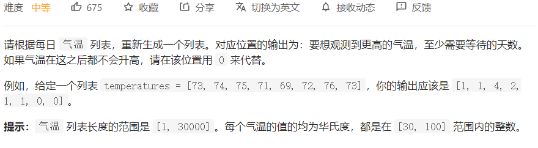

# leetcode 最热100题

刷题是不可能刷题的，这辈子都不可能刷题的，看也看不懂，学也学不会，只能靠着题解区大佬的解答才能维持得了生活的样子，里面个个都是人才，代码写的秀，我超喜欢这里的！

## 739.每日温度



大概意思：找数组里面每个数字后面第一个比他大的数字距离他的距离，没有则置为0.

解法：单调栈。找数组中距离某个值左侧/右侧第一个比他大/小的值之间的距离这种，可考虑单调栈。类似lc84题。

维护一个单调递减的栈，栈中存放元素的下标：

1、栈为空，直接入栈；

2、栈不为空，比较当前值与栈顶下标对应值的大小：

若小于栈顶值则入栈当前元素的下标。

大于栈顶值，则栈顶元素出栈，下标之差即为第一个比栈顶元素大的值距离栈顶元素的距离。

java：

```java
class Solution {
    public int[] dailyTemperatures(int[] T) {
        //单调栈
        Deque<Integer> stack = new LinkedList<>();
        int[] res = new int[T.length];
        //遍历数组
        for(int i=0;i<T.length;i++){
            //拿到当前元素
            int currentTemperature = T[i];
            //栈不为空且栈顶下标指向值小于当前值
            while(stack.size()!=0 && T[stack.peek()]<currentTemperature){
                //出栈并计算栈顶元素的距离差
                int temp = stack.pop();
                res[temp] = i - temp;
            }
            //其他情况则直接入栈
            stack.push(i);
        }
        return res;
    }
}
```

