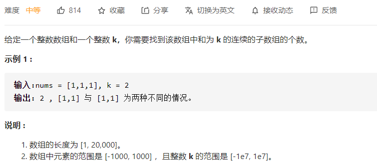

# leetcode

刷题是不可能刷题的，这辈子都不可能刷题的，看也看不懂，学也学不会，只能靠着题解区大佬的解答才能维持得了生活的样子，里面个个都是人才，代码写的秀，讲解说的透，我超喜欢这里的！

## leetcode 最热100题

### 739.每日温度


题意：找数组里面每个数字后面第一个比他大的数字距离他的距离，没有则置为0.

解法：单调栈。找数组中距离某个值左侧/右侧第一个比他大/小的值之间的距离这种，可考虑单调栈。类似lc84题。

维护一个单调递减的栈，栈中存放元素的下标：

1、栈为空，直接入栈；

2、栈不为空，比较当前值与栈顶下标对应值的大小：

若小于栈顶值则入栈当前元素的下标。

大于栈顶值，则栈顶元素出栈，下标之差即为第一个比栈顶元素大的值距离栈顶元素的距离。

java：

```java
class Solution {
    public int[] dailyTemperatures(int[] T) {
        //单调栈
        Deque<Integer> stack = new LinkedList<>();
        int[] res = new int[T.length];
        //遍历数组
        for(int i=0;i<T.length;i++){
            //拿到当前元素
            int currentTemperature = T[i];
            //栈不为空且栈顶下标指向值小于当前值
            while(stack.size()!=0 && T[stack.peek()]<currentTemperature){
                //出栈并计算栈顶元素的距离差
                int temp = stack.pop();
                res[temp] = i - temp;
            }
            //其他情况则直接入栈
            stack.push(i);
        }
        return res;
    }
}
```

### 647.回文子串


题意：计算一个子串中有多少回文子串。

解法：中心扩展法，和lc第5题 求解最长回文子串类似。

解1：串长分为奇数和偶数两种情况，中心点是不一样的，可能为1个，也可能是2个，所以直接计算两次。

```java
class Solution {
    int result = 0;

    public int countSubstrings(String s) {
        //遍历字符串，分别计算奇数、偶数两种情况，
        for (int i = 0; i < s.length(); i++) {
            //奇数中心点只有一个，也即left、right初始位置重合
            help(i, i, s);
            //偶数中心点有两个，left和right相邻
            help(i, i + 1, s);
        }
        return result;
    }

    public void help(int left, int right, String s) {
        while (left >= 0 && right < s.length() && s.charAt(left) == s.charAt(right)) {
            result++;
            left--;
            right++;
        }
    }
}
```

解2：之所以要分为奇数和偶数，就是因为串长不同，会导致左右指针的初始位置不同，如果考虑把字母之间的间隙考虑进去，如果中心点是字母之间的空格，看一下左右指针的初始位置。中心点位置为center，左指针为left，右指针为right，则

| center | left | right |
| ------ | ---- | ----- |
| 0      | 0    | 0     |
| 1      | 0    | 1     |
| 2      | 1    | 1     |
| 3      | 1    | 2     |
| 4      | 2    | 2     |
| 5      | 2    | 3     |
| 6      | 3    | 3     |

带上字母之间的间隙，center一共有2n-1个遍历位置。

很直观的结论  ： left = center/2，right = center-center/2;

Java:

```java
class Solution {
    public int countSubstrings(String s) {
        int n = s.length();
        int left = 0, right = 0, result = 0;
        //center从0~2n-1遍历
        for (int center = 0; center <= 2 * n - 1; center++) {
            //初始化left 和 right指针
            left = center / 2;
            right = center - left;
            //判断是否已到边界&&是否是回文串,更新结果
            while (left >= 0 && right < n && s.charAt(left) == s.charAt(right)) {
                result++;
                left--;
                right++;
            }
        }
        return result;
    }
}
```

### 621.任务调度器


题意：给了不同的任务，任务如何排列花费时间最少，相同的任务在执行时候有冷却时间的限制，比如执行了任务A，那么下一次执行A之前，必须等待足够N的时间，才能够再次A类型的任务。

解答：给了三个实例，看完后感觉就是，应该选择多个不同的任务(也即新选择的任务尽可能不在冷却时间中)来回切换，并且切换的任务数不大于冷却时间最好(为了给之后的任务尽可能多的提供来回切换的机会)。为了达成这个条件，每次选择的就应该是不在冷却中、并且剩余最多的任务。

所以应该选出数量最多的任务进行分组，每个组的大小应该为冷却时间+1，这样第一组执行完，轮到第二组的时候，数量最多的任务刚刚好冷却完毕。然后将剩余任务依次放入分组中即可。这样，只需要计算最后一个分组有多少个元素，就可以得到最短时间了。

解析中的桶思想和这个差不多。


$$
(maxTimes-1)*(n+1)+maxCount
$$
如果冷却时间足够短，任务种类足够多，上面的公式计算式错误的，例如冷却时间1秒，任务为5A 4B 3C，按照公式计算的结果是 (5-1)*2+1=9,实际值应该就是任务的个数，也即是12. 所以最终应该计算两者，并取较大的值作为正确结果。

```java
class Solution {
    public int leastInterval(char[] tasks, int n) {
        int[] taskNumArr = new int[26];
        //统计26中任务出现的次数
        for (char cr : tasks) {
            taskNumArr[cr - 'A']++;
        }
        //排序
        Arrays.sort(taskNumArr);
        //最大次数在末尾，也即maxTimes，并计算和它值相等的任务种类
        //也即maxCount，最后一个分组的任务个数
        int maxTimes = taskNumArr[taskNumArr.length - 1];
        int maxCount = 1;
        for (int i = taskNumArr.length - 2; i > 0; i--) {
            if (taskNumArr[i] == maxTimes) {
                maxCount++;
            } else {
                break;
            }
        }
        return Math.max(tasks.length, (maxTimes - 1) * (n + 1) + maxCount);
    }
}
```

### 617.合并二叉树


题意：合并二叉树。。对应位置值合并，构建一个新的二叉树。

递归

```java
class Solution {
    public TreeNode mergeTrees(TreeNode root1, TreeNode root2) {
        //如果有一个为null，直接连接剩下的树
        if (root1 == null) {
            return root2;
        }
        if (root2 == null) {
            return root1;
        }
        //递归构建二叉树
        TreeNode treeNode = new TreeNode(root1.val + root2.val);
        treeNode.left = mergeTrees(root1.left, root2.left);
        treeNode.right = mergeTrees(root1.right, root2.right);
        return treeNode;
    }
}
```


迭代，层序遍历，

广度优先遍历(层序)用队列，深度优先遍历(前中后序)用栈。

```java
class Solution {
    public TreeNode mergeTrees(TreeNode root1, TreeNode root2) {
        if (root1 == null) {
            return root2;
        }
        if (root2 == null) {
            return root1;
        }
        //层序遍历的方式，用队列
        Queue<TreeNode> queueRes = new LinkedList<>();
        Queue<TreeNode> rootQueue1 = new LinkedList<>();
        Queue<TreeNode> rootQueue2 = new LinkedList<>();
        //初始化，从根节点开始
        TreeNode res = new TreeNode(root1.val + root2.val);
        queueRes.offer(res);
        rootQueue1.offer(root1);
        rootQueue2.offer(root2);
        //两棵树的队列均不为空
        //若有一个队列为空，则说明其中某个树已经完全遍历完成，另一棵树余下的子节点已经直接连接到合并树上了，不需要再计算
        while (rootQueue1.size() != 0 && rootQueue2.size() != 0) {
            //3队列头元素出队
            TreeNode treeNode1 = rootQueue1.poll();
            TreeNode treeNode2 = rootQueue2.poll();
            TreeNode resNode = queueRes.poll();
            //拿到左右子节点
            TreeNode left1 = treeNode1.left;
            TreeNode left2 = treeNode2.left;
            TreeNode right1 = treeNode1.right;
            TreeNode right2 = treeNode2.right;
            //如果左孩子均不为空，则新建节点并入队，同时，两个左节点也各自入队
            if (left1 != null && left2 != null) {
                TreeNode left = new TreeNode(left1.val + left2.val);
                resNode.left = left;
                queueRes.offer(left);
                rootQueue1.offer(left1);
                rootQueue2.offer(left2);
             //若有一个为null，则直接将余下的节点连接起来即可
            } else if (left1 == null) {
                resNode.left = left2;
            } else {
                resNode.left = left1;
            }
            //右孩子同理
            if (right1 != null && right2 != null) {
                TreeNode right = new TreeNode(right1.val + right2.val);
                resNode.right = right;
                queueRes.offer(right);
                rootQueue1.offer(right1);
                rootQueue2.offer(right2);
            } else if (right1 == null) {
                resNode.right = right2;
            } else {
                resNode.right = right1;
            }
        }
        return res;
    }
}
```

### 581.最短无需连续子数组


解答1：将数组排序，然后比照着原数组，左边第一个不同的元素和右边第一个不同的元素，它们的差就是所求。

```java
class Solution {
    public int findUnsortedSubarray(int[] nums) {
        int[] tempArr = nums.clone();
        //排序
        Arrays.sort(tempArr);
        //初始化值left应该在最右侧，right应该在最左侧
        //考虑下数组整体逆序的情况
        int left =nums.length - 1;
        int right = 0;
        //比较位置的不同
        for (int i = 0; i < nums.length; i++) {
            if (nums[i] != tempArr[i]) {
                left = i;
                break;
            }
        }
        for (int i = nums.length - 1; i >= 0; i--) {
            if (nums[i] != tempArr[i]) {
                right = i;
                break;
            }
        }
        //差值+1即为所求
        return right - left > 0 ? right - left + 1 : 0;
    }
}
```

解答2：其实就是寻找数组里面所有逆序子数组中最大和最小的元素，然后寻找他们在原数组应该放置的正确的位置。

```java
class Solution {
    public int findUnsortedSubarray(int[] nums) {
        int min = Integer.MAX_VALUE;
        int max = Integer.MIN_VALUE;
        //寻找所有 *逆序* 子数组中的最大值和最小值 
        for (int i = 0; i < nums.length - 1; i++) {
            if (nums[i] > nums[i + 1]) {
                min = Math.min(min, nums[i + 1]);
                max = Math.max(max, nums[i]);
            }
        }
        int left = 0;
        int right = 0;
        //从左向左找第一个大于逆序子数组最小值的元素位置。
        //(其实就是将数组排序，然后把逆序子数组的最小值放到它应该放的位置)
        for (int i = 0; i < nums.length; i++) {
            if (nums[i] > min) {
                left = i;
                break;
            }
        }
        //从右向左寻找第一个小于逆序子数组最大值的元素(原理同上)
        for (int i = nums.length - 1; i >= 0; i--) {
            if (nums[i] < max) {
                right = i;
                break;
            }
        }
        return right - left > 0 ? right - left + 1 : 0;
    }
}
```

### 560.和为K的子数组



解答1：暴力法。

外循环从0遍历到数组末尾，内循环以外层循环当前值为数组的头，累计计算所有可能的子数组的和。

```java
class Solution {
    public int subarraySum(int[] nums, int k) {
        int count = 0;
        for (int i = 0; i < nums.length; i++) {
            int sum = 0;
            for (int start = i; start <= nums.length - 1; start++) {
                sum += nums[start];
                if (sum == k) {
                    count++;
                }
            }
        }
        return count;
    }
}
```

解答2：前缀和+哈希

暴力法中数组的和的计算方式可以优化，不必每次都从一个数开始，逐个数相加。

子数组 [ i, j] 的和可以通过前缀和直接计算：
$$
Sum(i,j) = preSum[j]-preSum[i-1]
$$

```java
class Solution {
    public int subarraySum(int[] nums, int k) {
    //    Strin
        int pre = 0;
        Map<Integer, Integer> map = new HashMap<>();
        map.put(0, 1);
        int count = 0;
        for (int i = 0; i < nums.length; i++) {
            pre += nums[i];
            if (map.containsKey(pre - k)) {
                count += map.get(pre - k);
            }
            map.put(pre, 1 + map.getOrDefault(pre, 0));
        }
        return count;
    }
}
```

