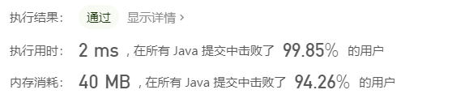
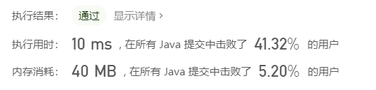
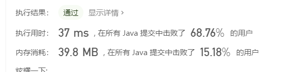
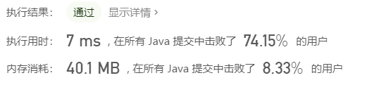
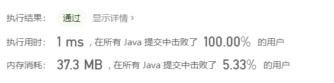
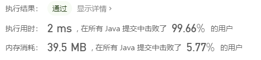
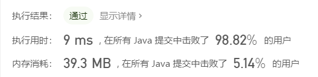
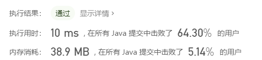

# 前言

从19年7月到20年6月，陆陆续续刷了200个lc了，四非渣渣，刚开始工作也不能分出太多时间刷题，而且好多题目的答案我看都看不懂，进度很慢。现在做题也能有一点点感觉，但是之前刷题基本都是想都不想直接去题解区读答案，把答案看懂了之后这题就算过了，也没好好再思考着写一遍，这一遍下来感觉效果很差，现在让我做这前200个题，有种一看就知道思路，一在白板上写大脑就一片空白的感觉。准备二刷，这次哪怕看了答案也还是应该自己能白板AC出来才能算ok，这次不求最优解，能白板写出来AC就行

# 1.两数之和(easy)

1、以数组的值为key，值的索引为value建立哈希表

2、遍历数组，用目标值减去当前元素，看看差值在不在哈希表里面

3、如果在哈希表中，且当前元素索引和差值索引不等，就返回这两个元素的索引。

```java
class Solution {
    public int[] twoSum(int[] nums, int target) {
        //哈希表
        Map<Integer, Integer> map = new HashMap<>();
        //以数组的值为key，值的索引为value建立哈希表
        for (int i = 0; i < nums.length; i++) {
            map.put(nums[i], i);
        }
        //遍历数组，用目标值减去当前元素，看看差值在不在哈希表里面
        for (int i = 0; i < nums.length; i++) {
            int temp = target - nums[i];
            //要求同样元素不能用两次，所以要加上判断，差值的索引和当前元素索引不能相同
            if (map.containsKey(temp) && map.get(temp) != i) {
                return new int[]{i, map.get(temp)};
            }
        }
        return new int[]{};
    
    }
}
```

时间复杂度O(n)

空间复杂度O(n)


# 2.两数相加(medium)

以逆序的方式存储，那么就遍历两条链表，逐位相加就行，进位 sum/10，当前位的值 sum%10。计算完成后如果进位为1，那么需要多new一个节点。

```java
    public ListNode addTwoNumbers(ListNode node1, ListNode node2) {
        //哑结点，用于记录链表头的位置
        ListNode dummy = new ListNode(-1);
        //用于结果链表的遍历
        ListNode head = dummy;
        //存储进位
        int carry = 0;
        //两条链表都遍历完为退出条件
        while (node1 != null || node2 != null) {
            //如果某条链表先遍历完，以0为值参加运算，可以简化代码
            int node1Val = node1==null?0:node1.val;
            int node2Val = node2==null?0:node2.val;
            int sum = node1Val + node2Val + carry;
            //当前位
            int value = sum % 10;
            //进位值
            carry = sum / 10;
            //新建节点，插入结果链表尾部
            ListNode temp = new ListNode(value);
            head.next = temp;
            head = head.next;
            if (node1!= null) {
                node1 = node1.next;
            }
            if (node2!= null) {
                node2 = node2.next;
            }
        
        }
        //最后一位计算如果有进位，需要多new一个节点
        if (carry == 1) {
            ListNode temp = new ListNode(carry);
            head.next = temp;
        }
        return dummy.next;
    }
```

时间复杂度O(m+n)

空间复杂度O(m+n)




# 3.无重复字符的最长子串(medium)

滑动窗口：使用两个指针，构建一个窗口，遇到不在窗口里的元素时，添加进来，窗口右侧向右移动。遇到已经在窗口中的元素时候，窗口最左侧元素移出，窗口左侧向右侧移动，一直到窗口中不包含重复元素为止。

```java
public class Solution {
    public int lengthOfLongestSubstring(String s) {
        //判断窗口中是否有重复元素
        Set<Character> set = new HashSet<>();
        int left = 0, right = 0, maxLength = 0;
        while (right < s.length()) {
            //遇到重复元素就缩小窗口
            if (set.contains(s.charAt(right))) {
                set.remove(s.charAt(left));
                left++;
                //遇到不在窗口中的元素就扩大窗口
            } else {
                set.add(s.charAt(right));
                maxLength = Math.max(maxLength, right - left + 1);
                right++;
            }
        }
        return maxLength;
    }
}
```



时间复杂度O(n)

空间复杂度O(n)

可以用HashMap优化，哈希表中记录字符和该字符的索引位，在遇到重复元素的时候，左侧不再一次只移动一位，而是跳跃到哈希表中记录该字符索引位，这里需要判断一下，左侧窗口只能向右移动不能往左移动，例如abba,在遇到第二个a时候，如果直接按照哈希表记录位置跳跃，左侧窗口就会跳到初始位置了。

```java
public class Solution{
    public int lengthOfLongestSubstring(String s){
        int n=s.length(),ans=0;
        //用于记录不重复元素中每个元素第一次出现的位置
        Map<Character,Integer> map=new HashMap<>();
        //滑动窗口，每次遍历都会移动窗口的右边缘，进行j++操作
        for(int j=0,i=0;j<n;j++){
            //如果包含了这个元素
            if(map.containsKey(s.charAt(j))){
                //窗口左边缘i直接跳跃到这个已记录元素的位置的下一位
                //注意，这里不能往回跳，所以遇到记录索引在做窗口左侧的时候，保持左侧窗口不动，等待右侧窗口更新哈希表，在下次循环中再跳跃
                i=Math.max(map.get(s.charAt(j))+1,i);
            }
            //更新最大值
            ans=Math.max(ans,j-i+1);
            //将这个当前位置的元素加入map中,如果该元素已存在，那么会更新这个元素的索引
            map.put(s.charAt(j),j);
        }
        return ans;
    }
}
```


# 4.两个排序数组的中位数(困难)

将两个数组合并，然后直接找中位数。

```java
class Solution {
   public double findMedianSortedArrays(int[] nums1, int[] nums2) {
      if (nums1 == null || nums1.length == 0) {
            if (nums2.length % 2 == 0) {
                return (nums2[nums2.length / 2 - 1] + nums2[nums2.length / 2]) / 2.0;
            } else {
                return nums2[nums2.length / 2];
            }
        }
        if (nums2 == null || nums2.length == 0) {
            if (nums1.length % 2 == 0) {
                return (nums1[nums1.length / 2 - 1] + nums1[nums1.length / 2]) / 2.0;
            } else {
                return nums1[nums1.length / 2];
            }
        }
        int[] total = new int[nums1.length + nums2.length];
        int index1 = 0, index2 = 0, index = 0;
        while (index1 < nums1.length && index2 < nums2.length) {
            if (nums1[index1] < nums2[index2]) {
                total[index] = nums1[index1];
                index++;
                index1++;
            } else {
                total[index] = nums2[index2];
                index++;
                index2++;
            }
        }
        while (index1 < nums1.length) {
            total[index] = nums1[index1];
            index++;
            index1++;
        }
        while (index2 < nums2.length) {
            total[index] = nums2[index2];
            index++;
            index2++;
        }

        if (total.length % 2 == 0) {
            return (total[total.length / 2 - 1] + total[total.length / 2]) / 2.0;
        } else {
            return total[total.length / 2];
        }
}
}
```


时间复杂度O(m+n)

空间复杂度O(m+n)

可以优化一下，只遍历到（m+n)/2;只记录中位数的两个值，不再真的合并数组，可以将空间复杂度降低到O(1)，但是时间复杂度降不下去了。

仰望下大佬的解答：[详细通俗解释，多解法](https://leetcode-cn.com/problems/median-of-two-sorted-arrays/solution/xiang-xi-tong-su-de-si-lu-fen-xi-duo-jie-fa-by-w-2/)，解法3和解法4很巧妙。

解法3：比较两个数组的中位数，直接舍去中位数较小的数组的前半部分。

```java
class Solution {
   public double findMedianSortedArrays(int[] nums1, int[] nums2) {
        int n = nums1.length;
        int m = nums2.length;
        int left = (n + m + 1) / 2;
        int right = (n + m + 2) / 2;
       //合并奇数和偶数的情况
        return (getKth(nums1, 0, n - 1, nums2, 0, m - 1, left) + getKth(nums1, 0, n - 1, nums2, 0, m - 1, right)) / 2.0;

    }

    private double getKth(int[] nums1, int start1, int end1, int[] nums2, int start2, int end2, int k) {
        //本次待比较的两个数组片段的长度
        int len1 = end1-start1+1;
        int len2 = end2-start2+1;
        //始终让数组1是小数组
        if (len1>len2){
            return getKth(nums2,start2,end2,nums1,start1,end1,k);
        }
        //len1为0，只需返回nums2对应的第k位即可。
        if (len1==0){
            return nums2[start2+k-1];
        }
        //就是比较当前两个指针指向的元素中较小的一个，求第1个最小的元素。。
        if (k==1){
            return Math.min(nums1[start1], nums2[start2]);
        }
        int i = start1+Math.min(len1,k/2)-1;
        int j = start2+Math.min(len2,k/2)-1;
        //将中位数小的数组的前半部分舍去
        if (nums1[i]>nums2[j]){
            return getKth(nums1,start1,end1,nums2,j+1,end2,k-(j-start2+1));
        }else {
            return getKth(nums1,i+1,end1,nums2,start2,end2,k-(i-start1+1));
        }
    }
}
```

所有递归都是尾递归

时间复杂度 O(log(m+n))

空间复杂度  O(1)

# 5.最长回文子串

从中心向两边扩散，分奇数/偶数两种情况。

```java
public class Solution {

    int maxLength = 0;
    String subStr = "";

    public String longestPalindrome(String s) {
        if (s == null || s.length() <= 1) {
            return s;
        }
        for (int i = 0; i < s.length() - 1; i++) {
            findLongestPalindrome(s, i, i);
            findLongestPalindrome(s, i, i + 1);
        }
        return subStr;
    }

    private void findLongestPalindrome(String s, int left, int right) {
        while (left >= 0 && right <= s.length() - 1) {
            if (s.charAt(left) == s.charAt(right)) {
                if (right - left + 1 > maxLength) {
                    maxLength = right - left + 1;
                    subStr = s.substring(left, right + 1);
                }
                left--;
                right++;
            } else {
                break;
            }
        }
    }

}
```

时间复杂度 O(n2)

空间复杂度O(n)



最优解法是马拉车算法。我还没理解，有待学习。。

# 6.Z字形变换

先从上往下，在从下往上，在到达边界时候转换方向，用一个flag作为增量，到达边界时候flag=-flag即可。

```java
 public String convert(String s, int numRows) {
        if (s.length()<2||numRows<2){
            return s;
        }
        List<StringBuilder> list = new ArrayList<>();
        for (int i = 0; i < numRows; i++) {
            list.add(new StringBuilder());
        }
        int level = 0;
        int flag = 1;
        for (int i = 0; i < s.length(); i++) {
            list.get(level).append(s.charAt(i));
            level += flag;
            if (level == 0 || level == numRows - 1) {
                flag = -flag;
            }
        }
        StringBuilder sb = new StringBuilder();
        for (int i = 0; i < numRows; i++) {
            sb.append(list.get(i));
        }
        return sb.toString();
    }
```

时间复杂度 O(n)

空间复杂度O(n)




# 7.整数反转

逐位反转，在Integer.MAX_VALUE/10、Integer.MIN_VALUE/10 附近进行一下判断，看下次相加的和会不会越界。

```java
class Solution {
    public int reverse(int x) {
       int res = 0;
        while (x != 0) {
            int temp = x % 10;
            if (x > 0 && res > Integer.MAX_VALUE / 10 || (res == Integer.MAX_VALUE / 10 &&temp > (Integer.MAX_VALUE % 10))) {
                return 0;
            }
            if (x < 0 && res < Integer.MIN_VALUE / 10 || (res == Integer.MIN_VALUE / 10 &&temp < (Integer.MIN_VALUE % 10))) {
                return 0;
            }
            res = res * 10 + temp;
            x = x / 10;
        }
        return res;
    }
}
```

时间复杂度O(n)

空间复杂度O(1)。



# 8. 字符串转换整数 

注意下细节就好。

```java
class Solution {
     public int myAtoi(String str) {
        //空串
        if (str == null || str.length() == 0) {
            return 0;
        }
        //去掉开头的空格
        int i = 0;
         while (i<str.length()&&str.charAt(i) == ' ') {
            i++;
        }
        String subStr = str.substring(i);
         //去掉空格后如果变成了空串
        if ("".equals(subStr)) {
            return 0;
        }
         //flag用于标记是正数还是负数
        int flag = 1;
         //sign用于记录是否有正负号
        boolean sign = false;
         //第一位是不是符号位
        if (subStr.charAt(0) > '9' || subStr.charAt(0) < '0') {
            if (subStr.charAt(0) != '-' && subStr.charAt(0) != '+') {
                return 0;
            }
            if (subStr.charAt(0) == '-') {
                flag = -1;
                sign = true;
            }
            if (subStr.charAt(0) == '+') {
                sign = true;
            }
        }
         //res记录结果
        int res = 0;
         //第一位如果是符号位，在循环中跳过第一位。
        for (int j = sign ? 1 : 0; j < subStr.length(); j++) {
            //遇到不是0~9的字符，结束循环
            if (subStr.charAt(j) > '9' || subStr.charAt(j) < '0') {
                break;
            }
            int temp = subStr.charAt(j) - '0';
            //因为跳过了符号位，所以都是正数
            if (res > Integer.MAX_VALUE / 10 || (res == Integer.MAX_VALUE / 10 && temp > (Integer.MAX_VALUE % 10))) {
                //如果越界，按照符号位返回上限或者下限
                return flag == 1 ? Integer.MAX_VALUE : Integer.MIN_VALUE;
            }
            //不越界的情况下，正常计算
            res = res * 10 + temp;
        }
         //返回的结果要带上符号位
        return res * flag;

    }
}
```



# 9.回文数

可以反转整数后判断等不等。


```java
class Solution {
    public boolean isPalindrome(int x) {
        //负数都不是回文数
        if (x < 0) {
            return false;
        }
        int temp=x;
        int res = 0;
        while (temp != 0) {
            res = res * 10 + temp % 10;
            temp /= 10;
        }
        return res == x;
    }

}
```



或者先判断这是个几位数，然后取出头和尾逐个判断，

```java
    public boolean isPalindrome(int x) {
        //负数都不是回文数
        if (x < 0) {
            return false;
        }
        int temp = x;
        //num记录x的最高位的权重,10/100/1000...
        int num = 1;
        while (temp >= 10) {
            temp /= 10;
            num *= 10;
        }
        int head = 0;
        int tail = 0;
        while (x > 0) {
            //头
            head = x / num;
            //尾
            tail = x % 10;
            if (head != tail) {
                return false;
            }
            //去掉最高位
            x = x % num;
            //去掉最低位
            x = x / 10;
            //更新最高位的权重
            num=num/100;
        }
        return true;
    }
```




# 10.正则表达式匹配

动态规划，不太擅长，参考：[大白话讲解动态规划](https://leetcode-cn.com/problems/regular-expression-matching/solution/dong-tai-gui-hua-zen-yao-cong-0kai-shi-si-kao-da-b/) 思路按照这个讲解来。

