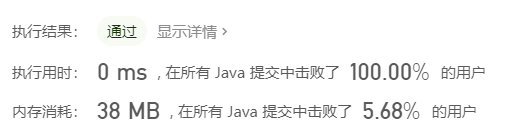
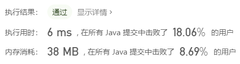
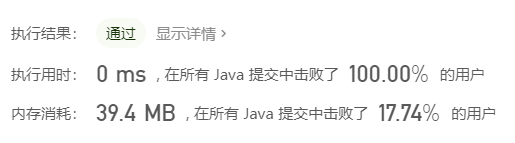
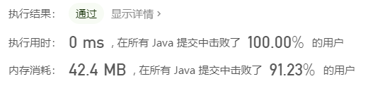
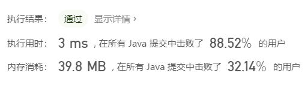
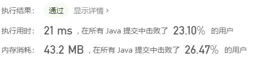
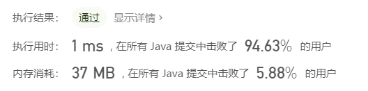

[toc]

# 前言

从19年7月到20年6月，陆陆续续刷了200个lc了，四非渣渣，刚开始工作也不能分出太多时间刷题，而且好多题目的答案我看都看不懂，进度很慢。现在做题也能有一点点感觉，但是之前刷题基本都是想都不想直接去题解区读答案，把答案看懂了之后这题就算过了，也没好好再思考着写一遍，这一遍下来感觉效果很差，现在让我做这前200个题，有种一看就知道思路，一在白板上写大脑就一片空白的感觉。准备二刷，这次哪怕看了答案也还是应该自己能白板AC出来才能算ok，这次不求最优解，能白板写出来AC就行

# 1.两数之和(easy)

1、以数组的值为key，值的索引为value建立哈希表

2、遍历数组，用目标值减去当前元素，看看差值在不在哈希表里面

3、如果在哈希表中，且当前元素索引和差值索引不等，就返回这两个元素的索引。

```java
class Solution {
    public int[] twoSum(int[] nums, int target) {
        //哈希表
        Map<Integer, Integer> map = new HashMap<>();
        //以数组的值为key，值的索引为value建立哈希表
        for (int i = 0; i < nums.length; i++) {
            map.put(nums[i], i);
        }
        //遍历数组，用目标值减去当前元素，看看差值在不在哈希表里面
        for (int i = 0; i < nums.length; i++) {
            int temp = target - nums[i];
            //要求同样元素不能用两次，所以要加上判断，差值的索引和当前元素索引不能相同
            if (map.containsKey(temp) && map.get(temp) != i) {
                return new int[]{i, map.get(temp)};
            }
        }
        return new int[]{};
    
    }
}
```

时间复杂度O(n)

空间复杂度O(n)


# 2.两数相加(medium)

以逆序的方式存储，那么就遍历两条链表，逐位相加就行，进位 sum/10，当前位的值 sum%10。计算完成后如果进位为1，那么需要多new一个节点。

```java
    public ListNode addTwoNumbers(ListNode node1, ListNode node2) {
        //哑结点，用于记录链表头的位置
        ListNode dummy = new ListNode(-1);
        //用于结果链表的遍历
        ListNode head = dummy;
        //存储进位
        int carry = 0;
        //两条链表都遍历完为退出条件
        while (node1 != null || node2 != null) {
            //如果某条链表先遍历完，以0为值参加运算，可以简化代码
            int node1Val = node1==null?0:node1.val;
            int node2Val = node2==null?0:node2.val;
            int sum = node1Val + node2Val + carry;
            //当前位
            int value = sum % 10;
            //进位值
            carry = sum / 10;
            //新建节点，插入结果链表尾部
            ListNode temp = new ListNode(value);
            head.next = temp;
            head = head.next;
            if (node1!= null) {
                node1 = node1.next;
            }
            if (node2!= null) {
                node2 = node2.next;
            }
        
        }
        //最后一位计算如果有进位，需要多new一个节点
        if (carry == 1) {
            ListNode temp = new ListNode(carry);
            head.next = temp;
        }
        return dummy.next;
    }
```

时间复杂度O(m+n)

空间复杂度O(m+n)


# 3.无重复字符的最长子串(medium)

滑动窗口：使用两个指针，构建一个窗口，遇到不在窗口里的元素时，添加进来，窗口右侧向右移动。遇到已经在窗口中的元素时候，窗口最左侧元素移出，窗口左侧向右侧移动，一直到窗口中不包含重复元素为止。

```java
public class Solution {
    public int lengthOfLongestSubstring(String s) {
        //判断窗口中是否有重复元素
        Set<Character> set = new HashSet<>();
        int left = 0, right = 0, maxLength = 0;
        while (right < s.length()) {
            //遇到重复元素就缩小窗口
            if (set.contains(s.charAt(right))) {
                set.remove(s.charAt(left));
                left++;
                //遇到不在窗口中的元素就扩大窗口
            } else {
                set.add(s.charAt(right));
                maxLength = Math.max(maxLength, right - left + 1);
                right++;
            }
        }
        return maxLength;
    }
}
```


时间复杂度O(n)

空间复杂度O(n)

可以用HashMap优化，哈希表中记录字符和该字符的索引位，在遇到重复元素的时候，左侧不再一次只移动一位，而是跳跃到哈希表中记录该字符索引位，这里需要判断一下，左侧窗口只能向右移动不能往左移动，例如abba,在遇到第二个a时候，如果直接按照哈希表记录位置跳跃，左侧窗口就会跳到初始位置了。

```java
public class Solution{
    public int lengthOfLongestSubstring(String s){
        int n=s.length(),ans=0;
        //用于记录不重复元素中每个元素第一次出现的位置
        Map<Character,Integer> map=new HashMap<>();
        //滑动窗口，每次遍历都会移动窗口的右边缘，进行j++操作
        for(int j=0,i=0;j<n;j++){
            //如果包含了这个元素
            if(map.containsKey(s.charAt(j))){
                //窗口左边缘i直接跳跃到这个已记录元素的位置的下一位
                //注意，这里不能往回跳，所以遇到记录索引在做窗口左侧的时候，保持左侧窗口不动，等待右侧窗口更新哈希表，在下次循环中再跳跃
                i=Math.max(map.get(s.charAt(j))+1,i);
            }
            //更新最大值
            ans=Math.max(ans,j-i+1);
            //将这个当前位置的元素加入map中,如果该元素已存在，那么会更新这个元素的索引
            map.put(s.charAt(j),j);
        }
        return ans;
    }
}
```


# 4.两个排序数组的中位数(hard)

将两个数组合并，然后直接找中位数。

```java
class Solution {
   public double findMedianSortedArrays(int[] nums1, int[] nums2) {
      if (nums1 == null || nums1.length == 0) {
            if (nums2.length % 2 == 0) {
                return (nums2[nums2.length / 2 - 1] + nums2[nums2.length / 2]) / 2.0;
            } else {
                return nums2[nums2.length / 2];
            }
        }
        if (nums2 == null || nums2.length == 0) {
            if (nums1.length % 2 == 0) {
                return (nums1[nums1.length / 2 - 1] + nums1[nums1.length / 2]) / 2.0;
            } else {
                return nums1[nums1.length / 2];
            }
        }
        int[] total = new int[nums1.length + nums2.length];
        int index1 = 0, index2 = 0, index = 0;
        while (index1 < nums1.length && index2 < nums2.length) {
            if (nums1[index1] < nums2[index2]) {
                total[index] = nums1[index1];
                index++;
                index1++;
            } else {
                total[index] = nums2[index2];
                index++;
                index2++;
            }
        }
        while (index1 < nums1.length) {
            total[index] = nums1[index1];
            index++;
            index1++;
        }
        while (index2 < nums2.length) {
            total[index] = nums2[index2];
            index++;
            index2++;
        }

        if (total.length % 2 == 0) {
            return (total[total.length / 2 - 1] + total[total.length / 2]) / 2.0;
        } else {
            return total[total.length / 2];
        }
}
}
```


时间复杂度O(m+n)

空间复杂度O(m+n)

可以优化一下，只遍历到（m+n)/2;只记录中位数的两个值，不再真的合并数组，可以将空间复杂度降低到O(1)，但是时间复杂度降不下去了。

仰望下大佬的解答：[详细通俗解释，多解法](https://leetcode-cn.com/problems/median-of-two-sorted-arrays/solution/xiang-xi-tong-su-de-si-lu-fen-xi-duo-jie-fa-by-w-2/)，解法3和解法4很巧妙。

解法3：比较两个数组的中位数，直接舍去中位数较小的数组的前半部分。

```java
class Solution {
   public double findMedianSortedArrays(int[] nums1, int[] nums2) {
        int n = nums1.length;
        int m = nums2.length;
        int left = (n + m + 1) / 2;
        int right = (n + m + 2) / 2;
       //合并奇数和偶数的情况
        return (getKth(nums1, 0, n - 1, nums2, 0, m - 1, left) + getKth(nums1, 0, n - 1, nums2, 0, m - 1, right)) / 2.0;

    }

    private double getKth(int[] nums1, int start1, int end1, int[] nums2, int start2, int end2, int k) {
        //本次待比较的两个数组片段的长度
        int len1 = end1-start1+1;
        int len2 = end2-start2+1;
        //始终让数组1是小数组
        if (len1>len2){
            return getKth(nums2,start2,end2,nums1,start1,end1,k);
        }
        //len1为0，只需返回nums2对应的第k位即可。
        if (len1==0){
            return nums2[start2+k-1];
        }
        //就是比较当前两个指针指向的元素中较小的一个，求第1个最小的元素。。
        if (k==1){
            return Math.min(nums1[start1], nums2[start2]);
        }
        int i = start1+Math.min(len1,k/2)-1;
        int j = start2+Math.min(len2,k/2)-1;
        //将中位数小的数组的前半部分舍去
        if (nums1[i]>nums2[j]){
            return getKth(nums1,start1,end1,nums2,j+1,end2,k-(j-start2+1));
        }else {
            return getKth(nums1,i+1,end1,nums2,start2,end2,k-(i-start1+1));
        }
    }
}
```

所有递归都是尾递归

时间复杂度 O(log(m+n))

空间复杂度  O(1)

# 5.最长回文子串

从中心向两边扩散，分奇数/偶数两种情况。

```java
public class Solution {

    int maxLength = 0;
    String subStr = "";

    public String longestPalindrome(String s) {
        if (s == null || s.length() <= 1) {
            return s;
        }
        for (int i = 0; i < s.length() - 1; i++) {
            findLongestPalindrome(s, i, i);
            findLongestPalindrome(s, i, i + 1);
        }
        return subStr;
    }

    private void findLongestPalindrome(String s, int left, int right) {
        while (left >= 0 && right <= s.length() - 1) {
            if (s.charAt(left) == s.charAt(right)) {
                if (right - left + 1 > maxLength) {
                    maxLength = right - left + 1;
                    subStr = s.substring(left, right + 1);
                }
                left--;
                right++;
            } else {
                break;
            }
        }
    }

}
```

时间复杂度 O(n2)

空间复杂度O(n)


最优解法是马拉车算法。我还没理解，有待学习。。

# 6.Z字形变换

先从上往下，在从下往上，在到达边界时候转换方向，用一个flag作为增量，到达边界时候flag=-flag即可。

```java
 public String convert(String s, int numRows) {
        if (s.length()<2||numRows<2){
            return s;
        }
        List<StringBuilder> list = new ArrayList<>();
        for (int i = 0; i < numRows; i++) {
            list.add(new StringBuilder());
        }
        int level = 0;
        int flag = 1;
        for (int i = 0; i < s.length(); i++) {
            list.get(level).append(s.charAt(i));
            level += flag;
            if (level == 0 || level == numRows - 1) {
                flag = -flag;
            }
        }
        StringBuilder sb = new StringBuilder();
        for (int i = 0; i < numRows; i++) {
            sb.append(list.get(i));
        }
        return sb.toString();
    }
```

时间复杂度 O(n)

空间复杂度O(n)


# 7.整数反转

逐位反转，在Integer.MAX_VALUE/10、Integer.MIN_VALUE/10 附近进行一下判断，看下次相加的和会不会越界。

```java
class Solution {
    public int reverse(int x) {
       int res = 0;
        while (x != 0) {
            int temp = x % 10;
            if (x > 0 && res > Integer.MAX_VALUE / 10 || (res == Integer.MAX_VALUE / 10 &&temp > (Integer.MAX_VALUE % 10))) {
                return 0;
            }
            if (x < 0 && res < Integer.MIN_VALUE / 10 || (res == Integer.MIN_VALUE / 10 &&temp < (Integer.MIN_VALUE % 10))) {
                return 0;
            }
            res = res * 10 + temp;
            x = x / 10;
        }
        return res;
    }
}
```

时间复杂度O(n)

空间复杂度O(1)。


# 8. 字符串转换整数 

注意下细节就好。

```java
class Solution {
     public int myAtoi(String str) {
        //空串
        if (str == null || str.length() == 0) {
            return 0;
        }
        //去掉开头的空格
        int i = 0;
         while (i<str.length()&&str.charAt(i) == ' ') {
            i++;
        }
        String subStr = str.substring(i);
         //去掉空格后如果变成了空串
        if ("".equals(subStr)) {
            return 0;
        }
         //flag用于标记是正数还是负数
        int flag = 1;
         //sign用于记录是否有正负号
        boolean sign = false;
         //第一位是不是符号位
        if (subStr.charAt(0) > '9' || subStr.charAt(0) < '0') {
            if (subStr.charAt(0) != '-' && subStr.charAt(0) != '+') {
                return 0;
            }
            if (subStr.charAt(0) == '-') {
                flag = -1;
                sign = true;
            }
            if (subStr.charAt(0) == '+') {
                sign = true;
            }
        }
         //res记录结果
        int res = 0;
         //第一位如果是符号位，在循环中跳过第一位。
        for (int j = sign ? 1 : 0; j < subStr.length(); j++) {
            //遇到不是0~9的字符，结束循环
            if (subStr.charAt(j) > '9' || subStr.charAt(j) < '0') {
                break;
            }
            int temp = subStr.charAt(j) - '0';
            //因为跳过了符号位，所以都是正数
            if (res > Integer.MAX_VALUE / 10 || (res == Integer.MAX_VALUE / 10 && temp > (Integer.MAX_VALUE % 10))) {
                //如果越界，按照符号位返回上限或者下限
                return flag == 1 ? Integer.MAX_VALUE : Integer.MIN_VALUE;
            }
            //不越界的情况下，正常计算
            res = res * 10 + temp;
        }
         //返回的结果要带上符号位
        return res * flag;

    }
}
```


# 9.回文数

可以反转整数后判断等不等。

```java
class Solution {
    public boolean isPalindrome(int x) {
        //负数都不是回文数
        if (x < 0) {
            return false;
        }
        int temp=x;
        int res = 0;
        while (temp != 0) {
            res = res * 10 + temp % 10;
            temp /= 10;
        }
        return res == x;
    }

}
```


或者先判断这是个几位数，然后取出头和尾逐个判断，

```java
    public boolean isPalindrome(int x) {
        //负数都不是回文数
        if (x < 0) {
            return false;
        }
        int temp = x;
        //num记录x的最高位的权重,10/100/1000...
        int num = 1;
        while (temp >= 10) {
            temp /= 10;
            num *= 10;
        }
        int head = 0;
        int tail = 0;
        while (x > 0) {
            //头
            head = x / num;
            //尾
            tail = x % 10;
            if (head != tail) {
                return false;
            }
            //去掉最高位
            x = x % num;
            //去掉最低位
            x = x / 10;
            //更新最高位的权重
            num=num/100;
        }
        return true;
    }
```


# 10.正则表达式匹配（hard）(未解决)

动态规划，不太擅长，参考：[大白话讲解动态规划](https://leetcode-cn.com/problems/regular-expression-matching/solution/dong-tai-gui-hua-zen-yao-cong-0kai-shi-si-kao-da-b/) 思路按照这个讲解来。

//TODO 周末再搞。

动态规划：


```java
class Solution {
     public boolean isMatch(String s,String p){
         if (s == null || p == null) {
            return false;
        }
        boolean[][] dp = new boolean[s.length() + 1][p.length() + 1];
        dp[0][0] = true;
        for (int i = 0; i < p.length(); i++) {
            if (p.charAt(i)=='*'&&dp[0][i-1]){
                dp[0][i+1]=true;
            }
        }
        for (int i = 0; i < s.length(); i++) {
            for (int j = 0; j < p.length(); j++) {
                if (p.charAt(j)=='.'||p.charAt(j)==s.charAt(i)){
                    dp[i+1][j+1]=dp[i][j];
                }
                if (p.charAt(j)=='*'){
                    if (p.charAt(j-1)!=s.charAt(i)&&p.charAt(j-1)!='.'){
                        dp[i+1][j+1]=dp[i+1][j-1];
                    }else {
                        dp[i+1][j+1]=(dp[i+1][j]||dp[i][j+1]||dp[i+1][j-1]);
                    }
                }
            }
        }
        return dp[s.length()][p.length()];
        
        }
    }
```


# 11.盛水最多的容器

双指针，一个最左一个最右，类似木桶效应，盛水由较低的木板决定，哪边的值小，就移动哪边，只有这样才有可能让面积变大。

```java
class Solution {
    public int maxArea(int[] height) {
          if (height.length == 0) {
            return 0;
        }
        int left = 0, right = height.length - 1;
        int res = 0;
        while (left < right) {
            //左边小，左边右移，这样才有可能增大面积
            if (height[left] < height[right]) {
                res = Math.max(res,(right - left)*height[left]);
                left++;
            } else {
                res = Math.max(res,(right - left)*height[right]);
                right--;
            }
        }
        return res;
    }
}
```


# 12.整数转罗马数字

拿整数减去最大的罗马数字。

把所有能拼成的罗马数字和对应的数字先列出来，拿整数和最大的罗马数字相比较，如果比他大就减去它，然后蒋天这个数字代表的罗马数字，以此类推。

```java
class Solution {
    public String intToRoman(int num) {
        StringBuilder res = new StringBuilder();
        String[] roman = {"M", "CM", "D", "CD", "C", "XC", "L", "XL", "X", "IX", "V", "IV", "I"};
        int[] values = {1000, 900, 500, 400, 100, 90, 50, 40, 10, 9, 5, 4, 1};
        int i = 0;
        while (num != 0) {
            //从最大的数开始减，依次往后推
            if (num >= values[i]&&i<values.length) {
                num = num-values[i];
                res.append(roman[i]);
                continue;
            }
            i++;
        }
        return res.toString();
    }
}
```


# 13.罗马数字转整数

如果一个罗马数字不在最后一位，并且这个罗马数字比下一位罗马数字小，那么这个罗马数字就代表负值。

按照这个思路写就行。

```java
class Solution {
    public int romanToInt(String s) {
   		Map<Character, Integer> map = new HashMap<>();
        map.put('I', 1);
        map.put('V', 5);
        map.put('X', 10);
        map.put('L', 50);
        map.put('C', 100);
        map.put('D', 500);
        map.put('M', 1000);
        int res = 0;
        for (int i = 0; i < s.length(); i++) {
            //小数在大数前面，且不是最后一位，就是负的
            if (i==s.length()-1||map.get(s.charAt(i))>=map.get(s.charAt(i+1))){
                res+=map.get(s.charAt(i));
            }else {
                res-=map.get(s.charAt(i));
            }
        }
        return res;
    }
}
```


# 14.最长公共前缀

取数组的第一个字符串作为最长公共前缀，让他和第二个字符串逐位匹配，遇到第一个不匹配的字符后，裁剪为相匹配的部分，然后再和第三个字符串相匹配，以此类推。

```java
class Solution {
    public String longestCommonPrefix(String[] strs) {
       if (strs.length == 0) {
            return "";
        }
        //取第一个字符串为最长公共前缀
        String res = strs[0];
        for (int i = 1; i < strs.length; i++) {
            int j = 0;
            //逐位匹配
            while (j < res.length() && j < strs[i].length()) {
                //遇到不匹配的字符，记录结束位置j，跳出循环
                if (res.charAt(j) != strs[i].charAt(j)) {
                    break;
                }
                j++;
            }
            //裁剪为相匹配的部分
            res = res.substring(0, j);
            //如果裁剪后最长公共前缀为空串，那么就没有继续往后比较的必要了
            if ("".equals(res)) {
                return "";
            }
        }
        return res;
    }
}
```


# 15.三数之和

排序数组，然后固定左边第一位，使用两个指针分别指向左边第二位和最后一位，如果和大于0，那么说明值偏大，让右指针左移，反之则左指针右移。

如果和刚好为0，那么记录这三个值，同时移动左指针和右指针，这样才有可能和继续为0,。注意判断重复。

然后固定左边第二位。。。以此类推。

```java
class Solution {
    public List<List<Integer>> threeSum(int[] nums) {
      List<List<Integer>> res = new ArrayList<>();
        if (nums.length < 3) {
            return res;
        }
        //对数组进行排序
        Arrays.sort(nums);
        //固定左边一位
        for (int i = 0; i <= nums.length - 3; i++) {
            //去重,不能用nums[i]==nums[i+1]判断，因为解答中允许重复数字，这样判断会直接把重复数字的可能解都过滤掉
            if (i>=1&&nums[i]==nums[i-1]){
                continue;
            }
            //数组已排序，左边的三个数是和最小的
            //如果最小的和都大于0，那么就没有继续往后面计算的必要了
            if (nums[i] + nums[i + 1] + nums[i + 2] > 0) {
                return res;
            }
            //左右两个指针， 和小于0 左指针右移， 和大于0 右指针左移
            //只有这样才有可能让和等于0
            int left = i + 1;
            int right = nums.length - 1;
        
            while (left < right) {
                int sum = nums[i] + nums[left] + nums[right];
                if (sum == 0) {
                    res.add(Arrays.asList(nums[i], nums[left], nums[right]));
                    //去重
                    while (left < right && nums[left] == nums[left + 1]) {
                        left++;
                    }
                    while (left < right && nums[right] == nums[right - 1]) {
                        right--;
                    }
                    //同时移动左右指针，有可能让和仍然为0
                    left++;
                    right--;
                }else if (sum<0){
                    left++;
                }else {
                    right--;
                }
            }
        }
        return res;
    }
}
```


PS：2020年7月19日21:50:56

最近两周出差，晚上回酒店没什么事把go的语法简单的撸了一遍，感觉好简洁……和java一样是静态语言却有点python的感觉。后续刷题用java解决后，尝试用go或者python去写下。

# 16.最接近的三数之和

和15题思路基本一致。直接上代码：

Java：

```java
class Solution {
      public int threeSumClosest(int[] nums, int target) {
        //记录差值
        int nearestValue = Integer.MAX_VALUE;
        //记录结果
        int res = 0;
        if (nums.length < 3) {
            int sum = 0;
            for (int i = 0; i < nums.length; i++) {
                sum += nums[i];
            }
            return sum;
        }
        //对数组进行排序
        Arrays.sort(nums);
        //最左侧三个值和最小，如果最小的值都比target大，其他组合只会更大，直接返回这三数之和即可
        int temp = nums[0] + nums[1] + nums[2];
        if (temp >= target) {
            return temp;
        }
        //每次左边固定一位
        for (int i = 0; i <= nums.length - 3; i++) {
            //左右两个指针
            int left = i + 1;
            int right = nums.length - 1;
            while (left < right) {
                //三数之和
                int sum = nums[i] + nums[left] + nums[right];
                //和与目标值的差值，这是差值，结果要最接近的数，不是要最接近的差值，不要搞混
                int differ = sum - target;
                if (Math.abs(differ) < Math.abs(nearestValue)) {
                    nearestValue = differ;
                    res = sum;
                }
                if (differ < 0) {
                    left++;
                } else if (differ > 0) {
                    right--;
                } else {
                    return target;
                }
            }
        }
        return res;
    }
}
```


Go：直接翻译java的解法

```go
func threeSumClosest(nums []int, target int) int {
nearestValue := math.MaxInt64
	res := 0
	if len(nums) < 3 {
		sum := 0
		for i := 0; i < len(nums); i++ {
			sum += nums[i]
		}
	}
	//排序
	sort.Ints(nums)
	temp := nums[0] + nums[1] + nums[2]
	if temp > target {
		return temp
	}
	for i := 0; i <= len(nums)-3; i++ {
		left := i + 1
		right := len(nums) - 1
		for left < right {
			sum := nums[i] + nums[left] + nums[right]
			differ := sum - target
			if math.Abs((float64(differ))) < math.Abs(float64(nearestValue)) {
				nearestValue = differ
				res = sum
			}
			if differ < 0 {
				left++
			} else if differ > 0 {
				right--
			} else {
				return target
			}
		}
	}
	return res
}

```


# 17.电话号码的字母组合

用回溯法，深度优先遍历DFS

```java
class Solution {
  //存数字与字母的对应关系
    Map<String, String> map = new HashMap<String, String>() {
        {
            put("2", "abc");
            put("3", "def");
            put("4", "ghi");
            put("5", "jkl");
            put("6", "mno");
            put("7", "pqrs");
            put("8", "tuv");
            put("9", "wxyz");
        }
    };

    public List<String> letterCombinations(String digits) {
        List<String> res = new ArrayList<>();
        if (digits == null || digits.length() == 0) {
            return res;
        }
        backtrack("", digits, res);
        return res;
    }

    private void backtrack(String letters, String digits, List<String> res) {
        //没有新的数字了，说明已经这条分岔路已经到头，加入结果集中并回退
        if (digits.length() == 0) {
            res.add(letters);
            return;
        }
        //拿到当前数字对应的字母表
        String alphabet = map.get(digits.substring(0,1));
        //遍历这个字母表，依次添加到当前字母列表后面
        for (int i=0;i<alphabet.length();i++){
            //递归调用，新字母加入字母组合，丢弃当前已经计算过的数字
            backtrack(letters+alphabet.charAt(i),digits.substring(1),res);
        }
    }
}

```


。。。效率不咋地。当做回溯法的练习吧。

Go写法：

```go
//存储对应关系
var dic map[string]string = map[string]string{
	"2": "abc",
	"3": "def",
	"4": "ghi",
	"5": "jkl",
	"6": "mno",
	"7": "pqrs",
	"8": "tuv",
	"9": "wxyz",
}


func letterCombinations(digits string) []string {
    //存出结果集
	var res = []string{}
	if len(digits) == 0 {
		return res
	}
    //要传切片的指针，因为go的参数传递都是值传递
	backtrack("", digits, &res)
	return res
}

func backtrack(letters string, digits string, slice *[]string) {
	if len(digits) == 0 {
        //因为是值传递，所以要这样更新结果集，必须接受append的返回值
		*slice = append(*slice, letters)
		return
	}
    //每次取一位数字，查字典找对应关系
	alphabet := dic[digits[0:1]]
    //遍历这个字母表，依次添加到当前字母列表后面
	for i, _ := range alphabet {
        //递归调用，新字母加入字母组合，更新切片的范围，以及结果集的指针
		backtrack(letters+alphabet[i:i+1], digits[1:], slice)
	}
}
```


卧槽。。。可能是没多少人用Go提交解答的原因吧。。。一定是这样的。。

用广度优先遍历BFS也阔以，以后有空再补充。

# 18.四数之和(medium)

和三数之和的思路基本一致，先排为升序，然后左边固定两个数，在右侧余下的区间里用双指针标记开头和结尾，和小于target左指针右移，大于target右指针左移。

```java
class Solution {
    public List<List<Integer>> fourSum(int[] nums, int target) {
        List<List<Integer>> res = new ArrayList<>();
        if (nums == null || nums.length < 4) {
            return res;
        }
        //排序
        Arrays.sort(nums);
        //可以再判断尾部4个数的和如果小于target，直接退出
        int temp = nums[0] + nums[1] + nums[2] + nums[3];
        if (temp > target) {
            return res;
        }
        //每次在左边固定两个数，然后在右边剩余的区间内用双指针
        for (int i = 0; i <= nums.length - 4; i++) {
            if (nums[i] + nums[i + 1] + nums[i + 2] + nums[i + 3] > target) {
                return res;
            }
            //去重
            if (i >= 1 && i < nums.length - 4 && nums[i] == nums[i - 1]) {
                continue;
            }
            for (int j = i + 1; j <= nums.length - 3; j++) {
                //去重
                if (j >= i + 2 && j <= nums.length - 3 && nums[j] == nums[j - 1]) {
                    continue;
                }
                int left = j + 1;
                int right = nums.length - 1;
                while (left < right) {
                    int sum = nums[i] + nums[j] + nums[left] + nums[right];
                    if (sum == target) {
                        res.add(Arrays.asList(nums[i], nums[j], nums[left], nums[right]));
                        //去重
                        while (left < right && nums[left] == nums[left + 1]) {
                            left++;
                        }
                        //去重
                        while (left < right && nums[right] == nums[right - 1]) {
                            right--;
                        }
                        left++;
                        right--;
                    } else if (sum > target) {
                        right--;
                    } else {
                        left++;
                    }
                }
            }
        }
        return res;
    }
}
```


# 19.删除链表的倒数第N个节点

双指针。用两个指针，快指针先出发经过n个节点，然后慢指针和快指针一起移动，直到快指针的下一个节点为null，此时快指针在倒数第1位，慢指针在倒数第1+n位，删除慢指针的下一个节点即可。

```java
/**
 * Definition for singly-linked list.
 * public class ListNode {
 *     int val;
 *     ListNode next;
 *     ListNode(int x) { val = x; }
 * }
 */
class Solution {
    public ListNode removeNthFromEnd(ListNode head, int n) {
        //哑结点，链表类题目常用
        ListNode dummy = new ListNode(0);
        dummy.next = head;
        //让快慢两个指针都从哑结点出发
        ListNode slow = dummy;
        ListNode fast = dummy;
        //让fast指针先移动N位
        for (int i = 0; i < n; i++) {
            fast = fast.next;
        }
        //然后两个指针一起移动，直到fast.next为空，此时，slow和fast中间相隔了n个节点
        //fast是倒数第一个节点，那么slow就是倒数第n+1个节点，slow的下一个节点就是倒数第N个节点
        while (fast.next != null) {
            fast = fast.next;
            slow = slow.next;
        }
        //删除节点
        slow.next = slow.next.next;
        return dummy.next;
    }
}
```


GO：思路一致，把Java的写法翻译下

```go
func removeNthFromEnd(head *ListNode, n int) *ListNode {
	dummy := ListNode{
		Val:  0,
		Next: head,
	}
    //双指针
	slow := &dummy
	fast := &dummy
    //先移动快指针
	for i := 0; i < n; i++ {
		fast = fast.Next
	}
    //然后两个指针一起移动
	for fast.Next != nil {
		fast = fast.Next
		slow = slow.Next
	}
	slow.Next = slow.Next.Next
	return dummy.Next
}
```


# 20.有效的括号(easy)

第一反应就是用栈吧……

Java：

```java
class Solution {
    public boolean isValid(String s) {
        //建议映射表
        Map<Character, Character> map = new HashMap<Character, Character>() {{
            put(']', '[');
            put('}', '{');
            put(')', '(');
        }};
        //栈
        Deque<Character> stack = new ArrayDeque<>();
        for (int i = 0; i < s.length(); i++) {
            //左括号一律入栈
            if (!map.containsKey(s.charAt(i))) {
                stack.push(s.charAt(i));
            } else {
                //右括号且栈为空，一定匹配失败
                if (stack.isEmpty()) {
                    return false;
                }
                //栈不为空，就出栈并和当前括号进行匹配
                if (!stack.pop().equals(map.get(s.charAt(i)))) {
                    return false;
                }
            }
        }
        //如果结束后栈是空的，说明全部匹配成功
        return stack.isEmpty();
    }
}
```


Go :

不用哈希表也可以，遇到右括号时候，都将相对应的左括号入栈即可。

go好像没有现成的栈可用。。可以用切片来模拟栈。

```go
func isValid(s string) bool {
	stack := []byte{}
	for i := 0; i < len(s); i++ {
		if s[i] == '[' {
			stack = append(stack, ']')
		} else if s[i] == '(' {
			stack = append(stack, ')')
		} else if s[i] == '{' {
			stack = append(stack, '}')
		} else {
			if len(stack) == 0 {
				return false
			}
			if !(stack[len(stack)-1] == s[i]) {
				return false
			}
			stack = stack[:len(stack)-1]
		}
	}
	return len(stack) == 0
}
```


# 21. 合并两个有序链表(easy)

Java:

```java
class Solution {
    public ListNode mergeTwoLists(ListNode l1, ListNode l2) {
        //哑结点
        ListNode dummy = new ListNode(0);
        //用来合并两个链表
        ListNode work = dummy;
        //都不为null时进行比较
        while (l1 != null && l2 != null) {
            if (l1.val > l2.val) {
                work.next = l2;
                work = work.next;
                l2 = l2.next;
            }else {
                work.next = l1;
                work = work.next;
                l1 = l1.next;
            }
        }
        //某个为空，把另一条链表的后续接上就完了
        if (l1 == null) {
            work.next = l2;
        }
        if (l2 == null) {
            work.next = l1;
        }
        return dummy.next;
    }
}
```


Go：

参考网上的递归解法。。递归我是真的玩不转啊。。

```go
/**
 * Definition for singly-linked list.
 * type ListNode struct {
 *     Val int
 *     Next *ListNode
 * }
 */
func mergeTwoLists(l1 *ListNode, l2 *ListNode) *ListNode {
	if l1 == nil {
		return l2
	}
	if l2 ==nil{
		return  l1
	}
	if l1.Val<l2.Val{
		l1.Next=mergeTwoLists(l1.Next,l2)
		return l1
	}else {
		l2.Next = mergeTwoLists(l1,l2.Next)
		return l2
	}
	
}
```


# 22. 括号生成

回溯法

生成括号时候：

1、先生成左括号，再生成右括号。

2、只要左括号的数目没有达到n，就可以继续添加左括号。

3、只要右括号数目没有超过左括号数目，就可以继续添加右括号。

把上面三点写在一个递归函数里面就好了

Java：

```java
class Solution {
   public List<String> generateParenthesis(int n) {
        List<String> res = new ArrayList<>();
        backtrack("", 0, 0, n, res);
        return res;
    }

    private void backtrack(String s, int left, int right, int n, List<String> res) {
        if (left == right && left == n) {
            res.add(s);
            return;
        }
        //只要左括号数量小于n，说明还没有到达规定的括号数量，可以继续添加左括号
        if (left < n) {
            backtrack(s + "(", left + 1, right, n, res);
        }
        //添加右括号的条件是：第一，先生成左括号才能生成右括号，第二，只有右括号数量小于左括号数量时候才能添加右括号。
        if (right < left) {
            backtrack(s + ")", left , right+1, n, res);
        }
    }

}
```


Python：同样思路

```python
class Solution:
    def generateParenthesis(self, n: int) -> List[str]:
        res = []
        self.backtrack("", 0, 0, n, res)
        return res

    def backtrack(self, str, left, right, n, res):
        if left == right and left == n:
            res.append(str)
            return
        if left < n:
            self.backtrack(str + "(", left + 1, right, n, res)
        if right < left:
            self.backtrack(str + ")", left, right + 1, n, res)
```


# 23. 合并K个排序链表(hard)(未解决)

hard跳过，周末补上


# 24. 两两交换链表中的节点(medium)

迭代解法

Go：

```go
func swapPairs(head *ListNode) *ListNode {
	if head==nil||head.Next==nil{
		return head
	}
	dummy:=&ListNode{Next: head}
	for work:=dummy;work!=nil&&work.Next!=nil&&work.Next.Next!=nil;work=work.Next.Next{
        //暂存待交换节点2的后继节点
		temp1:=work.Next.Next.Next
        //暂存待交换节点1的后继节点
		temp2:=work.Next.Next
        //待交换节点2的后继指向待交换节点1
		temp2.Next = work.Next
        //待交换节点1的后继指向原来待交换节点2的后继
		work.Next.Next = temp1
        //更新原来指向待交换节点1的指针
		work.Next=temp2
	}
	return dummy.Next
}
```


递归解法：

尝试着想如何使用递归解题。。

每两个节点进行交换，给你两个节点，写一个交换函数，这个很容易。

```python
nodeA = head.next  
# 1
nodeB = head.next.next
nodeA.next = head
# 2
head.next = nodeB 
return nodeA

```

现在要去写一个递归函数来交换，那么就应该只关注递归中的某一次递归需要做什么以及这个递归函数的输入是什么、返回是什么。

1、这个递归函数输入一个节点，然后会将以这个节点为头结点的链表进行两两交换，然后返回新链表头节点。

2、选取一个递归的过程，他要做的是，交换两个节点，返回第二个节点，至于这两个节点后续的节点怎么交换，不用管，把递归函数看作是一个已知正确的结果使用就行。

这样想还是能写出来的。。

Python：

```python
# Definition for singly-linked list.
# class ListNode:
#     def __init__(self, x):
#         self.val = x
#         self.next = None

class Solution:
    def swapPairs(self, head: ListNode) -> ListNode:
        if head is None or head.next is None:
            return head
        temp = head.next
        head.next = self.swapPairs(temp.next)
        temp.next =head
        return temp
```


递归：Java：

```Java
/**
 * Definition for singly-linked list.
 * public class ListNode {
 *     int val;
 *     ListNode next;
 *     ListNode(int x) { val = x; }
 * }
 */
class Solution {
    public ListNode swapPairs(ListNode head) {
        if (head == null || head.next == null) {
            return head;
        }
        ListNode temp = head.next;
        //下两步不能颠倒，否则就构造了一个闭环，然后SOF
        head.next = swapPairs(temp.next);
        temp.next = head;
        return temp;
    }

}
```


# 25. K 个一组翻转链表（hard）未解决

hard题目 周末统一做


# 26. 删除排序数组中的重复项(easy)

双指针：从左到右遍历数组，遇到重复元素时候，就标记初始重复元素的位置，然后继续往后寻找，找到第一个不同的元素后，把这个元素的值赋给之前标记的重复元素的下一个位置。就这样扫描一次数组就可完成。

Java：

```java
class Solution {
    public int removeDuplicates(int[] nums) {
        if (nums.length <= 1) {
            return nums.length;
        }
        int mark = 0;
        for (int i = 1; i < nums.length; i++) {
            if (nums[mark] != nums[i]) {
                nums[++mark] = nums[i];
            }
        }
        return mark + 1;
    }
}
```


# 27. 移除元素

可以采用和26题一样的思路：

双指针：一个快指针j一个慢指针i，初始都指向数组第一个元素，当快指针指向的值与目标值相等时候，递增快指针跳过这个值，当快指针遇到非目标值时候，将nums[j]的值赋值给nums[i] 即可。

Java：

```java
class Solution {
    public int removeElement(int[] nums, int val) {
     int i = 0;
        for (int j = 0; j < nums.length; j++) {
            if (nums[j] != val) {
                nums[i++] = nums[j];
            }
        }
        return i;
    }
}
```




看其他人的解法,仍然用两个指针，但是一个指向开头，一个指向结尾，头指针如果遇到目标值，就把尾指针指向的值复制过来，然后尾指针向前移动，就这样循环判断，直到头指针的值不是目标值为止，此时移动头指针，继续判断即可。

```java
class Solution {
    public int removeElement(int[] nums, int val) {
    int i=0,n=nums.length;
        while (i<n){
            if (nums[i]==val){
                nums[i]=nums[--n];
            }else {
                i++;
            }
        }
        return n;
    }
}
```


# 28.实现strStr()

KMP 算法就不说了，暂且跳过。。

双指针：用两个指针，指向两个字符串，匹配的话同时移动继续匹配下一位，不成功就回退到下一个位置，继续匹配，直到遍历完字符串为止。


```java
class Solution {
    public int strStr(String haystack, String needle) {
        if (needle.length() == 0) {
            return 0;
        }
        int i = 0;
        while (i < haystack.length()) {
            for (int j=0;;j++) {
                if (j == needle.length()) {
                    return i;
                }
                if(i+j==haystack.length()){
                    return -1;
                }
                if (haystack.charAt(i+j) != needle.charAt(j)) {
                    break;
                }
            }
            i++;
        }
        return -1;
    }
}
```




# 29.两数相除

参考网上解法：

简单说就是：商*除数+余数=被除数。那么这个除数能被减多少次，商就是多少。

用移位来进行计算，先让A右移31位，相当于除以2^31，如果这个结果小于B，那么就除了2^30，直到遇到第一个A/2^x>=B的x值，也就是A>=B *2^x，A可以减去2^x个B，所以商就加上2^x，然后缩小x，继续这样右移比较，直到x小于0为止。将减去了多少个B的值累加起来就是结果。

左移乘2，右移除2.

Java

```java
class Solution {
     public int divide(int A, int B) {
         //溢出判断
           if (A == Integer.MIN_VALUE && B == -1) {
            return Integer.MAX_VALUE;
        }
        int a = Math.abs(A);
        int b = Math.abs(B);
        int res = 0;
         //从大到小开始相减，直到减去某个数后余数大于0
        for (int i = 31; i >= 0; i--) {
            if ((a >>> i) - b >= 0) {
                //将减去多少个除数累加起来
                res += 1 << i;
                //更新被除数
                a -= b << i;
            }
        }
         //A、B异号商取负值
        if (A > 0 != B > 0) {
            res = -res;
        }
        return res;
    }
}
```


# 30.串联所有单词的子串（hard）未解决

hard跳过，周末一起搞


# 31.下一个排列

参考下lc题解区，先理解下字典序。

Java：

```java
class Solution {
public void nextPermutation(int[] nums) {
        int i = nums.length - 2;
        //找到^形状的凸点，拿到凸点左一位的位置
        while (i >= 0 && nums[i] >= nums[i + 1]) {
            i--;
        }
    	//说明有转折点
        if (i >= 0) {
            //从后往前找第一个大于nums[i]值的位置，将他们交换
            for (int j = nums.length - 1; j > i; j--) {
                if (nums[j] > nums[i]) {
                    swap(nums, i, j);
                    //将转折点开始的数组改为升序，就是下一个字典序
                    reverse(nums, i + 1, nums.length - 1);
                    return;
                }
            }
        }
    	//如果i<0，说明整个数组是降序的，直接逆序即可
        reverse(nums, 0, nums.length - 1);

    }


    private void reverse(int[] nums, int i, int j) {
        while (i < j) {
            swap(nums, i++, j--);
        }
    }

    private void swap(int[] nums, int i, int j) {
        nums[i] = nums[i] ^ nums[j];
        nums[j] = nums[i] ^ nums[j];
        nums[i] = nums[i] ^ nums[j];
    }


}
```


# 32.最长有效括号(hard)未解决


# 33.搜索旋转排序数组

二分查找：

这种带有旋转点的题目，基本思路就是判断中间值和右侧值的大小关系，

中间值大于右侧值，说明左侧是单调区间

中间值小于右侧值，说明右侧是单调区间

```java
class Solution {
    public int search(int[] nums, int target) {
        int left = 0;
        int right = nums.length - 1;
        int mid = 0;
        while (left <= right) {
            mid = left + (right - left) / 2;
            if (nums[mid] == target) {
                return mid;
                //说明左侧是有序的
            } else if (nums[mid] > nums[right]) {
                if (target >= nums[left] && target < nums[mid]) {
                    right = mid - 1;
                } else {
                    left = mid + 1;
                }
                //说明右侧是有序的
            } else {
                if (target <= nums[right] && target > nums[mid]) {
                    left = mid + 1;
                } else {
                    right = mid - 1;
                }
            }
        }
        return -1;
    }
}
```




# 34.在排序数组中查找元素的第一个和最后一个位置

参考lc题解区 labuladong 的解析

```java
class Solution {
   public int[] searchRange(int[] nums, int target) {
        int resLeft = searchLeft(nums, target);
        int resRight = searchRight(nums,target);
        return new int[]{resLeft,resRight};

    }

    private int searchLeft(int[] nums, int target) {
        int left = 0;
        int right = nums.length - 1;
        while (left <= right) {
             int mid = left + (right - left) / 2;
            //大于或者等于目标值，都更新右侧边界
            if (nums[mid] >= target) {
                right = mid - 1;
            } else {
                left = mid + 1;
            }
        }
        //判断是否越界
        if (left == nums.length || nums[left] != target) {
            return -1;
        }
        return left;
    }

    private int searchRight(int[] nums, int target) {
        int left = 0;
        int right = nums.length - 1;
        while (left <= right) {
           int mid = left + (right - left) / 2;
            //小于或者等于目标值，都更新左侧边界
            if (nums[mid] <= target) {
                left = mid + 1;
            } else {
                right = mid - 1;
            }
        }
        //判断是否越界
        if (right <0|| nums[right] != target) {
            return -1;
        }
        return right;
    }
}
```





# 35.搜索插入位置

二分查找:

```java
class Solution {
    public int searchInsert(int[] nums, int target) {
        int left = 0;
        int right = nums.length - 1;
        int mid;
        while (left <= right) {
            mid = left + (right - left) / 2;
            if (nums[mid] == target) {
                return mid;
            } else if (nums[mid] < target) {
                left = mid + 1;
            } else {
                right = mid - 1;
            }
        }
        return left;
    }
}
```


# 36.有效的数独

判断在哪个方块：(i /3)*3+j/3 ，一个点的坐标是( i, j ) 。想按照图中的0~8层次排列。 j/3 就是列坐标了，列坐标都是一个一个累加的，每次递进1.

i/3是横坐标，也就是行数，行数的加权是3，递进关系是0-3-6.所以拿到一个坐标判断在哪块就是 (i/3)*3+j/3。

```java
class Solution {
    public boolean isValidSudoku(char[][] board) {
        //记录行、列、小格子
        Map<Integer, Set<Integer>> row = new HashMap<>();
        Map<Integer, Set<Integer>> col = new HashMap<>();
        Map<Integer, Set<Integer>> box = new HashMap<>();
        for (int i = 0; i < 9; i++) {
            row.put(i, new HashSet<>());
            col.put(i, new HashSet<>());
            box.put(i, new HashSet<>());
        }
        for (int i = 0; i < 9; i++) {
            for (int j = 0; j < 9; j++) {
                int temp = board[i][j] - '0';
                if (temp < 0 || temp > 9) {
                    continue;
                }
                //在哪个格子里面
                int boxNum = (i / 3) * 3 + j / 3;
                //行、列、格子中已经包含这个值，返回false
                if (row.get(i).contains(temp) || col.get(j).contains(temp) || box.get(boxNum).contains(temp)) {
                    return false;
                }
                //否则就添加到对应行、列、格子的HashSet中
                row.get(i).add(temp);
                col.get(j).add(temp);
                box.get(boxNum).add(temp);
            }
        }
        return true;
    }
}
```


# 37.解数独(hard) 未解决

hard跳过，周末一起解决


# 38.外观数列

题目的意思是对序列前一个数进行报数，数列第一项不是1吗，那第二项就报第一项的有1个1，输出11，然后第三项就在第二项的基础上报数，第二项是11，第三项不就是2个1么，然后输出21。。。

每一项都是对前一项的报数。

```java
class Solution {
    public String countAndSay(int n) {
    if (n == 1) {
            return "1";
        }
        StringBuilder sb = new StringBuilder();
        //找到n-1的结果
        String str = countAndSay(n - 1);
        //对n-1的结果进行报数
        int i =0;
        while (i<str.length()){
            char temp = str.charAt(i);
            int val = temp-'0';
            int num = 1;
            while (i+1<str.length()&&temp==str.charAt(i+1)){
                i++;
                num++;
            }
            sb.append(num+""+val);
            i++;
        }
        return sb.toString();
    }
}
```


# 39.组合总和

回溯法：

往结果集中添加集合时候，需要new一个list，把元素复制过去添加。。不能犯直接添加引用过去这种低级错误了。

Java：

```java
class Solution {
 
    public List<List<Integer>> combinationSum(int[] candidates, int target) {
        List<List<Integer>> res = new ArrayList<>();
        //给数组排序，方便后面剪枝
        Arrays.sort(candidates);
        backtrack(new LinkedList<Integer>(),candidates,0,target,res);
        return res;
    }

    private void backtrack(LinkedList<Integer> list, int[] nums, int index, int target, List<List<Integer>> res) {
        if (target==0){
            res.add(new LinkedList<>(list));
            return;
        }
        for (int i = index; i < nums.length; i++) {
            //数组已排序，如果这个条件成立，之后的值肯定都不符合条件，可以跳出循环了
            if (target-nums[i]<0){
                break;
            }
            list.add(nums[i]);
            //同样元素可以重复利用，索引仍然从i开始
            backtrack(list,nums,i,target-nums[i],res);
            list.removeLast();
        }
    }
}
```

PS：labuladong的回溯法总结写的真的棒。


# 40.组合总和 II

回溯法：

和39题基本一致。

改动有两点：1 是在添加元素递归调用之前先判断一下，该元素的值是否和上一个元素的值相同，如果相同，则跳过。

2 是递归调用时候，该元素不可再用，要从下一个元素开始。

第一遍刷题时候参考了这位大佬的解答，灰常清晰：[参考解析](https://leetcode-cn.com/problems/combination-sum-ii/solution/hui-su-suan-fa-jian-zhi-python-dai-ma-java-dai-m-3/)


```java
class Solution {
     public List<List<Integer>> combinationSum2(int[] candidates, int target) {
        List<List<Integer>> res = new ArrayList<>();
        Arrays.sort(candidates);
        backtrack(new LinkedList<Integer>(),candidates,0,target,res);
        return res;
    }

    private void backtrack(LinkedList<Integer> list, int[] nums, int index, int target, List<List<Integer>> res) {
        if (target==0){
            res.add(new LinkedList<>(list));
            return;
        }
        for (int i = index; i < nums.length; i++) {
            if (target-nums[i]<0){
                break;
            }
            //同一个for循环中，出现的值都是在树的同一个层级上，让i>index 可以保留不同层级上的相同元素，过滤掉同一层级上的相同元素，避免结果中出现重复的解
            if(i>index&&nums[i]==nums[i-1]){
                continue;
            }
            list.add(nums[i]);
            backtrack(list,nums,i+1,target-nums[i],res);
            list.removeLast();
        }
    }
}
```





# 41.缺失的第一个正数(hard)未解决

hard周末统一搞


# 42.接雨水(hard)未解决

hard周末统一搞


# 43.字符串相乘 未解决

参考lc题解区，两种解法：

1、逐位相乘，再相加。

```java

```


# 44.通配符匹配(hard)未解决

跳过


# 45.跳跃游戏(hard)未解决

跳过


# 46.全排列

回溯法：

注意要使用一个标记数组，标记哪个值已经用过了。其他的和之前的组合题目差不多。

```java
class Solution {
     public List<List<Integer>> permute(int[] nums) {
        List<List<Integer>> res = new ArrayList<>();
        boolean[] used = new boolean[nums.length];
        LinkedList<Integer> list = new LinkedList<>();
        backtrack(list, 0, used, nums, res);
        return res;

    }

    private void backtrack(LinkedList<Integer> list, int start, boolean[] used, int[] nums, List<List<Integer>> res) {
        if (start == nums.length) {
            res.add(new ArrayList<>(list));
            return;
        }
        for (int i = 0; i < nums.length; i++) {
            if (!used[i]) {
                list.add(nums[i]);
                used[i] = true;
                backtrack(list, start + 1, used, nums, res);
                used[i] = false;
                list.removeLast();
            }
        }
    }
        
}
```


# 47.全排列 ||

和上个题差不多，有重复元素的，都建议对数组排序，方便剪枝。

```java
class Solution {
      public List<List<Integer>> permuteUnique(int[] nums) {
        List<List<Integer>> res = new ArrayList<>();
        boolean[] used = new boolean[nums.length];
         //排序，方便剪枝
        Arrays.sort(nums);
        LinkedList<Integer> list = new LinkedList<>();
        backtrack(list, 0, used, nums, res);
        return res;

    }

    private void backtrack(LinkedList<Integer> list, int start, boolean[] used, int[] nums, List<List<Integer>> res) {
        if (start == nums.length) {
            res.add(new ArrayList<>(list));
            return;
        }
        for (int i = 0; i < nums.length; i++) {
            if (!used[i]) {
                //去重  加上!used[i-1]判断是为了同层级值相同的值进行去重，同时不影响不同层级相同的值。
                if (i>0&&nums[i]==nums[i-1]&&!used[i-1]){
                    continue;
                }
                list.add(nums[i]);
                used[i] = true;
                backtrack(list, start + 1, used, nums, res);
                used[i] = false;
                list.removeLast();
            }
        }
    }
}
```

[这个解析很赞](https://leetcode-cn.com/problems/permutations-ii/solution/hui-su-suan-fa-python-dai-ma-java-dai-ma-by-liwe-2/)


# 48.旋转图像

先转置矩阵，再左右翻转。

```java
class Solution {
  public void rotate(int[][] matrix) {
        if (matrix.length == 0) {
            return;
        }
        //转置矩阵, i,j = j,i 就行
        for (int i = 0; i < matrix.length; i++) {
            //注意j从i开始，要不反转两次就变回去了
            for (int j = i; j < matrix[0].length; j++) {
                int temp = matrix[i][j];
                matrix[i][j] = matrix[j][i];
                matrix[j][i] = temp;
            }
        }
        //左右翻转
        int colNum = matrix[0].length;
        for (int i = 0; i < matrix.length; i++) {
            //注意j只需要到一半，要不又变回去了
            for (int j = 0; j < matrix[0].length/2; j++) {
                int temp = matrix[i][j];
                matrix[i][j] = matrix[i][colNum - 1 - j];
                matrix[i][colNum - 1 - j] = temp;
            }
        }
    }
}
```


# 49.字母异位词分组

用长度为26的数组，对应位数表示a~z出现的次数。

异位词的特征就是，字母一样，字母出现的次数也一样。就是考虑如何表示一个词包含的字母以及对应字母的次数。

字母只有26个，用一个int[]数组的对应位置表示，次数就是数字，把他转成一个String，不同的位置中间使用‘#’连接起来，防止出现某个字母出现次数大于10，边界无法判断的问题。

参考题解区官方题解。

```java
class Solution {
    public List<List<String>> groupAnagrams(String[] strs) {
        if (strs.length == 0) {
            return new ArrayList<>();
        }
        Map<String, List<String>> map = new HashMap<>();
        int[] count = new int[26];
        for (String s : strs) {
            Arrays.fill(count, 0);
            for (char c : s.toCharArray()) {
                count[c - 'a']++;
            }
            StringBuilder sb = new StringBuilder();
            for (int i = 0; i < 26; i++) {
                sb.append('#')
                        .append(count[i]);
            }
            String key = sb.toString();
            if (!map.containsKey(key)){
                map.put(key,new ArrayList<>());
            }
            map.get(key).add(s);
        }
        return new ArrayList<>(map.values());
    }
}
```





# 50.Pow(x,n)

就想到了暴力法，一步一步累乘。。一直超时。

参考题解区，快速幂。

```java
class Solution {
    public double myPow(double x, int n) {
        long N = n;
        if (N < 0) {
            x = 1 / x;
            N = -N;
        }
        double res = 1;
        double current_product = x;
        for (long i = N; i > 0; i /= 2) {
            if ((i%2)==1) {
                res *= current_product;
            }
            current_product*=current_product;
        }
        return res;
    }
}
```





--2020年8月10日21:28:33

--短短两周，从对未来生活的无限憧憬和向往到收到了一个又一个晴天霹雳，人生无常。


# 51.N皇后

参考labuladong的解答。

```java
class Solution {
     // 思路：每一层 --》 查看每个节点的这一列，左上，右上是否符合条件
    List<List<String>> res;

    //n皇后
    public List<List<String>> solveNQueens(int n){
        if (n <= 0){
            return null;
        }

        res = new LinkedList<>();
        //存放每一条结果的
        char[][] board = new char[n][n];
        //先将其填满”.“
        for (char[] chars : board){
            Arrays.fill(chars,'.');
        }
        //开始回溯
        backtrace(board,0);
        return res;
    }

    /**
     * 路径：board中小于row的那些行都已经成功放置了皇后
     * 可选择列表: 第row行的所有列都是放置Q的选择
     * 结束条件: row超过board的最后一行
     *
     * @param board
     * @param row
     */
    public void backtrace(char[][] board, int row){
        //边界
        if (row == board.length){
            //由于用的是char[][],所以还要转成list，因为返回的是List<List<String>>
            res.add(charToString(board));
            return;
        }

        for (int i = 0; i < board.length; i++) {
            //如果不满足要求就剪枝
            if (!isValid(board,row,i)){
                continue;
            }
            board[row][i] = 'Q';
            //到下一行
            backtrace(board,row+1);
            //回溯
            board[row][i] = '.';
        }
    }

    /**
     * 将char[][]转成List<String>
     * @param array
     * @return
     */
    public List<String> charToString(char[][] array){
        List<String> result = new LinkedList();
        for (char[] chars : array){
            //将字符串数组添加进List中
            result.add(String.valueOf(chars));
        }
        return result;
    }

    /**
     * 判断board数组是否符合n皇后规定
     * @param board
     * @param row
     * @param col
     * @return
     */
    public boolean isValid(char[][] board,int row,int col){
        //这一列不能有Q
        for (int i = 0; i< row; i++){
            if (board[i][col] == 'Q'){
                return false;
            }
        }
        //左上一条对角不能有Q
        for (int i = row - 1, j = col - 1; i >= 0 && j >= 0; i--, j--) {
            //有出现Q
            if (board[i][j] == 'Q') {
                return false;
            }
        }
        //同理，右上一条对角不能有Q
        for (int i = row - 1, j = col + 1; i >= 0 && j < board.length; i--, j++) {
            if (board[i][j] == 'Q'){
                return false;
            }
        }
        return true;
    }
}
```

# 52.N皇后 II（未解决）

参考题解区

# 53.最大子序和

动态规划类题目：

从0开始遍历数组，每当遍历一个新元素时候，检查当前自序和是否<=0，如果是，说明新元素加上该自序和不会比这个自序和更大，也即对结果无增益，直接更新自序和为当前元素值即可。

```java
class Solution {
    public int maxSubArray(int[] nums) {
        int ans = nums[0];
        int sum = 0;
        for(int num : nums){
            if(sum > 0){
                sum += num;
            } else {
                sum = num;
            }
            ans = Math.max(ans, sum);
        }
        return ans;
    }
}
```

# 54.螺旋矩阵

只要圈数计算没错，这个题就比较简单了。

圈数=(Min(行数，列数)+1)/2;

```java
class Solution {
  public List<Integer> spiralOrder(int[][] matrix) {
        List<Integer> list = new ArrayList<Integer>();
        if(matrix == null || matrix.length == 0)
    		return list;
        int m = matrix.length;
        int n = matrix[0].length;
        int i = 0; 

        //统计矩阵从外向内的层数，如果矩阵非空，那么它的层数至少为1层
        int count = (Math.min(m, n)+1)/2;
        //从外部向内部遍历，逐层打印数据
        while(i < count) {
        	for (int j = i; j < n-i; j++) {
				list.add(matrix[i][j]);
			}
        	for (int j = i+1; j < m-i; j++) {
				list.add(matrix[j][(n-1)-i]);
			}
        	
        	for (int j = (n-1)-(i+1); j >= i && (m-1-i != i); j--) {
				list.add(matrix[(m-1)-i][j]);
			}
        	for (int j = (m-1)-(i+1); j >= i+1 && (n-1-i) != i; j--) {
				list.add(matrix[j][i]);
			}
        	i++;
        }    
        return list;
    }

}
```


# 55.跳跃游戏

思路：记录一个最远能到达的位置，并与当前位置的索引相比较，如果小于当前索引说明无论如何都到达不了这个位置。遍历数组，不断更新最远能到达的位置，如果遍历完整个数组，每个位置都能达到，就说明能够跳跃到数组末尾。

```java
class Solution {
    public boolean canJump(int[] nums) {
        int maxJump =0;
        for(int i=0;i<nums.length;i++){
            if(i>maxJump){
                return false;
            }
            maxJump = Math.max(maxJump,i+nums[i]);
        }
        return true;
    }
}
```


# 56.合并区间

将二维数组按照每隔数组左区间元素的大小进行排序；

取第一个元素为新数组的起始，遍历这个二维数组，将每个数组的左区间元素和当前数组的右侧区间进行比较，如果左侧元素小于当前数组的右侧元素，说明可以合并，此时还需比较他们的右侧区间谁更大，避免完全包含的情况，之后进行合并即可。

如果左侧元素大于右侧元素，说明没有交集，将当前数组更新为新数组并存入结果集。

```java
class Solution {
	public int[][] merge(int[][] intervals) {
		if (intervals.length <= 1)
			return intervals;

		// Sort by ascending starting point
		Arrays.sort(intervals, (i1, i2) -> Integer.compare(i1[0], i2[0]));

		List<int[]> result = new ArrayList<>();
        //从第一个区间开始
		int[] newInterval = intervals[0];
		result.add(newInterval);
		for (int[] interval : intervals) {
            //每个新区间的开始和目前已经存储区间的结束作比较，如果新区间开始大于存储区间的结束，说明有交叉，更新储存区间的结束位置
            //interval是新区间，newInterval是我们的存储区间，一直在更新。
			if (interval[0] <= newInterval[1]) // Overlapping intervals, move the end if needed
				newInterval[1] = Math.max(newInterval[1], interval[1]);//不能确定新区间是不是已存储区间的子区间，所以要比较两个区间的尾部，看谁更大
			else {                             // Disjoint intervals, add the new interval to the list
              //  节点不连贯，没有交集的，直接存储新节点，并将存储节点更新为新节点开头
				newInterval = interval;
				result.add(newInterval);
			}
		}

		return result.toArray(new int[result.size()][]);
	}
}
```


# 57.插入区间

和56题合并区间类似，拿待插入区间和二维数组一个一个比较，如果两个区间有交集就合并，左区间取最小值，右区间取最大值。没有交集就直接插入，这里需要判断下是插入在前面还是后面。

```java
class Solution {
  public int[][] insert(int[][] intervals, int[] newInterval) {
        List<int[]> result = new ArrayList<>();
      //原二维数组为空，直接添加并返回
        if (intervals.length == 0) {
            result.add(newInterval);
            return result.toArray(new int[result.size()][]);
        }
      //遍历数组，只要这个数组尾部小于给定给定数组的开头，说明无交集，直接加到结果集中
        for (int[] interval : intervals) {
            if (interval[1] < newInterval[0]) {
                result.add(interval);
                //头部大于给定数组的尾部，也说明无交集
                //出现这种情况，说明当前区间的开头就比要插入区间的结尾大，无交集，所以先把这个新区间插进去，因为新区间更小更靠前。
                //插进去新区间后，把等待插入的区间更新为当前本应插入但是没插入的老区间。
            } else if (interval[0] > newInterval[1]) {
                result.add(newInterval);
                newInterval = interval;//
                //余下的情况都是有交集的，更新这个指定数组的头部和尾部，头部要最小的，尾部要最大的。（将指定的数组进行扩张）
            } else if (interval[0] <= newInterval[1]) {
                newInterval[0] = Math.min(interval[0], newInterval[0]);
                newInterval[1] = Math.max(interval[1], newInterval[1]);
            }
        }
        result.add(newInterval);
        return result.toArray(new int[result.size()][]);

    }
}
```


# 58.最后一个单词的长度

也就是找到最后一个元素的起始位置。

从后往前遍历，记录第一个不是空字符的位置，继续往前遍历，直到字符串开头或者遇到了空字符为止。

```java
class Solution {
    public int lengthOfLastWord(String s) {
        int end = s.length() - 1;
        //end指向第一个不是空字符的位置
        while(end >= 0 && s.charAt(end) == ' ') end--;
        if(end < 0) return 0;
        int start = end;
        //start指向遇到的第一个空字符的位置。
        while(start >= 0 && s.charAt(start) != ' ') start--;
        return end - start;
    }
}
```


# 59.螺旋矩阵 II

从1开始，到n*n，和54题差不多，注意边界判定就行。

```java
class Solution {
    public int[][] generateMatrix(int n) {
        int[][] arr = new int[n][n];
        //j表示圈数
        int c = 1, j = 0;
        while (c <= n * n) {
        //水平从左到右
            for (int i = j; i < n - j; i++)
                arr[j][i] = c++;
            //从右上到右下
            for (int i = j + 1; i < n - j; i++)
                arr[i][n - j - 1] = c++;
            //从右下到左下
            for (int i = n - j - 2; i >= j; i--)
                arr[n - j - 1][i] = c++;
            //从左下到左上
            for (int i = n -j - 2; i > j; i--)
                arr[i][j] = c++;
            //此层完成，开始下一层
            j++;
        }
        return arr;
    }

}
```


# 60.第K个排列（未解决）

只能想到暴力回溯了。。看了有更好的解答：

思路：既然所有的全排列是从小到大，那么可以对每一位的数字进行定位。例如，假如给定题目为（5,46）。固定第一位数，后面4位的全排列数为24，math.ceil(46/24)=2（Math.ceil是向上进位。）,即处于第1位数的第二个循环中，即第一位数为2.同理，对于固定第二位数，math.ceil(（46-24）/6)=4,即处于第2位数的第四个循环中（此时列表移除了已确定的数字2），即第2位数为5.同理，可依次推理出最后结果为“25341”.总复杂度为O（n）.

大佬解答：

```java
class Solution { 
    
    public String getPermutation(int n, int k) {
        /**
        直接用回溯法做的话需要在回溯到第k个排列时终止就不会超时了, 但是效率依旧感人
        可以用数学的方法来解, 因为数字都是从1开始的连续自然数, 排列出现的次序可以推
        算出来, 对于n=4, k=15 找到k=15排列的过程:
        
        1 + 对2,3,4的全排列 (3!个)         
        2 + 对1,3,4的全排列 (3!个)         3, 1 + 对2,4的全排列(2!个)
        3 + 对1,2,4的全排列 (3!个)-------> 3, 2 + 对1,4的全排列(2!个)-------> 3, 2, 1 + 对4的全排列(1!个)-------> 3214
        4 + 对1,2,3的全排列 (3!个)         3, 4 + 对1,2的全排列(2!个)         3, 2, 4 + 对1的全排列(1!个)
        
        确定第一位:
            k = 14(从0开始计数)
            index = k / (n-1)! = 2, 说明第15个数的第一位是3 
            更新k
            k = k - index*(n-1)! = 2
        确定第二位:
            k = 2
            index = k / (n-2)! = 1, 说明第15个数的第二位是2
            更新k
            k = k - index*(n-2)! = 0
        确定第三位:
            k = 0
            index = k / (n-3)! = 0, 说明第15个数的第三位是1
            更新k
            k = k - index*(n-3)! = 0
        确定第四位:
            k = 0
            index = k / (n-4)! = 0, 说明第15个数的第四位是4
        最终确定n=4时第15个数为3214 
        **/
        
        StringBuilder sb = new StringBuilder();
        // 候选数字
        List<Integer> candidates = new ArrayList<>();
        // 分母的阶乘数
        int[] factorials = new int[n+1];
        factorials[0] = 1;
        int fact = 1;
        //candidates存放1~n的候选数字
        //factorials存放 f[1]=1！、f[2]=2！、3！。。。n！
        for(int i = 1; i <= n; ++i) {
            candidates.add(i);
            fact *= i;
            factorials[i] = fact;
        }
        //让k从0开始。（默认K的范围为1~9，改为0~8）
        k -= 1;
        //从(n-1)!开始
        for(int i = n-1; i >= 0; --i) {
            // 计算候选数字的index,也即 k/(n-1)!   newK/(n-2)!....这样
            int index = k / factorials[i];//这里取的是整数部分，舍弃了余数
            sb.append(candidates.remove(index));
            k -= index*factorials[i];//减的时候要把整数部分*除数，也即得到的K是上次计算的余数。
        }
        return sb.toString();
    }
}
```


另外一个大佬的解答：

```java
public class Solution {

    /**
     * 记录数字是否使用过
     */
    private boolean[] used;

    /**
     * 阶乘数组
     */
    private int[] factorial;

    private int n;
    private int k;
    /**
     * 从根结点到叶子结点的路径
     */
    private List<Integer> path;

    public String getPermutation(int n, int k) {
        this.n = n;
        this.k = k;
        used = new boolean[n + 1];
        Arrays.fill(used, false);

        // 计算阶乘数组
        factorial = new int[n + 1];
        factorial[0] = 1;
        for (int i = 1; i <= n; i++) {
            factorial[i] = factorial[i - 1] * i;
        }

        path = new ArrayList<>(n);
        dfs(0);

        StringBuilder stringBuilder = new StringBuilder();
        for (Integer c : path) {
            stringBuilder.append(c);
        }
        return stringBuilder.toString();
    }

    /**
     * @param index 在这一步之前已经选择了几个数字，其值恰好等于这一步需要确定的索引位置
     * @return
     */
    private void dfs(int index) {
        if (index == n) {
            return;
        }

        // 还未确定的数字的全排列的个数，第 1 次进入的时候是 n - 1
        int cnt = factorial[n - 1 - index];
        for (int i = 1; i <= n; i++) {
            if (used[i]) {
                continue;
            }
            if (cnt < k) {
                k -= cnt;
                continue;
            }
            path.add(i);
            used[i] = true;
            dfs(index + 1);
        }
    }
}


```


# 61.旋转链表

lc评论区：说是循环旋转，其实就是将尾部向前数第K个元素作为头，原来的头接到原来的尾上。

```java
class Solution {
   public ListNode rotateRight(ListNode head, int k) {
	int n = 0 ;
	ListNode b = head ;
       //遍历链表，找个k的位置，如果超出链表长度，则先记录下链表长度的值，也就是n
	while(n < k && b != null){
		b = b.next ;
		n ++ ;
	}
	if(n == 0) return head ;
	// 如果b为 null，那么k大于节点长度，重新计算。
	if(b == null){
        //取余数即可，余数就是链表的断开点
		k %= n ;
		if(k == 0) return head;
        //从头开始遍历，遍历到断开点的位置，循环后b在断开点处
		for(b = head,n = 0;n < k;n ++){
			b = b.next ;
		}
	}
       //存储头结点的位置
	ListNode kPre = head ;
       //两个指针一起向右移动，直到某个指针的后继为null，这时，前面的指针就在断开处左侧，后面的指针需要和现在的head节点连接起来
	while(b.next != null){
		b = b.next ;
		kPre = kPre.next ;
	}	
	// 将第 k-1 个后面的节点移动到 head 前。
    //断开的节点处，后面的节点先存起来，然后断开，把后半截连接到原来链表的开头，返回保存的断开节点(头节点)即可。
	ListNode kNode = kPre.next ;
	kPre.next = null ;
	b.next = head ;
	return kNode ;
}

}
```

------------------>

应该会消失很长一段时间，直到我能从这次的打击中走出来为止吧


2020年11月12日22:29:02，过去快100天了，生活发生了翻天覆地的变化，不管未来如何，还是应该面对，不管是被迫面对还是真正鼓起勇气面对，总之，不能逃避。

# 62.不同路径

动态规划：

```java
class Solution {
    public int uniquePaths(int m, int n) {
        int[][] dp = new int[m][n];
        for (int i = 0; i < n; i++) dp[0][i] = 1;
        for (int i = 0; i < m; i++) dp[i][0] = 1;
        for (int i = 1; i < m; i++) {
            for (int j = 1; j < n; j++) {
                dp[i][j] = dp[i - 1][j] + dp[i][j - 1];
            }
        }
        return dp[m - 1][n - 1];  
    }
}
```


# 63.不同路径 2

动态规划，还是建议用官方题解那样的，用二维dp去理解会简单点。

```java
class Solution {
    public int uniquePathsWithObstacles(int[][] obstacleGrid) {

        int R = obstacleGrid.length;//行数
        int C = obstacleGrid[0].length;//列数

        //如果入口处有障碍，直接返回
        // If the starting cell has an obstacle, then simply return as there would be
        // no paths to the destination.
        if (obstacleGrid[0][0] == 1) {
            return 0;
        }

        // Number of ways of reaching the starting cell = 1.
        obstacleGrid[0][0] = 1;

        // Filling the values for the first column
        for (int i = 1; i < R; i++) {
            //填充第一行，第一行只能由左侧值获取，判断他是不是障碍物，如果不是，就等于左侧值。
            obstacleGrid[i][0] = (obstacleGrid[i][0] == 0 && obstacleGrid[i - 1][0] == 1) ? 1 : 0;
        }

        // Filling the values for the first row填充第一列，和填充第一行类似
        for (int i = 1; i < C; i++) {
            obstacleGrid[0][i] = (obstacleGrid[0][i] == 0 && obstacleGrid[0][i - 1] == 1) ? 1 : 0;
        }

        // Starting from cell(1,1) fill up the values
        // No. of ways of reaching cell[i][j] = cell[i - 1][j] + cell[i][j - 1]每个值都等于左边的值+上面的值，也就是动态规划里面的转移公式
        // i.e. From above and left.
        for (int i = 1; i < R; i++) {
            for (int j = 1; j < C; j++) {
                if (obstacleGrid[i][j] == 0) {
                    obstacleGrid[i][j] = obstacleGrid[i - 1][j] + obstacleGrid[i][j - 1];
                } else {
                    obstacleGrid[i][j] = 0;
                }
            }
        }

        // Return value stored in rightmost bottommost cell. That is the destination.
        return obstacleGrid[R - 1][C - 1];
    }
}
```


另一种解法，思路类似：

```java
  public int uniquePathsWithObstacles(int[][] obstacleGrid) {
        //取出二维数组的列数。
        int width = obstacleGrid[0].length;
        //DP数组，DP方程为 new_dp[j]=old_dp[j]+old_dp[j-1]
        int[] dp = new int[width];
        //边界条件
        dp[0] = 1;
        //对一个二维数组，取出每一行（row行，col列，再次强调。。）
        for (int[] row : obstacleGrid) {
            //遍历该行，width就是列数，也即每一行元素的个数
            for (int j = 0; j < width; j++) {
                //如果有障碍物，就
                if(row[j] == 1){
                    dp[j] = 0;
                }else if(j > 0){
                    dp[j] += dp[j-1];
                }
            }
        }
        return dp[width -1];
    }
```

