[toc]

# 前言

从19年7月到20年6月，陆陆续续刷了200个lc了，四非渣渣，刚开始工作也不能分出太多时间刷题，而且好多题目的答案我看都看不懂，进度很慢。现在做题也能有一点点感觉，但是之前刷题基本都是想都不想直接去题解区读答案，把答案看懂了之后这题就算过了，也没好好再思考着写一遍，这一遍下来感觉效果很差，现在让我做这前200个题，有种一看就知道思路，一在白板上写大脑就一片空白的感觉。准备二刷，这次哪怕看了答案也还是应该自己能白板AC出来才能算ok，这次不求最优解，能白板写出来AC就行

# 1.两数之和(easy)

1、以数组的值为key，值的索引为value建立哈希表

2、遍历数组，用目标值减去当前元素，看看差值在不在哈希表里面

3、如果在哈希表中，且当前元素索引和差值索引不等，就返回这两个元素的索引。

```java
class Solution {
    public int[] twoSum(int[] nums, int target) {
        //哈希表
        Map<Integer, Integer> map = new HashMap<>();
        //以数组的值为key，值的索引为value建立哈希表
        for (int i = 0; i < nums.length; i++) {
            map.put(nums[i], i);
        }
        //遍历数组，用目标值减去当前元素，看看差值在不在哈希表里面
        for (int i = 0; i < nums.length; i++) {
            int temp = target - nums[i];
            //要求同样元素不能用两次，所以要加上判断，差值的索引和当前元素索引不能相同
            if (map.containsKey(temp) && map.get(temp) != i) {
                return new int[]{i, map.get(temp)};
            }
        }
        return new int[]{};
    
    }
}
```

时间复杂度O(n)

空间复杂度O(n)


# 2.两数相加(medium)

以逆序的方式存储，那么就遍历两条链表，逐位相加就行，进位 sum/10，当前位的值 sum%10。计算完成后如果进位为1，那么需要多new一个节点。

```java
    public ListNode addTwoNumbers(ListNode node1, ListNode node2) {
        //哑结点，用于记录链表头的位置
        ListNode dummy = new ListNode(-1);
        //用于结果链表的遍历
        ListNode head = dummy;
        //存储进位
        int carry = 0;
        //两条链表都遍历完为退出条件
        while (node1 != null || node2 != null) {
            //如果某条链表先遍历完，以0为值参加运算，可以简化代码
            int node1Val = node1==null?0:node1.val;
            int node2Val = node2==null?0:node2.val;
            int sum = node1Val + node2Val + carry;
            //当前位
            int value = sum % 10;
            //进位值
            carry = sum / 10;
            //新建节点，插入结果链表尾部
            ListNode temp = new ListNode(value);
            head.next = temp;
            head = head.next;
            if (node1!= null) {
                node1 = node1.next;
            }
            if (node2!= null) {
                node2 = node2.next;
            }
        
        }
        //最后一位计算如果有进位，需要多new一个节点
        if (carry == 1) {
            ListNode temp = new ListNode(carry);
            head.next = temp;
        }
        return dummy.next;
    }
```

时间复杂度O(m+n)

空间复杂度O(m+n)


# 3.无重复字符的最长子串(medium)

滑动窗口：使用两个指针，构建一个窗口，遇到不在窗口里的元素时，添加进来，窗口右侧向右移动。遇到已经在窗口中的元素时候，窗口最左侧元素移出，窗口左侧向右侧移动，一直到窗口中不包含重复元素为止。

```java
public class Solution {
    public int lengthOfLongestSubstring(String s) {
        //判断窗口中是否有重复元素
        Set<Character> set = new HashSet<>();
        int left = 0, right = 0, maxLength = 0;
        while (right < s.length()) {
            //遇到重复元素就缩小窗口
            if (set.contains(s.charAt(right))) {
                set.remove(s.charAt(left));
                left++;
                //遇到不在窗口中的元素就扩大窗口
            } else {
                set.add(s.charAt(right));
                maxLength = Math.max(maxLength, right - left + 1);
                right++;
            }
        }
        return maxLength;
    }
}
```


时间复杂度O(n)

空间复杂度O(n)

可以用HashMap优化，哈希表中记录字符和该字符的索引位，在遇到重复元素的时候，左侧不再一次只移动一位，而是跳跃到哈希表中记录该字符索引位，这里需要判断一下，左侧窗口只能向右移动不能往左移动，例如abba,在遇到第二个a时候，如果直接按照哈希表记录位置跳跃，左侧窗口就会跳到初始位置了。

```java
public class Solution{
    public int lengthOfLongestSubstring(String s){
        int n=s.length(),ans=0;
        //用于记录不重复元素中每个元素第一次出现的位置
        Map<Character,Integer> map=new HashMap<>();
        //滑动窗口，每次遍历都会移动窗口的右边缘，进行j++操作
        for(int j=0,i=0;j<n;j++){
            //如果包含了这个元素
            if(map.containsKey(s.charAt(j))){
                //窗口左边缘i直接跳跃到这个已记录元素的位置的下一位
                //注意，这里不能往回跳，所以遇到记录索引在做窗口左侧的时候，保持左侧窗口不动，等待右侧窗口更新哈希表，在下次循环中再跳跃
                i=Math.max(map.get(s.charAt(j))+1,i);
            }
            //更新最大值
            ans=Math.max(ans,j-i+1);
            //将这个当前位置的元素加入map中,如果该元素已存在，那么会更新这个元素的索引
            map.put(s.charAt(j),j);
        }
        return ans;
    }
}
```


# 4.两个排序数组的中位数(hard)

将两个数组合并，然后直接找中位数。

```java
class Solution {
   public double findMedianSortedArrays(int[] nums1, int[] nums2) {
      if (nums1 == null || nums1.length == 0) {
            if (nums2.length % 2 == 0) {
                return (nums2[nums2.length / 2 - 1] + nums2[nums2.length / 2]) / 2.0;
            } else {
                return nums2[nums2.length / 2];
            }
        }
        if (nums2 == null || nums2.length == 0) {
            if (nums1.length % 2 == 0) {
                return (nums1[nums1.length / 2 - 1] + nums1[nums1.length / 2]) / 2.0;
            } else {
                return nums1[nums1.length / 2];
            }
        }
        int[] total = new int[nums1.length + nums2.length];
        int index1 = 0, index2 = 0, index = 0;
        while (index1 < nums1.length && index2 < nums2.length) {
            if (nums1[index1] < nums2[index2]) {
                total[index] = nums1[index1];
                index++;
                index1++;
            } else {
                total[index] = nums2[index2];
                index++;
                index2++;
            }
        }
        while (index1 < nums1.length) {
            total[index] = nums1[index1];
            index++;
            index1++;
        }
        while (index2 < nums2.length) {
            total[index] = nums2[index2];
            index++;
            index2++;
        }

        if (total.length % 2 == 0) {
            return (total[total.length / 2 - 1] + total[total.length / 2]) / 2.0;
        } else {
            return total[total.length / 2];
        }
}
}
```


时间复杂度O(m+n)

空间复杂度O(m+n)

可以优化一下，只遍历到（m+n)/2;只记录中位数的两个值，不再真的合并数组，可以将空间复杂度降低到O(1)，但是时间复杂度降不下去了。

仰望下大佬的解答：[详细通俗解释，多解法](https://leetcode-cn.com/problems/median-of-two-sorted-arrays/solution/xiang-xi-tong-su-de-si-lu-fen-xi-duo-jie-fa-by-w-2/)，解法3和解法4很巧妙。

解法3：比较两个数组的中位数，直接舍去中位数较小的数组的前半部分。

```java
class Solution {
   public double findMedianSortedArrays(int[] nums1, int[] nums2) {
        int n = nums1.length;
        int m = nums2.length;
        int left = (n + m + 1) / 2;
        int right = (n + m + 2) / 2;
       //合并奇数和偶数的情况
        return (getKth(nums1, 0, n - 1, nums2, 0, m - 1, left) + getKth(nums1, 0, n - 1, nums2, 0, m - 1, right)) / 2.0;

    }

    private double getKth(int[] nums1, int start1, int end1, int[] nums2, int start2, int end2, int k) {
        //本次待比较的两个数组片段的长度
        int len1 = end1-start1+1;
        int len2 = end2-start2+1;
        //始终让数组1是小数组
        if (len1>len2){
            return getKth(nums2,start2,end2,nums1,start1,end1,k);
        }
        //len1为0，只需返回nums2对应的第k位即可。
        if (len1==0){
            return nums2[start2+k-1];
        }
        //就是比较当前两个指针指向的元素中较小的一个，求第1个最小的元素。。
        if (k==1){
            return Math.min(nums1[start1], nums2[start2]);
        }
        int i = start1+Math.min(len1,k/2)-1;
        int j = start2+Math.min(len2,k/2)-1;
        //将中位数小的数组的前半部分舍去
        if (nums1[i]>nums2[j]){
            return getKth(nums1,start1,end1,nums2,j+1,end2,k-(j-start2+1));
        }else {
            return getKth(nums1,i+1,end1,nums2,start2,end2,k-(i-start1+1));
        }
    }
}
```

所有递归都是尾递归

时间复杂度 O(log(m+n))

空间复杂度  O(1)

# 5.最长回文子串

从中心向两边扩散，分奇数/偶数两种情况。

```java
public class Solution {

    int maxLength = 0;
    String subStr = "";

    public String longestPalindrome(String s) {
        if (s == null || s.length() <= 1) {
            return s;
        }
        for (int i = 0; i < s.length() - 1; i++) {
            findLongestPalindrome(s, i, i);
            findLongestPalindrome(s, i, i + 1);
        }
        return subStr;
    }

    private void findLongestPalindrome(String s, int left, int right) {
        while (left >= 0 && right <= s.length() - 1) {
            if (s.charAt(left) == s.charAt(right)) {
                if (right - left + 1 > maxLength) {
                    maxLength = right - left + 1;
                    subStr = s.substring(left, right + 1);
                }
                left--;
                right++;
            } else {
                break;
            }
        }
    }

}
```

时间复杂度 O(n2)

空间复杂度O(n)


最优解法是马拉车算法。我还没理解，有待学习。。

# 6.Z字形变换

先从上往下，在从下往上，在到达边界时候转换方向，用一个flag作为增量，到达边界时候flag=-flag即可。

```java
 public String convert(String s, int numRows) {
        if (s.length()<2||numRows<2){
            return s;
        }
        List<StringBuilder> list = new ArrayList<>();
        for (int i = 0; i < numRows; i++) {
            list.add(new StringBuilder());
        }
        int level = 0;
        int flag = 1;
        for (int i = 0; i < s.length(); i++) {
            list.get(level).append(s.charAt(i));
            level += flag;
            if (level == 0 || level == numRows - 1) {
                flag = -flag;
            }
        }
        StringBuilder sb = new StringBuilder();
        for (int i = 0; i < numRows; i++) {
            sb.append(list.get(i));
        }
        return sb.toString();
    }
```

时间复杂度 O(n)

空间复杂度O(n)


# 7.整数反转

逐位反转，在Integer.MAX_VALUE/10、Integer.MIN_VALUE/10 附近进行一下判断，看下次相加的和会不会越界。

```java
class Solution {
    public int reverse(int x) {
       int res = 0;
        while (x != 0) {
            int temp = x % 10;
            if (x > 0 && res > Integer.MAX_VALUE / 10 || (res == Integer.MAX_VALUE / 10 &&temp > (Integer.MAX_VALUE % 10))) {
                return 0;
            }
            if (x < 0 && res < Integer.MIN_VALUE / 10 || (res == Integer.MIN_VALUE / 10 &&temp < (Integer.MIN_VALUE % 10))) {
                return 0;
            }
            res = res * 10 + temp;
            x = x / 10;
        }
        return res;
    }
}
```

时间复杂度O(n)

空间复杂度O(1)。


# 8. 字符串转换整数 

注意下细节就好。

```java
class Solution {
     public int myAtoi(String str) {
        //空串
        if (str == null || str.length() == 0) {
            return 0;
        }
        //去掉开头的空格
        int i = 0;
         while (i<str.length()&&str.charAt(i) == ' ') {
            i++;
        }
        String subStr = str.substring(i);
         //去掉空格后如果变成了空串
        if ("".equals(subStr)) {
            return 0;
        }
         //flag用于标记是正数还是负数
        int flag = 1;
         //sign用于记录是否有正负号
        boolean sign = false;
         //第一位是不是符号位
        if (subStr.charAt(0) > '9' || subStr.charAt(0) < '0') {
            if (subStr.charAt(0) != '-' && subStr.charAt(0) != '+') {
                return 0;
            }
            if (subStr.charAt(0) == '-') {
                flag = -1;
                sign = true;
            }
            if (subStr.charAt(0) == '+') {
                sign = true;
            }
        }
         //res记录结果
        int res = 0;
         //第一位如果是符号位，在循环中跳过第一位。
        for (int j = sign ? 1 : 0; j < subStr.length(); j++) {
            //遇到不是0~9的字符，结束循环
            if (subStr.charAt(j) > '9' || subStr.charAt(j) < '0') {
                break;
            }
            int temp = subStr.charAt(j) - '0';
            //因为跳过了符号位，所以都是正数
            if (res > Integer.MAX_VALUE / 10 || (res == Integer.MAX_VALUE / 10 && temp > (Integer.MAX_VALUE % 10))) {
                //如果越界，按照符号位返回上限或者下限
                return flag == 1 ? Integer.MAX_VALUE : Integer.MIN_VALUE;
            }
            //不越界的情况下，正常计算
            res = res * 10 + temp;
        }
         //返回的结果要带上符号位
        return res * flag;

    }
}
```


# 9.回文数

可以反转整数后判断等不等。

```java
class Solution {
    public boolean isPalindrome(int x) {
        //负数都不是回文数
        if (x < 0) {
            return false;
        }
        int temp=x;
        int res = 0;
        while (temp != 0) {
            res = res * 10 + temp % 10;
            temp /= 10;
        }
        return res == x;
    }

}
```


或者先判断这是个几位数，然后取出头和尾逐个判断，

```java
    public boolean isPalindrome(int x) {
        //负数都不是回文数
        if (x < 0) {
            return false;
        }
        int temp = x;
        //num记录x的最高位的权重,10/100/1000...
        int num = 1;
        while (temp >= 10) {
            temp /= 10;
            num *= 10;
        }
        int head = 0;
        int tail = 0;
        while (x > 0) {
            //头
            head = x / num;
            //尾
            tail = x % 10;
            if (head != tail) {
                return false;
            }
            //去掉最高位
            x = x % num;
            //去掉最低位
            x = x / 10;
            //更新最高位的权重
            num=num/100;
        }
        return true;
    }
```


# 10.正则表达式匹配（hard）(未解决)

动态规划，不太擅长，参考：[大白话讲解动态规划](https://leetcode-cn.com/problems/regular-expression-matching/solution/dong-tai-gui-hua-zen-yao-cong-0kai-shi-si-kao-da-b/) 思路按照这个讲解来。

//TODO 周末再搞。


# 11.盛水最多的容器

双指针，一个最左一个最右，类似木桶效应，盛水由较低的木板决定，哪边的值小，就移动哪边，只有这样才有可能让面积变大。

```java
class Solution {
    public int maxArea(int[] height) {
          if (height.length == 0) {
            return 0;
        }
        int left = 0, right = height.length - 1;
        int res = 0;
        while (left < right) {
            //左边小，左边右移，这样才有可能增大面积
            if (height[left] < height[right]) {
                res = Math.max(res,(right - left)*height[left]);
                left++;
            } else {
                res = Math.max(res,(right - left)*height[right]);
                right--;
            }
        }
        return res;
    }
}
```

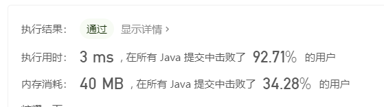

# 12.整数转罗马数字

拿整数减去最大的罗马数字。

把所有能拼成的罗马数字和对应的数字先列出来，拿整数和最大的罗马数字相比较，如果比他大就减去它，然后蒋天这个数字代表的罗马数字，以此类推。

```java
class Solution {
    public String intToRoman(int num) {
        StringBuilder res = new StringBuilder();
        String[] roman = {"M", "CM", "D", "CD", "C", "XC", "L", "XL", "X", "IX", "V", "IV", "I"};
        int[] values = {1000, 900, 500, 400, 100, 90, 50, 40, 10, 9, 5, 4, 1};
        int i = 0;
        while (num != 0) {
            //从最大的数开始减，依次往后推
            if (num >= values[i]&&i<values.length) {
                num = num-values[i];
                res.append(roman[i]);
                continue;
            }
            i++;
        }
        return res.toString();
    }
}
```

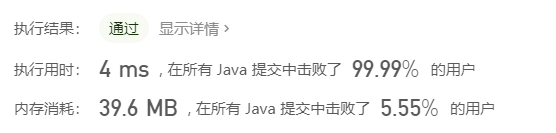

# 13.罗马数字转整数

如果一个罗马数字不在最后一位，并且这个罗马数字比下一位罗马数字小，那么这个罗马数字就代表负值。

按照这个思路写就行。

```java
class Solution {
    public int romanToInt(String s) {
   		Map<Character, Integer> map = new HashMap<>();
        map.put('I', 1);
        map.put('V', 5);
        map.put('X', 10);
        map.put('L', 50);
        map.put('C', 100);
        map.put('D', 500);
        map.put('M', 1000);
        int res = 0;
        for (int i = 0; i < s.length(); i++) {
            //小数在大数前面，且不是最后一位，就是负的
            if (i==s.length()-1||map.get(s.charAt(i))>=map.get(s.charAt(i+1))){
                res+=map.get(s.charAt(i));
            }else {
                res-=map.get(s.charAt(i));
            }
        }
        return res;
    }
}
```


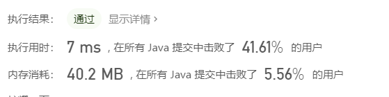

# 14.最长公共前缀

取数组的第一个字符串作为最长公共前缀，让他和第二个字符串逐位匹配，遇到第一个不匹配的字符后，裁剪为相匹配的部分，然后再和第三个字符串相匹配，以此类推。

```java
class Solution {
    public String longestCommonPrefix(String[] strs) {
       if (strs.length == 0) {
            return "";
        }
        //取第一个字符串为最长公共前缀
        String res = strs[0];
        for (int i = 1; i < strs.length; i++) {
            int j = 0;
            //逐位匹配
            while (j < res.length() && j < strs[i].length()) {
                //遇到不匹配的字符，记录结束位置j，跳出循环
                if (res.charAt(j) != strs[i].charAt(j)) {
                    break;
                }
                j++;
            }
            //裁剪为相匹配的部分
            res = res.substring(0, j);
            //如果裁剪后最长公共前缀为空串，那么就没有继续往后比较的必要了
            if ("".equals(res)) {
                return "";
            }
        }
        return res;
    }
}
```


# 15.三数之和

排序数组，然后固定左边第一位，使用两个指针分别指向左边第二位和最后一位，如果和大于0，那么说明值偏大，让右指针左移，反之则左指针右移。

如果和刚好为0，那么记录这三个值，同时移动左指针和右指针，这样才有可能和继续为0,。注意判断重复。

然后固定左边第二位。。。以此类推。

```java
class Solution {
    public List<List<Integer>> threeSum(int[] nums) {
      List<List<Integer>> res = new ArrayList<>();
        if (nums.length < 3) {
            return res;
        }
        //对数组进行排序
        Arrays.sort(nums);
        //固定左边一位
        for (int i = 0; i <= nums.length - 3; i++) {
            //去重,不能用nums[i]==nums[i+1]判断，因为解答中允许重复数字，这样判断会直接把重复数字的可能解都过滤掉
            if (i>=1&&nums[i]==nums[i-1]){
                continue;
            }
            //数组已排序，左边的三个数是和最小的
            //如果最小的和都大于0，那么就没有继续往后面计算的必要了
            if (nums[i] + nums[i + 1] + nums[i + 2] > 0) {
                return res;
            }
            //左右两个指针， 和小于0 左指针右移， 和大于0 右指针左移
            //只有这样才有可能让和等于0
            int left = i + 1;
            int right = nums.length - 1;
        
            while (left < right) {
                int sum = nums[i] + nums[left] + nums[right];
                if (sum == 0) {
                    res.add(Arrays.asList(nums[i], nums[left], nums[right]));
                    //去重
                    while (left < right && nums[left] == nums[left + 1]) {
                        left++;
                    }
                    while (left < right && nums[right] == nums[right - 1]) {
                        right--;
                    }
                    //同时移动左右指针，有可能让和仍然为0
                    left++;
                    right--;
                }else if (sum<0){
                    left++;
                }else {
                    right--;
                }
            }
        }
        return res;
    }
}
```


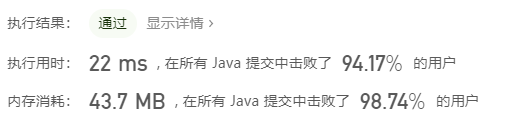


PS：2020年7月19日21:50:56

最近两周出差，晚上回酒店没什么事把go的语法简单的撸了一遍，感觉好简洁……和java一样是静态语言却有点python的感觉。后续刷题用java解决后，尝试用go或者python去写下。

# 16.最接近的三数之和

和15题思路基本一致。直接上代码：

Java：

```java
class Solution {
      public int threeSumClosest(int[] nums, int target) {
        //记录差值
        int nearestValue = Integer.MAX_VALUE;
        //记录结果
        int res = 0;
        if (nums.length < 3) {
            int sum = 0;
            for (int i = 0; i < nums.length; i++) {
                sum += nums[i];
            }
            return sum;
        }
        //对数组进行排序
        Arrays.sort(nums);
        //最左侧三个值和最小，如果最小的值都比target大，其他组合只会更大，直接返回这三数之和即可
        int temp = nums[0] + nums[1] + nums[2];
        if (temp >= target) {
            return temp;
        }
        //每次左边固定一位
        for (int i = 0; i <= nums.length - 3; i++) {
            //左右两个指针
            int left = i + 1;
            int right = nums.length - 1;
            while (left < right) {
                //三数之和
                int sum = nums[i] + nums[left] + nums[right];
                //和与目标值的差值，这是差值，结果要最接近的数，不是要最接近的差值，不要搞混
                int differ = sum - target;
                if (Math.abs(differ) < Math.abs(nearestValue)) {
                    nearestValue = differ;
                    res = sum;
                }
                if (differ < 0) {
                    left++;
                } else if (differ > 0) {
                    right--;
                } else {
                    return target;
                }
            }
        }
        return res;
    }
}
```

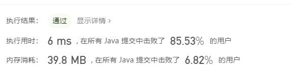

Go：直接翻译java的解法

```go
func threeSumClosest(nums []int, target int) int {
nearestValue := math.MaxInt64
	res := 0
	if len(nums) < 3 {
		sum := 0
		for i := 0; i < len(nums); i++ {
			sum += nums[i]
		}
	}
	//排序
	sort.Ints(nums)
	temp := nums[0] + nums[1] + nums[2]
	if temp > target {
		return temp
	}
	for i := 0; i <= len(nums)-3; i++ {
		left := i + 1
		right := len(nums) - 1
		for left < right {
			sum := nums[i] + nums[left] + nums[right]
			differ := sum - target
			if math.Abs((float64(differ))) < math.Abs(float64(nearestValue)) {
				nearestValue = differ
				res = sum
			}
			if differ < 0 {
				left++
			} else if differ > 0 {
				right--
			} else {
				return target
			}
		}
	}
	return res
}

```

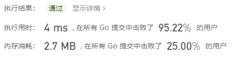

# 17.电话号码的字母组合

用回溯法，深度优先遍历DFS

```java
class Solution {
  //存数字与字母的对应关系
    Map<String, String> map = new HashMap<String, String>() {
        {
            put("2", "abc");
            put("3", "def");
            put("4", "ghi");
            put("5", "jkl");
            put("6", "mno");
            put("7", "pqrs");
            put("8", "tuv");
            put("9", "wxyz");
        }
    };

    public List<String> letterCombinations(String digits) {
        List<String> res = new ArrayList<>();
        if (digits == null || digits.length() == 0) {
            return res;
        }
        backtrack("", digits, res);
        return res;
    }

    private void backtrack(String letters, String digits, List<String> res) {
        //没有新的数字了，说明已经这条分岔路已经到头，加入结果集中并回退
        if (digits.length() == 0) {
            res.add(letters);
            return;
        }
        //拿到当前数字对应的字母表
        String alphabet = map.get(digits.substring(0,1));
        //遍历这个字母表，依次添加到当前字母列表后面
        for (int i=0;i<alphabet.length();i++){
            //递归调用，新字母加入字母组合，丢弃当前已经计算过的数字
            backtrack(letters+alphabet.charAt(i),digits.substring(1),res);
        }
    }
}

```


。。。效率不咋地。当做回溯法的练习吧。

Go写法：

```go
//存储对应关系
var dic map[string]string = map[string]string{
	"2": "abc",
	"3": "def",
	"4": "ghi",
	"5": "jkl",
	"6": "mno",
	"7": "pqrs",
	"8": "tuv",
	"9": "wxyz",
}


func letterCombinations(digits string) []string {
    //存出结果集
	var res = []string{}
	if len(digits) == 0 {
		return res
	}
    //要传切片的指针，因为go的参数传递都是值传递
	backtrack("", digits, &res)
	return res
}

func backtrack(letters string, digits string, slice *[]string) {
	if len(digits) == 0 {
        //因为是值传递，所以要这样更新结果集，必须接受append的返回值
		*slice = append(*slice, letters)
		return
	}
    //每次取一位数字，查字典找对应关系
	alphabet := dic[digits[0:1]]
    //遍历这个字母表，依次添加到当前字母列表后面
	for i, _ := range alphabet {
        //递归调用，新字母加入字母组合，更新切片的范围，以及结果集的指针
		backtrack(letters+alphabet[i:i+1], digits[1:], slice)
	}
}
```

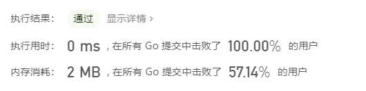

卧槽。。。可能是没多少人用Go提交解答的原因吧。。。一定是这样的。。

用广度优先遍历BFS也阔以，以后有空再补充。

# 18.四数之和(medium)

和三数之和的思路基本一致，先排为升序，然后左边固定两个数，在右侧余下的区间里用双指针标记开头和结尾，和小于target左指针右移，大于target右指针左移。

```java
class Solution {
    public List<List<Integer>> fourSum(int[] nums, int target) {
        List<List<Integer>> res = new ArrayList<>();
        if (nums == null || nums.length < 4) {
            return res;
        }
        //排序
        Arrays.sort(nums);
        //可以再判断尾部4个数的和如果小于target，直接退出
        int temp = nums[0] + nums[1] + nums[2] + nums[3];
        if (temp > target) {
            return res;
        }
        //每次在左边固定两个数，然后在右边剩余的区间内用双指针
        for (int i = 0; i <= nums.length - 4; i++) {
            if (nums[i] + nums[i + 1] + nums[i + 2] + nums[i + 3] > target) {
                return res;
            }
            //去重
            if (i >= 1 && i < nums.length - 4 && nums[i] == nums[i - 1]) {
                continue;
            }
            for (int j = i + 1; j <= nums.length - 3; j++) {
                //去重
                if (j >= i + 2 && j <= nums.length - 3 && nums[j] == nums[j - 1]) {
                    continue;
                }
                int left = j + 1;
                int right = nums.length - 1;
                while (left < right) {
                    int sum = nums[i] + nums[j] + nums[left] + nums[right];
                    if (sum == target) {
                        res.add(Arrays.asList(nums[i], nums[j], nums[left], nums[right]));
                        //去重
                        while (left < right && nums[left] == nums[left + 1]) {
                            left++;
                        }
                        //去重
                        while (left < right && nums[right] == nums[right - 1]) {
                            right--;
                        }
                        left++;
                        right--;
                    } else if (sum > target) {
                        right--;
                    } else {
                        left++;
                    }
                }
            }
        }
        return res;
    }
}
```

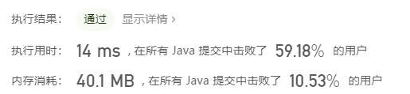

# 19.删除链表的倒数第N个节点

双指针。用两个指针，快指针先出发经过n个节点，然后慢指针和快指针一起移动，直到快指针的下一个节点为null，此时快指针在倒数第1位，慢指针在倒数第1+n位，删除慢指针的下一个节点即可。

```java
/**
 * Definition for singly-linked list.
 * public class ListNode {
 *     int val;
 *     ListNode next;
 *     ListNode(int x) { val = x; }
 * }
 */
class Solution {
    public ListNode removeNthFromEnd(ListNode head, int n) {
        //哑结点，链表类题目常用
        ListNode dummy = new ListNode(0);
        dummy.next = head;
        //让快慢两个指针都从哑结点出发
        ListNode slow = dummy;
        ListNode fast = dummy;
        //让fast指针先移动N位
        for (int i = 0; i < n; i++) {
            fast = fast.next;
        }
        //然后两个指针一起移动，直到fast.next为空，此时，slow和fast中间相隔了n个节点
        //fast是倒数第一个节点，那么slow就是倒数第n+1个节点，slow的下一个节点就是倒数第N个节点
        while (fast.next != null) {
            fast = fast.next;
            slow = slow.next;
        }
        //删除节点
        slow.next = slow.next.next;
        return dummy.next;
    }
}
```


GO：思路一致，把Java的写法翻译下

```go
func removeNthFromEnd(head *ListNode, n int) *ListNode {
	dummy := ListNode{
		Val:  0,
		Next: head,
	}
    //双指针
	slow := &dummy
	fast := &dummy
    //先移动快指针
	for i := 0; i < n; i++ {
		fast = fast.Next
	}
    //然后两个指针一起移动
	for fast.Next != nil {
		fast = fast.Next
		slow = slow.Next
	}
	slow.Next = slow.Next.Next
	return dummy.Next
}
```

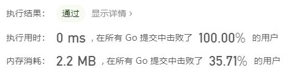

# 20.有效的括号(easy)

第一反应就是用栈吧……

Java：

```java
class Solution {
    public boolean isValid(String s) {
        //建议映射表
        Map<Character, Character> map = new HashMap<Character, Character>() {{
            put(']', '[');
            put('}', '{');
            put(')', '(');
        }};
        //栈
        Deque<Character> stack = new ArrayDeque<>();
        for (int i = 0; i < s.length(); i++) {
            //左括号一律入栈
            if (!map.containsKey(s.charAt(i))) {
                stack.push(s.charAt(i));
            } else {
                //右括号且栈为空，一定匹配失败
                if (stack.isEmpty()) {
                    return false;
                }
                //栈不为空，就出栈并和当前括号进行匹配
                if (!stack.pop().equals(map.get(s.charAt(i)))) {
                    return false;
                }
            }
        }
        //如果结束后栈是空的，说明全部匹配成功
        return stack.isEmpty();
    }
}
```


Go :

不用哈希表也可以，遇到右括号时候，都将相对应的左括号入栈即可。

go好像没有现成的栈可用。。可以用切片来模拟栈。

```go
func isValid(s string) bool {
	stack := []byte{}
	for i := 0; i < len(s); i++ {
		if s[i] == '[' {
			stack = append(stack, ']')
		} else if s[i] == '(' {
			stack = append(stack, ')')
		} else if s[i] == '{' {
			stack = append(stack, '}')
		} else {
			if len(stack) == 0 {
				return false
			}
			if !(stack[len(stack)-1] == s[i]) {
				return false
			}
			stack = stack[:len(stack)-1]
		}
	}
	return len(stack) == 0
}
```

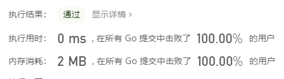

# 21. 合并两个有序链表(easy)

Java:

```java
class Solution {
    public ListNode mergeTwoLists(ListNode l1, ListNode l2) {
        //哑结点
        ListNode dummy = new ListNode(0);
        //用来合并两个链表
        ListNode work = dummy;
        //都不为null时进行比较
        while (l1 != null && l2 != null) {
            if (l1.val > l2.val) {
                work.next = l2;
                work = work.next;
                l2 = l2.next;
            }else {
                work.next = l1;
                work = work.next;
                l1 = l1.next;
            }
        }
        //某个为空，把另一条链表的后续接上就完了
        if (l1 == null) {
            work.next = l2;
        }
        if (l2 == null) {
            work.next = l1;
        }
        return dummy.next;
    }
}
```


Go：

参考网上的递归解法。。递归我是真的玩不转啊。。

```go
/**
 * Definition for singly-linked list.
 * type ListNode struct {
 *     Val int
 *     Next *ListNode
 * }
 */
func mergeTwoLists(l1 *ListNode, l2 *ListNode) *ListNode {
	if l1 == nil {
		return l2
	}
	if l2 ==nil{
		return  l1
	}
	if l1.Val<l2.Val{
		l1.Next=mergeTwoLists(l1.Next,l2)
		return l1
	}else {
		l2.Next = mergeTwoLists(l1,l2.Next)
		return l2
	}
	
}
```

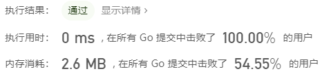

# 22. 括号生成

回溯法

生成括号时候：

1、先生成左括号，再生成右括号。

2、只要左括号的数目没有达到n，就可以继续添加左括号。

3、只要右括号数目没有超过左括号数目，就可以继续添加右括号。

把上面三点写在一个递归函数里面就好了

Java：

```java
class Solution {
   public List<String> generateParenthesis(int n) {
        List<String> res = new ArrayList<>();
        backtrack("", 0, 0, n, res);
        return res;
    }

    private void backtrack(String s, int left, int right, int n, List<String> res) {
        if (left == right && left == n) {
            res.add(s);
            return;
        }
        //只要左括号数量小于n，说明还没有到达规定的括号数量，可以继续添加左括号
        if (left < n) {
            backtrack(s + "(", left + 1, right, n, res);
        }
        //添加右括号的条件是：第一，先生成左括号才能生成右括号，第二，只有右括号数量小于左括号数量时候才能添加右括号。
        if (right < left) {
            backtrack(s + ")", left , right+1, n, res);
        }
    }

}
```


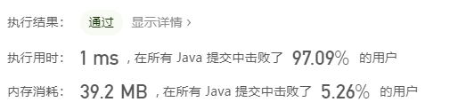

Python：同样思路

```python
class Solution:
    def generateParenthesis(self, n: int) -> List[str]:
        res = []
        self.backtrack("", 0, 0, n, res)
        return res

    def backtrack(self, str, left, right, n, res):
        if left == right and left == n:
            res.append(str)
            return
        if left < n:
            self.backtrack(str + "(", left + 1, right, n, res)
        if right < left:
            self.backtrack(str + ")", left, right + 1, n, res)
```


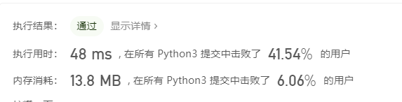


# 23. 合并K个排序链表(hard)(未解决)

hard跳过，周末补上


# 24. 两两交换链表中的节点(medium)

迭代解法

Go：

```go
func swapPairs(head *ListNode) *ListNode {
	if head==nil||head.Next==nil{
		return head
	}
	dummy:=&ListNode{Next: head}
	for work:=dummy;work!=nil&&work.Next!=nil&&work.Next.Next!=nil;work=work.Next.Next{
        //暂存待交换节点2的后继节点
		temp1:=work.Next.Next.Next
        //暂存待交换节点1的后继节点
		temp2:=work.Next.Next
        //待交换节点2的后继指向待交换节点1
		temp2.Next = work.Next
        //待交换节点1的后继指向原来待交换节点2的后继
		work.Next.Next = temp1
        //更新原来指向待交换节点1的指针
		work.Next=temp2
	}
	return dummy.Next
}
```

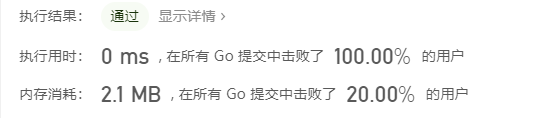

递归解法：

尝试着想如何使用递归解题。。

每两个节点进行交换，给你两个节点，写一个交换函数，这个很容易。

```python
nodeA = head.next  
# 1
nodeB = head.next.next
nodeA.next = head
# 2
head.next = nodeB 
return nodeA

```

现在要去写一个递归函数来交换，那么就应该只关注递归中的某一次递归需要做什么以及这个递归函数的输入是什么、返回是什么。

1、这个递归函数输入一个节点，然后会将以这个节点为头结点的链表进行两两交换，然后返回新链表头节点。

2、选取一个递归的过程，他要做的是，交换两个节点，返回第二个节点，至于这两个节点后续的节点怎么交换，不用管，把递归函数看作是一个已知正确的结果使用就行。

这样想还是能写出来的。。

Python：

```python
# Definition for singly-linked list.
# class ListNode:
#     def __init__(self, x):
#         self.val = x
#         self.next = None

class Solution:
    def swapPairs(self, head: ListNode) -> ListNode:
        if head is None or head.next is None:
            return head
        temp = head.next
        head.next = self.swapPairs(temp.next)
        temp.next =head
        return temp
```

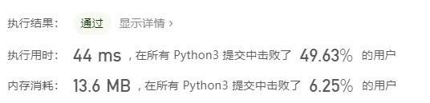


递归：Java：

```Java
/**
 * Definition for singly-linked list.
 * public class ListNode {
 *     int val;
 *     ListNode next;
 *     ListNode(int x) { val = x; }
 * }
 */
class Solution {
    public ListNode swapPairs(ListNode head) {
        if (head == null || head.next == null) {
            return head;
        }
        ListNode temp = head.next;
        //下两步不能颠倒，否则就构造了一个闭环，然后SOF
        head.next = swapPairs(temp.next);
        temp.next = head;
        return temp;
    }

}
```


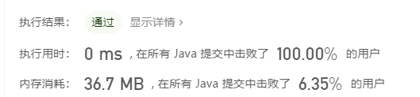


# 25. K 个一组翻转链表（hard）未解决

hard题目 周末统一做


# 26. 删除排序数组中的重复项(easy)

双指针：从左到右遍历数组，遇到重复元素时候，就标记初始重复元素的位置，然后继续往后寻找，找到第一个不同的元素后，把这个元素的值赋给之前标记的重复元素的下一个位置。就这样扫描一次数组就可完成。

Java：

```java
class Solution {
    public int removeDuplicates(int[] nums) {
        if (nums.length <= 1) {
            return nums.length;
        }
        int mark = 0;
        for (int i = 1; i < nums.length; i++) {
            if (nums[mark] != nums[i]) {
                nums[++mark] = nums[i];
            }
        }
        return mark + 1;
    }
}
```


# 27. 移除元素