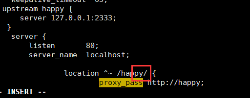

# Nginx 转发请求

最常用的一种方式：

这样访问http://192.168.222.128/happy/xxxxx 时候nginx会转发请求到 http://127.0.0.1:2333/xxxxx

配置location 匹配路径时候，一般会在目标地址后面加上 ' / ' ，这样就会把匹配成功的部分去掉，然后在拼接到proxy_pass的地址上。

proxy_pass 的地址一般不带 ' / ' ，只代理域名，url和后面的查询参数都不会变。

虚拟机的快照功能感觉有坑，今天遇到了怪事，windows上可以访问部署的服务，在部署服务器上用浏览器请求反而访问不了。后来重启虚拟机后恢复正常了。

